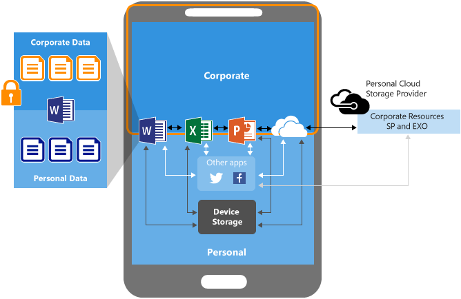

---
# required metadata

title: app based conditional access to 0365 | Microsoft Intune
description: Understand the concepts of how MAM CA can help with controlling what apps have access to O365 services.
keywords:
author: karthikaraman
manager: angrobe
ms.date: 09/24/2016
ms.topic: article
ms.prod:
ms.service: microsoft-intune
ms.technology:
ms.assetid: bd6bee60-5e39-42c8-a2e9-f5865ac3573f

# optional metadata

#ROBOTS:
#audience:
#ms.devlang:
ms.reviewer: chrisgre
ms.suite: ems
#ms.tgt_pltfrm:
#ms.custom:

---

# Allow only policy managed apps to access O365 services
By implementing conditional access for apps with MAM policies (MAM CA), you can restrict the  apps that can access O365 services like Exchange Online and SharePoint Online. You can create a policy that allows only mobile apps that have MAM policies to be able to access these services.  
In this context, conditional access is based on which mobile apps are allowed to access a service. You have the ability to list the apps that can access in the policy. If end-users tries to access the service using apps that are not listed in the policy, access will be blocked.

The diagram below illustrates how company data is protected.  With MAM, you can configure policies that prevent corporate data from being transferred to the device or to non-protected apps. With MAM CA, access to cloud apps like Exchange Online and SharePoint online can be managed.

## Some examples on how MAM CA can be used
* Block  mobile apps that don’t have Intune MAM support from accessing SharePoint Online.
* Block the built-in mail apps on iOS and Android from sync'ing email from Exchange Online

>[!NOTE]
> Outlook app for iOS does not yet support conditional access for MAM, so this use case only works on Android

## Supported apps
* Microsoft Word for iOS and Android
* Microsoft Excel for iOS and Android
* Microsoft PowerPoint for iOS and Android
* Microsoft OneDrive for Business for iOS and Android
* Microsoft OneNote for iOS
* Microsoft Outlook for Android and iOS

>[!NOTE]
>Microsoft Excel, PowerPoint, Word, Skype for Business, and OneNote apps for iOS and Android are
bundled together as a single option. When you select the bundled app list, the apps listed will be
automatically included in the allowed app list.  The OneNote app for Android does not yet support MAM without enrollment.

## End-user experience
MAM CA verifies the identity of the approved application via a broker app that must be present on the device. On iOS, the Azure Authenticator app is the broker app. On Android, the Intune Company Portal app is the broker app.  If a user is signing in to an approved app (like OneDrive or Outlook) for the first time, she will be prompted to install the broker app and register the device with Azure ActiveDirectory. Device registration in AAD (previously known as Workplace Join) will create a device record and certificate against which tokens will be issued.  It is important to note that this is NOT the same as MDM enrollment; no management profiles or policies are applied, and there is no inventory taken of installed apps.  The process of installing the broker app and registering the device will happen on the first use of a managed app only.
Here’s an example of when the user first signs in to an app but doesn’t yet the iOS Authenticator App:
<screenshot here>

## Next steps
### See also
