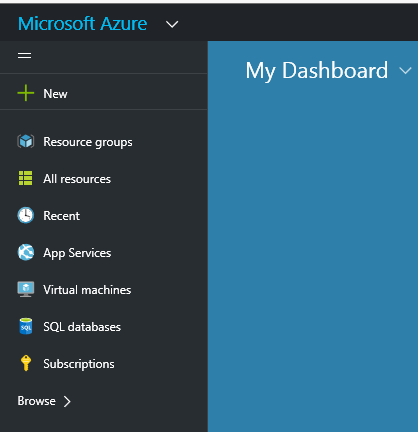
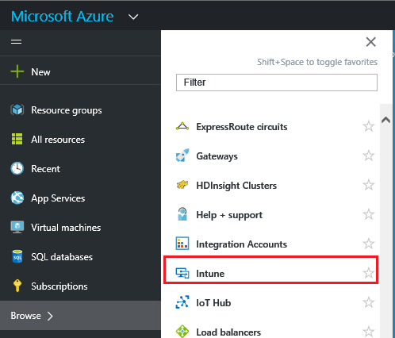

# Azure portal for Microsoft Intune MAM policies
## Accessing the Azure  portal
The **Azure  portal** allows you create and manage mobile app management policies.

Azure portal supports creating MAM policies for:
- Apps running on devices **enrolled and managed by Intune**.
- Apps running on devices that are **not enrolled** in any MDM solution.
- Apps running on devices that are **enrolled in a third party MDM solution**.

If you are currently using the **Intune admin console** to manage your devices, you can create a MAM policy that supports apps for devices enrolled in Intune using the [Intune admin console](configure-and-deploy-mobile-application-management-policies-in-the-microsoft-intune-console.md).
>[!IMPORTANT]
> You may not see all MAM policy settings in the Intune admin console. The Azure portal is the new admin console for creating MAM policies.

## Login to the Azure portal and customize your start page

1.  Go the [Azure  portal](https://portal.azure.com) and sign in with  your [!INCLUDE[wit_nextref](../includes/wit_nextref_md.md)] credentials.

    

2.  Once you are successfully signed in, you will see the **Dashboard**. The **Dashboard** page comes with a set of default tiles that you can remove and add new ones to customize the page.

    

3.  From the **Browse** menu, find **Intune**.

4.  Click **Intune > Intune mobile application management > Settings**.

    

    > [!TIP]
    > To pin a blade to the **Start** page, you can use the **pin** option on the blade.  Click the pin icon on the **Intune mobile application management blade**, to pin it to the **Start** page.

    

    
## Next steps
[Get ready to configure mobile app management policies](get-ready-to-configure-mobile-app-management-policies-with-microsoft-intune.md)
