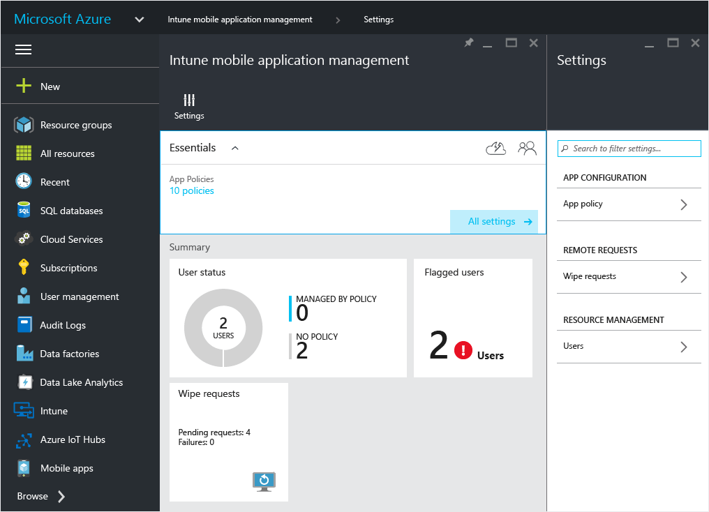
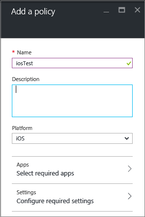
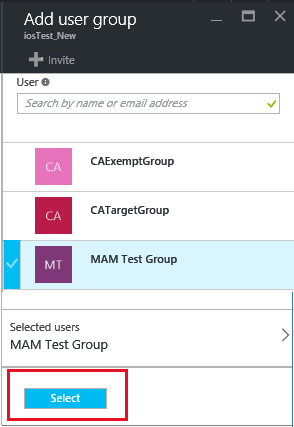
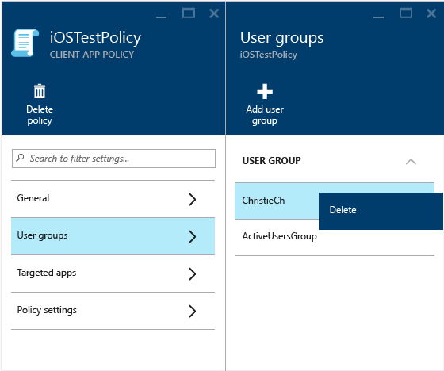

# Create and deploy mobile app management policies with Microsoft Intune
You can create mobile app management policies (MAM) policies and deploy them to users in the Azure  portal.  The MAM policies that you create here are independent of device enrollment, meaning that they can be used on devices that are not managed at all, or managed by [!INCLUDE[wit_firstref](../includes/wit_firstref_md.md)] or another third-party solution.

##  Create a MAM policy

1.  Click **Intune mobile application management &gt; Settings** to open the **Settings** blade.

    

    > [!TIP]
    > If this is the first time you are using the Azure portal, read [Azure portal for Microsoft Intune MAM policies](azure-portal-for-microsoft-intune-mam-policies.md) first to get familiar with the portal.

2.  In the **Settings** blade, click **App policy**.  This opens the **App policy** blade where you'll  create new policies and edit existing policies.

    

3.  Click **Add a policy**.

    

4.  Type  a name for the policy, add  a brief description, and select the platform type to create a policy for iOS or Android.  You can create more than one policy for each platform.

    

5.  Click **Apps** to open the **Apps blade** where a list of available apps is displayed. You can select one or more apps from the list that you want to associate with the policy that you are creating. One you have selected the apps, click the **Select** button at the bottom of the **Apps** blade to save your selection.

    > [!IMPORTANT]
    > You must select at least one app to create a policy.

6.  On the **Add a policy blade**, click **Configure required settings** to open the policy settings blade.

    There are two categories of policy settings-**Data relocation** and **Access**.  Data relocation policies are applicable to data movement in and out of the apps, while the access polices determine how the end-user accesses the apps in a work context.
    To get you started the policy settings have default values.  You do not have to make any changes if the default values meet your requirements.

    > [!TIP]
    > These policy settings are enforced only when using apps in the work context.  When the end-user uses the app to do a personal task, they will not be affected by these policies.

    

7.  Click **OK** to save this configuration.  You are now back in the **Add a policy** blade. Click **Create** to create the policy and save your settings.

    

    

When you finish creating a policy as described in the previous procedure, it is not deployed to any users.  Follow the steps described below to deploy the policy.

> [!NOTE]
> If you have created mobile application management policies from the Intune or Configuration Manager consoles, and also created an app management policy from the Azure console, then associated both policies with the same app, the policy you created from the Azure portal takes precedence. However, the reporting in the Intune or Configuration Manager console will report the policy settings created from the Azure  portal. For example:
>
> -   You created a mobile application management policy in the Intune admin console that blocks copy from an app.
> -   You created a mobile app management policy in the Azure console that allows copy from an app
> -   You associate both of these policies to the same app.
> -   The result is that the policy you created from the Azure console takes precedence and copy is allowed.
> -   However, status and reports in the Intune console will incorrectly indicate that copy is blocked.

## Deploy a policy to users

1.  In the **Policy**blade, click  **User groups**, which opens the **User groups**blade. Click **Add user group** in the **User groups** blade to open the **Add user group** blade.

    

2.  A list of user groups is displayed on the **Add user group** blade. This is a list of all the security groups in your **Azure Active Directory**.  You can select the user groups you want this policy to apply to and click **Select**. **Clicking Select deploys the policy to users**.

    

    > [!NOTE]
    > Only users with [!INCLUDE[wit_nextref](../includes/wit_nextref_md.md)] licenses assigned to them will be affected by the policy.  Users who are in the security group that you selected that don’t have a [!INCLUDE[wit_nextref](../includes/wit_nextref_md.md)] license assigned to them are not affected.

    > [!NOTE]
    > If you are using Intune with Configuration Manager to manage your iOS and Android devices, the policy is only applied to the users directly in the group that you selected.  Members of child groups  nested within the group you selected will not be affected.

You have now created a policy and deployed it to users.

The end users can download the apps from the App store or Google Play. For a detailed walkthrough of the end user experience, see [End-user experience for apps associated with Microsoft Intune mobile app management policies](end-user-experience-for-apps-associated-with-microsoft-intune-mobile-app-management-policies.md).

##  Change existing policies
When you change existing policies,  users who are already signed  in to the apps won’t see the changes for a 8-hour period.

If you are testing and would like to see the changed policy immediately, sign out of the app and sign back in to see the new settings.

### Change the list of apps associated with the policy

1.  In  the **App policy** blade, click the policy you want to change. This opens a blade specific to the policy you just selected.

    

2.  In the policy blade, click **Targeted apps** to open the list of apps.

3.  Remove or add apps from the list and click the **Save icon** to save your changes.

### Change the list of user groups

1.  In  the **App policy** blade, click the policy you want to change. This opens the blade specific to the policy you selected.

2.  In the policy blade, click **User groups** to open the **User group** blade that shows the list of current user groups who have this policy.

3.  To **add a new user group** to the policy, click **Add user group**, and select the user group. Click **Select** to deploy the policy to the group you selected.

    

4.  To **delete a user group**, highlight the user group you want to remove, click the ellipses (…), then click **Delete** to remove the user group.

    

### Change policy settings

1.  In the **App policy** blade, click the policy you want to change. This opens a blade specific to the policy you just selected.

    

2.  Click **Policy settings** to open the **Policy settings** blade.

3.  Change the settings, and click the **Save icon** to save your changes.

    

## Policy settings
Each platform has various data relocation, and access policies:
> [!div class="op_single_selector"]
  - [iOS policies]()
  - [Android policies]()

### Next steps
[Monitor mobile app management policies with Microsoft Intune](monitor-mobile-app-management-policies-with-microsoft-intune.md)
