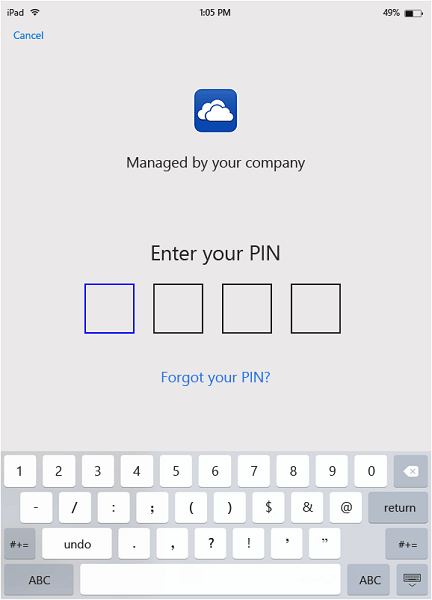
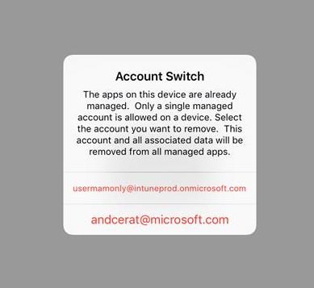

---
# required metadata

title: End user experience for MAM enabled apps | Microsoft Intune
description:
keywords:
author: karthikaraman
manager: jeffgilb
ms.date: 04/28/2016
ms.topic: article
ms.prod:
ms.service:
ms.technology:
ms.assetid: b57e6525-b57c-4cb4-a84c-9f70ba1e8e19

# optional metadata

#ROBOTS:
#audience:
#ms.devlang:
ms.reviewer: jeffgilb
ms.suite: ems
#ms.tgt_pltfrm:
#ms.custom:

---

# End user experience for MAM enabled apps with Microsoft Intune
Mobile application management (MAM) polices are applied only when apps are used in the work context.  Read the following scenarios to understand how managed apps work.
##  Accessing OneDrive on an iOS device

1.  Launch the  **OneDrive** app to open the sign in page.

    

    > [!NOTE]
    > On a personal device, typically the end-user would download the app.  If the device is managed by a MDM solution, your can deploy the app to the device.

2.  Type your work account user name. You are redirected to the **O365 authentication** page to enter your work credentials.

    

3.  After your credentials are successfully authenticated  by Azure AD, the MAM polices are applied, and you will be asked to restart the **OneDrive** app.

    

4.  When you re-launch the **OneDrive** app, the app launches with the MAM policies turned on. You are now prompted to set a **PIN** for the app. (if you configured the policy for this).

    

5.  Once you set the PIN and confirm,  you are able to access the files on your **OneDrive for Business**.

    

    > [!NOTE]
    > When you change a deployed policy, the changes will be applied next time you open the app.

##  Accessing OneDrive on an Android device

1.  Launch the OneDrive app to open the sign in page.

    > [!NOTE]
    > On a personal device, typically the end-user would download the app.  If the device is managed by a MDM solution, you can deploy the app to the device.

2.  Type your work account user name. You are redirected to the **O365 authentication** page to enter your work credentials.

    

3.  Once your credentials are successfully authenticated by **Azure AD**, you should see a message displayed with instructions to install the company portal app, if it is not already installed on the device.  Tap on **Get the app** to proceed.

    

4.  You are now in the **Google Play** store where you can download and install the **Company Portal** app.

    The Company Portal app helps keep the data secure and protected.

    

5.  Once you have completed the install, click **Accept** to accept the terms.

    

6.  The **OneDrive** app launches automatically.

7.  The next time you open OneDrive, you will see the prompt to set a **PIN**, provided the policy settings are set to require a PIN to access the **OneDrive** app.

    

8.  Once the PIN is set and confirmed, you can continue using **OneDrive**, which is now managed by app policies.

    

##  Using apps with multi-identity support
Microsoft Word is used as an example for this scenario.

1.  Open the **Word** app on your device. We are using an iOS device to show the steps.

2.  Tap **New** to create a new word document.

    

3.  Type a sentence of your choice.  When you try to save this document, both personal and work locations are shown as options to save the document you just created.  At this step, the app policies are not yet applied since this work/personal context is not yet established.

4.  Save the document to your OneDrive for business location. This is now tagged as company data and the policy restrictions apply.

    

5.  Open the document you saved to your work location.  Copy the text, open your personal **Facebook** account  and try to paste the copied text.  You should not be able paste the content into the new Facebook post. The paste option is not greyed out, but nothing happens when you press **Paste**.

    

    

6.  Now repeat steps 2 and 3 to create another new document, type a sentence of your choice, and instead of saving it to your work, save it to your personal location, like **OneDrive - personal**.

    

7.  Open the personal saved document.  Copy the text, open the **Facebook** app and try to paste the copied text. You see that you are able to paste the content to a Facebook post.

    

<!---##  Viewing media files with the Rights Management sharing app
To view AV, PDF and image files, on Android devices, you can use the [Microsoft Rights Management (RMS) sharing app](https://play.google.com/store/apps/details?id=com.microsoft.ipviewer).

Download this app from the  Google Play store.  Once the app is installed on your device, launch the app and authenticate with your company credentials. You should now be able to view unprotected and protected files from other policy-managed apps.--->

##  Managing user accounts

Intune only supports deploying MAM policies to only one user account per device. If a device has more than one work account, only one work account is managed by the MAM policies.

Depending on the app that you are using, the second user may or may not be blocked on the device. However, in all cases, only the first user who gets the MAM policies is affected by the policy.

If a device has existing multiple user accounts before the MAM policies are deployed, the account that the MAM policies is deployed to first is managed by Intune MAM policies.

**Microsoft Word**, **Excel**, and **PowerPoint** don't block a second user account, but the second user account is not affected by the MAM policies.  

For **OneDrive and Outlook apps**, you can only use one work account.  Adding multiple work accounts are blocked on these apps.  You can however, remove a user and add a different user on the device.

Read the example scenario below to get a deeper understanding of how multiple user accounts are treated.

User A works for two companies - **Company X**, and **Company Y**. User A has a work account for each company, and both use Intune to deploy MAM policies. **Company X** deploys MAM policies **before** **Company Y**. The account associated with **Company X** will get the MAM policy, but not the account associated with Company Y. If you want the user account associated with Company Y to be managed by the MAM policies, you must remove the user account associated with Company X.
### Adding a second account
#### IOS
If you are using an iOS device, when you try to add a second work account on the same device, you may see blocking message.  You will also see an option to remove the existing account and add a new one. You can do so by clicking **Yes**.

####  Android
If you are using an Android device, You may see a blocking message with instructions to remove the existing account and add a new one.  On Android devices, to remove the existing account, go to **Settings &gt;General &gt; Application Manager &gt;Company Portal and select "Clear Data"**.

## See Also
[Create and deploy mobile app management policies with Microsoft Intune](create-and-deploy-mobile-app-management-policies-with-microsoft-intune.md)
