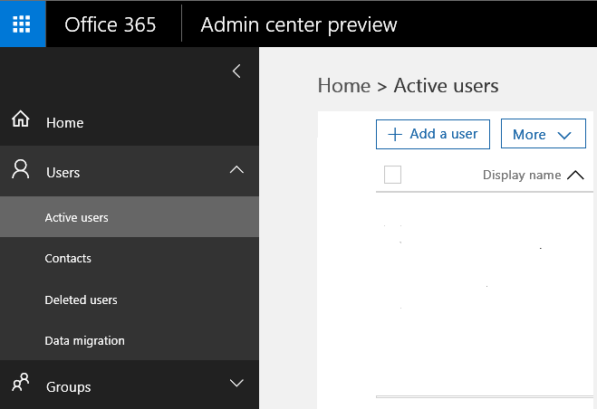

---
# required metadata

title: Get ready to configure mobile app management policies | Microsoft Intune
description:
keywords:
author: karthikaraman
manager: jeffgilb
ms.date: 04/28/2016
ms.topic: article
ms.prod:
ms.service: microsoft-intune
ms.technology:
ms.assetid: 7e6a85e7-e007-41b6-9034-64d77f547b87

# optional metadata

#ROBOTS:
#audience:
#ms.devlang:
ms.reviewer: jeffgilb
ms.suite: ems
#ms.tgt_pltfrm:
#ms.custom:

---

# Get ready to configure mobile app management policies with Microsoft Intune
This topic describes what you need to do before you can create mobile app management policies (MAM) in the Azure portal.
If you are currently using the **Intune admin console** to manage your devices, you can create a MAM policy that supports apps for devices enrolled in Intune using the [Intune admin console](configure-and-deploy-mobile-application-management-policies-in-the-microsoft-intune-console.md).
>[!IMPORTANT]
> You may not see all MAM policy settings in the Intune admin console. The Azure portal is the new admin console for creating MAM policies.

##  Supported platforms
- iOS 8.1 or later

- Android 4 or later

##  Supported apps
To see the full list of supported apps, go to [Microsoft Intune mobile application gallery](https://www.microsoft.com/en-us/server-cloud/products/microsoft-intune/partners.aspx) on the Microsoft Intune application partners page.
Click the app to see the supported scenarios, platforms and whether or not the app supported multi-identity.

**Before** you can configure MAM policies, you'll need the following:

-   **A subscription to Microsoft Intune**.    End users need [!INCLUDE[wit_nextref](../includes/wit_nextref_md.md)] licenses to get apps with MAM policy.

-   The **mobile device management authority** must be set to either **Intune** or **Configuration manager**, depending on whether you are using just Intune or Configuration Manager integrated with Intune to manage your devices. If you are using O365 built-in mobile device management, you must purchase an Intune subscription and [set the mobile device management authority to Intune](https://stage.docs.microsoft.com/en-us/intune/deploy-use/get-ready-to-enroll-devices-in-microsoft-intune.md#set-mobile-device-management-authority).
-   An **Office 365 (O365)** subscription that is required for the following:
  - To apply MAM policies to apps with multi-identity support.
  - To create  SharePoint Online and Exchange Online work accounts. Exchange On-premises and SharePoint on-premises are not supported.

- **Azure Active Directory (Azure AD)** to create users. Azure AD authenticates the user when the end user launches the app and enters their work credentials.

    > [!NOTE]
    > If you are setting up users using the [!INCLUDE[wit_nextref](../includes/wit_nextref_md.md)] console, be aware that the MAM policy configuration is moving to the Azure portal going forward and to use this portal, you need to set up Azure AD user groups using the Office 365 portal.

## Create users and assign Microsoft Intune licenses

1. You need an Intune subscription: You   already have an [!INCLUDE[wit_nextref](../includes/wit_nextref_md.md)] subscription if you are currently using [!INCLUDE[wit_nextref](../includes/wit_nextref_md.md)] to manage your devices.  You also have an [!INCLUDE[wit_nextref](../includes/wit_nextref_md.md)] subscription if you have purchased an EMS license. If you are trying [!INCLUDE[wit_nextref](../includes/wit_nextref_md.md)] to check out the MAM capabilities, you can get a trial account [here](http://www.microsoft.com/en-us/server-cloud/products/microsoft-intune/).

    To check if you have an [!INCLUDE[wit_nextref](../includes/wit_nextref_md.md)] subscription, on the Office portal, go to Billing page.  You should see [!INCLUDE[wit_nextref](../includes/wit_nextref_md.md)] as **Active** under subscriptions.

2.  Sign in to the   [the Office portal](http://portal.office.com) with your admin credentials.

3.  Navigate to the **Active Users** page to add users and assign [!INCLUDE[wit_nextref](../includes/wit_nextref_md.md)] licenses.

    

4.  To give a user the ability to access the Office portal, the Azure AD portal and the Azure  portal, assign the **Global administrator role** to the user.

    

5.  MAM policies are deployed to user groups in Azure Active Directory. To create user groups you want to use for your MAM policies, navigate to the **Groups** page on the **Office  portal** and click the **+** icon to create a new security group.  Type a name and description and click **Create**. When the group is created, you can add user to the group by clicking **Edit members** on the newly created security group. The security group is created in Azure Active Directory.

    

The following table lists the role and permissions you can assign to admin users.

|||
|--|----|
|**Role**|**Permissions**|
|Global administrator (O365 portal)|Access to O365 portal, and Azure AD portal  Access to Azure  portal (can do both role management and mobile app management tasks).|
|Owner role (Azure  portal)|Access to Azure  portal (can do both role management and mobile app management tasks).|
|Contributor role (Azure  portal)|Access to Azure  portal (can only do the mobile app management tasks).|

## Assign the contributor role to a user

**Global administrators** have access to the Azure portal.  If you want other admin users to be able to configure policies, and do other mobile app management tasks, you can assign the **contributor role** to the user as described below:

1.  On the **Settings** blade,  from the **Resource management** section, click **Users**.

    

2.  Click **Add** to open the **Add access** blade.

3.  Click **Select a role**, then **Contributor role**.

    

4.  Once you have selected the role, click **Add user**, and search for the user by the user name or email address. The users you see on this list are the first 1000 users you previously created in Azure AD using the Office portal. Click **Ok** on the **Add access** blade to save and assign the role to the user.

    

    > [!IMPORTANT]
    > If you select a user who does not have an [!INCLUDE[wit_nextref](../includes/wit_nextref_md.md)] license assigned to them, they will not be able to access the portal.

## Next steps
[Create and deploy mobile app management policies with Microsoft Intune](create-and-deploy-mobile-app-management-policies-with-microsoft-intune.md)
