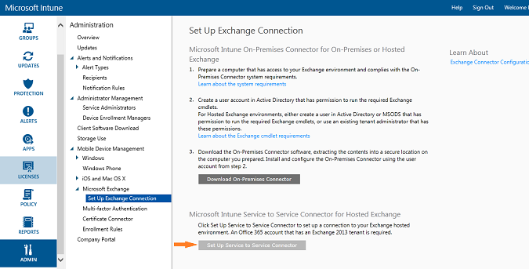

---
# required metadata

title: Configure the Microsoft Intune Exchange connector for hosted Exchange | Microsoft Intune
description:
keywords:
author: NathBarn
manager: jeffgilb
ms.date: 04/28/2016
ms.topic: article
ms.prod:
ms.service:
ms.technology:
ms.assetid: 05fa5dc9-9bad-4557-987a-9b8ce4edebb0

# optional metadata

#ROBOTS:
#audience:
#ms.devlang:
ms.reviewer: jeffgilb
ms.suite: ems
#ms.tgt_pltfrm:
#ms.custom:

---

# Configure the Intune service-to-service connector for Exchange Online

Use this information to connect Microsoft Intune and Exchange Online service hosted by Office 365.

## Requirements for the service-to-service Connector
The **Service to Service Connector** supports only hosted Exchange and has no requirements for on-premises infrastructure.

|Requirement|More information|
|---------------|--------------------|
|Hosted Exchange configured and running|[Exchange Online](https://technet.microsoft.com/library/jj200580.aspx) |
|Mobile device management authority| [Set the mobile device management authority to Microsoft Intune](get-ready-to-enroll-devices-in-microsoft-intune.md#set-mobile-device-management-authority)|
|Microsoft Exchange version|You must have an Office 365 subscription that has an Exchange Server 2013 or later tenant. So long as the tenant is Exchange Server 2013 or later, the connector supports Exchange Server 2010 in that same environment.|
|Active Directory Synchronization|Before you can use the Intune Connector, you must [set up Active Directory synchronization](../get-started/start-with-a-paid-subscription-to-microsoft-intune-step-3.md) so that your local users and security groups are synchronized with your instance of Azure Active Directory.|

### Exchange cmdlet requirements

You must also create an Exchange Online user account that is used by the Intune Exchange Connector. The account must have permission to use the Intune admin console and to run these required Windows PowerShell Exchange cmdlets:

 - Get-ActiveSyncOrganizationSettings, Set-ActiveSyncOrganizationSettings
 - Get-MobileDeviceMailboxPolicy, Set-MobileDeviceMailboxPolicy, New-MobileDeviceMailboxPolicy, Remove-MobileDeviceMailboxPolicy
 - Get-ActiveSyncDeviceAccessRule, Set-ActiveSyncDeviceAccessRule, New-ActiveSyncDeviceAccessRule, Remove-ActiveSyncDeviceAccessRule
 - Get-MobileDeviceStatistics
 - Get-MobileDevice
 - Get-ActiveSyncDeviceClass

## Set up the service-to-service Connector
> [!IMPORTANT]
> Before you being installing and configuring the service-to-service connector, ensure that you meet the [Exchange connector installation requirements](./intune-exchange-connector-requirements.md).

1. Open the [Microsoft Intune administration console](http://manage.microsoft.com) with a user account with Exchange admin rights and permissions for the cmdlets [above](#exchange-cmdlet-requirements). Microsoft Intune uses the email address of the currently logged in user to set up the connection.

2.  In the workspace shortcuts pane, choose **ADMIN**, then go **Mobile Device Management** > **Microsoft Exchange** > **Set Up Exchange Connection**.

3.  On the **Set Up Exchange Connection** page, choose **Set Up Service to Service Connector**.

The Service-to-Service Connector will automatically configure and synchronize with your Hosted Exchange environment.

## Validate your Exchange connection

After you have successfully configured the Exchange Connector, in the Intune admin console choose the **ADMIN** workspace and go **Mobile Device Management** > **Microsoft Exchange** and validate that the details you provided appear under **Exchange Connection Information**.

You can also check the time and date of the last successful synchronization attempt.
