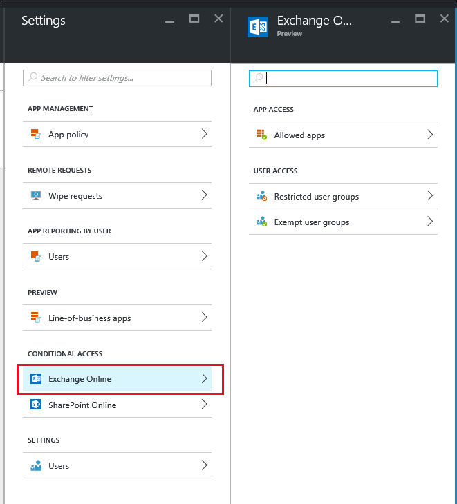

---
# required metadata

title: Configure app access for Exchange Online | Microsoft Intune
description: This topic describes how you can configure a conditional access policy for MAM apps.
keywords:
author: karthikaraman
manager: angrobe
ms.date: 10/15/2016
ms.topic: article
ms.prod:
ms.service: microsoft-intune
ms.technology:
ms.assetid: f2cd1a1f-fd29-4081-8dfa-c40993a107d5

# optional metadata

#ROBOTS:
#audience:
#ms.devlang:
ms.reviewer: chrisgre
ms.suite: ems
#ms.tgt_pltfrm:
#ms.custom:

---

# Create an Exchange Online conditional access to only allow apps supported by MAM
This topic gives you step-by-step instructions on how to set up conditional access for  Exchange Online to only allow mobile apps that support Intune mobile app management (MAM) policies.

## Create an Exchange Online policy
**Step 1:** Sign into the [Azure portal](portal.azure.com) that includes the app access feature. If you
are new to the Azure portal experience read the [Azure portal for MAM policies](azure-portal-for-microsoft-intune-mam-policies.md) topic.

**Step 2:** Go to **Browse >Intune > Intune mobile application management blade > Settings**, and in the **conditional access** section, choose **Exchange Online**.

**Step 3:** On the **Allowed apps** blade, choose **Allow apps that support Intune app policies** option to allow only apps that are supported by Intune MAM policies to have the ability to access Exchange Online. When you select the option to only allow apps that are supported by Intune MAM policies, the list of supported apps is displayed.

>[!NOTE]
>All EAS mail clients, including the built-in mail clients on iOS and Android that connect to Exchange
Online will be prevented from sending or receiving email. Users will instead receive a single email
informing them that they need to use the Outlook mail app. 

**Step 4:** To apply this policy to users, open the **Restricted user groups** blade, and choose **Add user group**. Select one or more user groups that should get this policy.

**Step 5:** You may want some users in the user group you selected in the previous step not to be affected by this policy. In such cases, add the group of users to the exempted user groups list. From the **Exchange Online** blade, choose **Exempted user groups**. Choose **Add user group** to open the list of user groups. Select the groups you want to exempt from this policy.  

## Modifying an existing policy
### Adding or deleting user groups

To **delete a user group** from the **restricted user groups** list, open the Restricted user groups blade, highlight the user group you want to delete, and click on the … to see the delete option. Choose **Delete** to remove the user group from the list. You can follow the same procedure to remove a user group from the **exempted user group** list.

## Next steps
[Configure app access for SharePoint Online](mam-ca-for-sharepoint-online.md)
[Block apps that do not have modern authentication](block-apps-with-no-modern-authentication.md)
### See also
[Protect app data with MAM policies](protect-app-data-using-mobile-app-management-policies-with-microsoft-intune.md)
