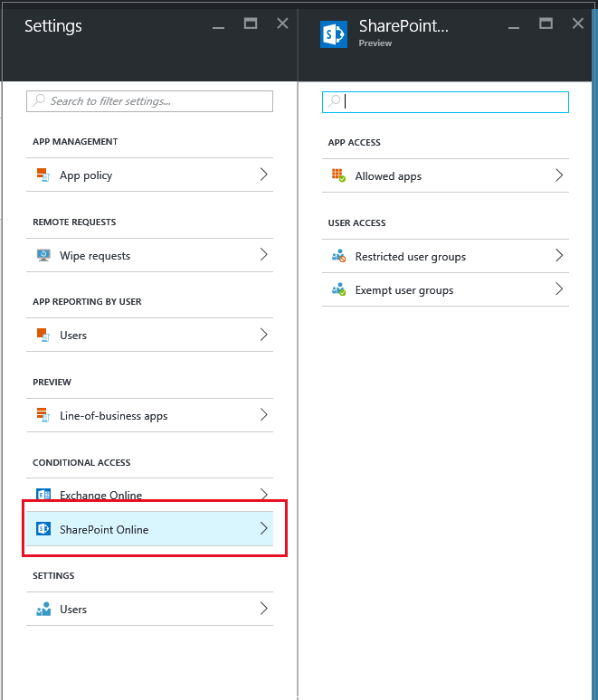
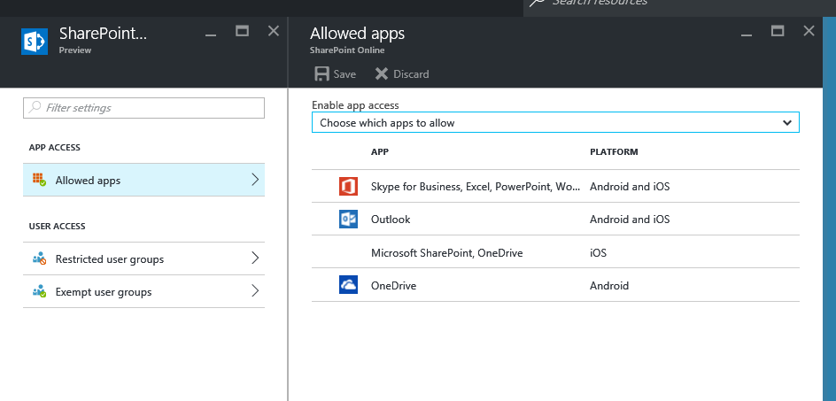

---
# required metadata

title: Configure app access for SharePoint Online | Microsoft Intune
description:
keywords:
author: karthikaraman
manager: angrobe
ms.date: 09/24/2016
ms.topic: article
ms.prod:
ms.service: microsoft-intune
ms.technology:
ms.assetid: 531b09bb-ddfd-498f-8ee3-6675d2466208

# optional metadata

#ROBOTS:
#audience:
#ms.devlang:
ms.reviewer: chrisgre
ms.suite: ems
#ms.tgt_pltfrm:
#ms.custom:

---

# Create a SharePoint Online conditional access policy for MAM apps
You can choose which apps should be allowed to access SharePoint Online and the users who are affected by the policy. This topic gives you step-by-step instructions on how to set up app access to SharePoint Online service.

## Configure a SharePoint Online policy
**Step 1:** Sign into the [Azure portal](portal.azure.com) that includes the app access feature. If  
are new to the Azure portal experience read the [Azure portal for MAM policies](azure-portal-for-microsoft-intune-mam-policies.md) topic.
**Step 2:** Go to **Browse >Intune > Intune mobile application management blade > Settings**, and in the **conditional access** section, choose **SharePoint Online**.

**Step 3:** On the **Allowed apps** blade, first select whether you want to allow all apps, or if only certain apps should have access to SharePoint Online. If you select to allow only certain apps to have access, a list of available apps is displayed. Select one or more apps from the list and save your changes.

**Step 4:** To apply this policy to users, open the **Restricted user groups** blade, and choose **Add user group**. Select one or more user groups that should get this policy.

**Step 5:** You may want some users in the user group you selected in the previous step not to be affected by this policy. In such cases, add the group of users to the exempted user groups list. From the **SharePoint Online** blade, choose **Exempted user groups**. Choose **Add user group** to open the list of user groups. Select the groups you want to exempt from this policy.  

## Modifying an existing policy
### Adding or deleting user groups
To **delete a user group** from the **restricted user groups** list, open the Restricted user groups blade, highlight the user group you want to delete, and click on the … to see the delete option. Choose **Delete** to remove the user group from the list. You can follow the same procedure to remove a user group from the **exempted user group** list.

### Adding or removing apps
To remove an app from the allowed apps list, go to the **Allowed apps** blade, and choose the app you want to unselect the app and save you changes.

## Next steps
[Configure app access for Exchange Online](mam-ca-for-exchange-online.md)
### See also
[Protect app data with MAM policies](protect-app-data-using-mobile-app-management-policies-with-microsoft-intune.md)
