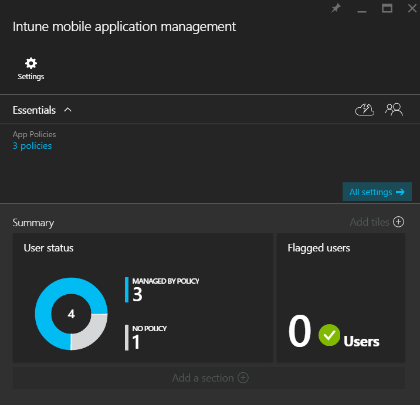

# Monitor mobile app management policies with Microsoft Intune
Use the information in this topic to help you monitor your mobile application management policies in the Azure preview portal.

## User status
The **User status** tile in the **Intune mobile application management** blade displays the compliance status of your app policies as described below:

-   **Users**- The total number of users in your company who are using work apps on their devices.

-   **POLICY**-This is the number of users who have used at least one of the apps associated with the policy.

-   **NO POLICY**- The number of users actively using work apps but not protected by the mobile application management policy.

    The **Flagged users** tile gives you the aggregated information on how many users are experiencing issues. Currently only users with jailbroken devices are marked as flagged.

    

##  Wipe requests
-   The **Wipe requests** tile shows you the summary report of the status of the wipe requests you made. Clicking on this tile will open a new blade that has more detailed information. For a detailed description of the wipe request information that is displayed in this blade, read the [Wipe managed company app data with Microsoft Intune](../Topic/Wipe-managed-company-app-data-with-Microsoft-Intune.md) topic.

    

### See also
[MAM policies in Open in management](microsoft-intune-mobile-app-management-policies-and-ios-open-in.md)

[End-user app experience](end-user-experience-for-apps-associated-with-microsoft-intune-mobile-app-management-policies.md)
