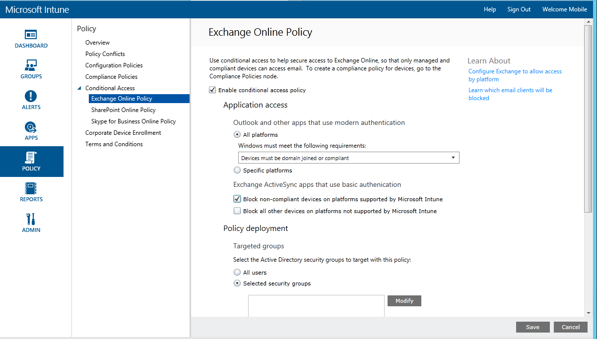

# Restrict email access to Exchange Online with Microsoft Intune

## Mobile devices
You can block access to Exchange email from the devices built-in **Exchange ActiveSync email client** on the following platforms:

- Android 4.0 and later, Samsung Knox Standard 4.0 and later

- iOS 7.1 and later

- Windows Phone 8.1 and later

You can block access to Exchange Online email from **Outlook app** on iOS and Android devices

If you configure conditional access, before a user can connect to their email, the device they use must:

-   Be enrolled with [!INCLUDE[wit_nextref](../Token/wit_nextref_md.md)] or a domain joined PC.

-   Register the device in Azure Active Directory (this happens automatically when the device is enrolled with [!INCLUDE[wit_nextref](../Token/wit_nextref_md.md)] (for Exchange Online only). Additionally, the client Exchange ActiveSync ID must be registered with Azure Active Directory.

AAD DRS will be activated automatically for Intune and Office 365 customers. Customers who have already deployed the ADFS Device Registration Service will not see registered devices in their on-premises Active Directory.

-   Be compliant with any [!INCLUDE[wit_nextref](../Token/wit_nextref_md.md)] compliance policies deployed to that device

-   You must use an Office 365 subscription that includes Exchange Online (such as E3) and users must be licensed for Exchange Online.

-   The optional **Microsoft Intune service to service connector** connects [!INCLUDE[wit_nextref](../Token/wit_nextref_md.md)] to Microsoft Exchange Online and helps you manage device information through the [!INCLUDE[wit_nextref](../Token/wit_nextref_md.md)] console (see [Mobile device management with Exchange ActiveSync and Microsoft Intune](../Topic/Mobile-device-management-with-Exchange-ActiveSync-and-Microsoft-Intune.md)). You do not need to use the connector to use compliance policies or conditional access policies, but is required to run reports that help evaluate the impact of conditional access.

   > [!NOTE]
   > Do not configure the service to service connector if you intend to use conditional access for both Exchange Online and Exchange On-premises

If a conditional access condition is not met, the user is presented with one of the following messages when they log in.

- If the device is not enrolled with [!INCLUDE[wit_nextref](../Token/wit_nextref_md.md)], or is not registered in Azure Active Directory, a message is displayed with instructions about how to install the company portal app, enroll the device, activate email, which associates the device’s Exchange ActiveSync ID with the device record in Azure Active Directory.

-   If the device is not compliant, a message is displayed that directs the user to the [!INCLUDE[wit_nextref](../Token/wit_nextref_md.md)] web portal, or the company portal app where they can find information about the problem and how to remediate it.

## Configure conditional access
### Step 1: Configure and deploy a compliance policy
Ensure that you have created and deployed a compliance policy to all devices that the Exchange conditional access policy will be targeted to.

For details about how to configure the compliance policy, see [Create a compliance policy](create-a-device-compliance-policy-in-microsoft-intune.md).

> [!IMPORTANT]
> If you have not deployed a compliance policy and then enable an Exchange conditional access policy, all targeted devices will be allowed access.

### Step 2: Evaluate the effect of the conditional access policy
If you have configured a connection between [!INCLUDE[wit_nextref](../Token/wit_nextref_md.md)] and Exchange by using the [Microsoft Intune service to service connector](Mobile-device-management-with-Exchange-ActiveSync-and-Microsoft-Intune.md#bkmk_S_S) or the [on-premises Exchange connector](Mobile-device-management-with-Exchange-ActiveSync-and-Microsoft-Intune.md#bkmk_EX_OP), you can use the **Mobile Device Inventory Reports** to identify EAS mail clients that will be blocked from accessing Exchange after you configure the conditional access policy.

1.  Navigate to **Reports -> Mobile Device Inventory Reports**.

2.  In the report parameters, select the [!INCLUDE[wit_nextref](../Token/wit_nextref_md.md)] group you want to evaluate and, if required, the device platforms to which the policy will apply.
3.  Once you’ve selected the criteria that meets your organization’s needs, choose **View Report**.
The Report Viewer opens in a new window.

After you run the report, examine these four columns to determine whether a user will be blocked:

-   **Management Channel** – Indicates whether the device is managed by Intune, Exchange ActiveSync, or both.

-   **AAD Registered** – Indicates whether the device is registered with Azure Active Directory (known as Workplace Join).

-   **Compliant** – Indicates whether the device is compliant with any compliance policies you deployed.

-   **Exchange ActiveSync ID** – iOS and Android devices are required to have their Exchange ActiveSync ID associated with the device registration record in Azure Active Directory. This happens when the user chooses the Activate Email link in the quarantine email.

    > [!NOTE]
    > Windows Phone devices always display a value in this column.

Devices that are part of a targeted group will be blocked from accessing Exchange unless the column values match those listed in the following table:

--------------------------
|Management channel|AAD registered|Compliant|Exchange ActiveSync ID|Resulting action|
|----------------------|------------------|-------------|--------------------------|--------------------|
|**Managed by Microsoft Intune and Exchange ActiveSync**|Yes|Yes|A value is displayed|Email access allowed|
|Any other value|No|No|No value is displayed|Email access blocked|
----------------------
You can export the contents of the report and use the **Email Address** column to help you inform users that they will be blocked.

### Step 3: Configure user groups for the conditional access policy
You target conditional access policies to different Azure Active Directory security groups of users depending on the policy types. These groups contain the users that will be targeted, or exempt from the policy. When a user is targeted by a policy, each device they use must be compliant in order to access email.

You can configure these groups in the **Office 365 admin center**, or the **Intune account portal**.

You can specify two group types in each policy:

-   **Targeted groups** – User groups to which the policy is applied

-   **Exempted groups** – User groups that are exempt from the policy (optional)

If a user is in both groups, they will be exempt from the policy.

Only the groups which are targeted by the conditional access policy are evaluated for Exchange access.

### Step 4: Configure the conditional access policy

The following flow is used by conditional access policies for Exchange Online to evaluate whether to allow or block devices.

#### To enable the Exchange Online policy

1.  In the [Microsoft Intune administration console](https://manage.microsoft.com), choose **Policy** &gt; **Conditional Access** &gt; **Exchange Online Policy**.

2.  On the **Exchange Online Policy** page, select **Enable conditional access policy for Exchange Online**. If you check this, the device must be compliant. If this is not checked then conditional access is not applied.

    > [!NOTE]
    > If you have not deployed a compliance policy and then enable the Exchange Online policy, all targeted devices are reported as compliant.
    >
    > Regardless of the compliance state, all users who are targeted by the policy will be required to enroll their devices with [!INCLUDE[wit_nextref](../Token/wit_nextref_md.md)].

3.  Under **Application access**, for apps that use modern authentication, you can choose to apply conditional access policy to:

    -   **All platforms**

        This will require that any device used to access **Exchange  Online**,  to be enrolled in Intune and compliant with the policies.  Any client application using **modern authentication** is subject to the conditional access policy, and if the platform is currently not supported by Intune, access to **Exchange Online** is blocked.

    -   **Specific platforms**

        If you choose the **Specific platforms** option, you will see a list of platforms that you can individually select.   Conditional access policy will apply to any client app that is using **modern authentication**, but only on the device platforms you select.

    > [!TIP]
    > **Modern authentication** brings Active Directory Authentication Library (ADAL)-based sign in to Office clients.
    >
    > -   The ADAL based authentication enables Office clients to engage in browser-based authentication (also known as passive authentication).  To authenticate, the user is directed to a sign-in web page.
    > -   This new sign-in method enables new scenarios such as, conditional access, based on **device compliance** and whether **multi-factor authentication** was performed.
    >
    > This [article](https://blogs.office.com/2014/11/12/office-2013-updated-authentication-enabling-multi-factor-authentication-saml-identity-providers/) has more detailed information on how modern authentication works.

4.  Under **Exchange ActiveSync apps**, you can choose to block noncompliant devices from accessing Exchange Online if the device is noncompliant, and select whether to allow or block access to email when Microsoft Intune cannot manage the device.

5.  Under **Targeted Groups**, select the Active Directory security groups of users to which the policy will apply. You can either choose to target all users or a selected list of user groups.

    > [!NOTE]
    > For users that are in the Targeted groups, the Intune polices will replace Exchange rules and policies.
    >
    > Exchange will only enforce Exchange allow, block and quarantine rules, and Exchange policies if:
    >
    > -   The user is not licensed for Intune.
    > -   The user is licensed for Intune, but the user does not belong to any security groups targeted in the conditional access policy.

6.  Under **Exempted Groups**, select the Active Directory security groups of users that are exempt from this policy. If a user  is in both the targeted and exempted groups, they will be exempt from the policy.

7.  When you are done, choose **Save**.

-   You do not have to deploy the conditional access policy, it takes effect immediately.

-   After a user creates an email account, the device is blocked immediately.

-   If a blocked user enrolls the device with [!INCLUDE[wit_nextref](../Token/wit_nextref_md.md)] (or remediates noncompliance), email access is unblocked within 2 minutes.

-   If the user un-enrolls their device, email is blocked after around 6 hours.

## Step 5: Monitor the compliance and conditional access policies

#### To view devices that are blocked from Exchange

On the [!INCLUDE[wit_nextref](../Token/wit_nextref_md.md)] dashboard, choose the **Blocked Devices from Exchange** tile to show the number of blocked devices and links to more information.

## Next steps
[Restrict access to SharePoint Online]()
[Restrict access to Skype for Business Online]()

### See also
[Restrict access to Exchange On-premises]()
[Restrict access to new Exchange Online Dedicated]()
[Restrict access to legacy Exchange Online Dedicated]()
