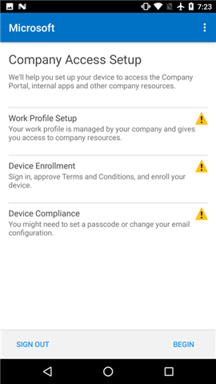
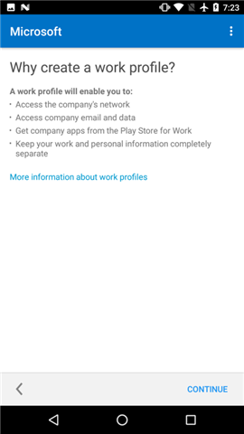
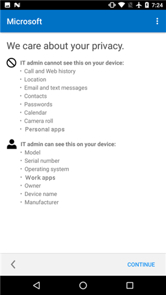
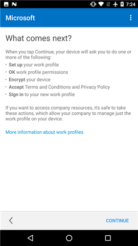
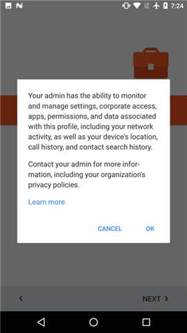
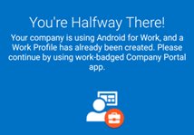
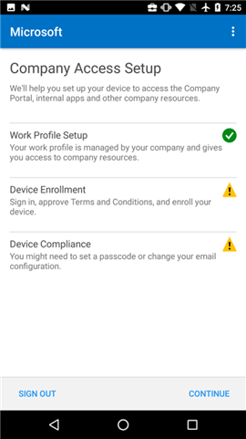
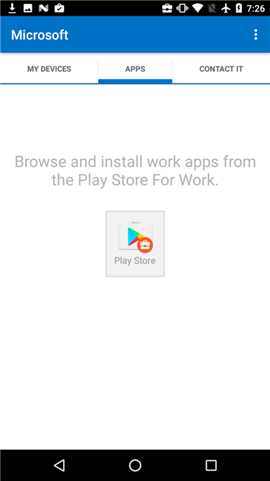

---
# required metadata

title: Create a work profile and enroll your device in Intune | Microsoft Intune
description: Describes how to encrypt an Android device
keywords:
author: staciebarker
manager: angrobe
ms.date: 10/12/2016
ms.topic: article
ms.prod:
ms.service: microsoft-intune
ms.technology:
ms.assetid: 33ffff16-0280-43bf-87b3-74ddf4439bfa

# optional metadata

#ROBOTS: 
#audience:
#ms.devlang:
ms.reviewer: arnab
ms.suite: ems
#ms.tgt_pltfrm:
#ms.custom:

---

# Create a work profile and enroll your device in Intune

A work profile is something that you set up on your device to enable you to access your work or school email, apps, and files. You can find out more about [what happens when you create a work profile](what-happens-when-you-create-a-work-profile-android.md).

To create a work profile:

1.  On the Android Company Portal **Welcome** screen, tap **Sign in**, and then sign in with your work or school account. If you haven't installed the free app yet, download and install it from [Google Play](http://play.google.com/store/apps/details?id=com.microsoft.windowsintune.companyportal).

	

2. On the **Company Access Setup** screen, tap **BEGIN**.

	

3.  On the **Why create a work profile?** screen, read about what you'll be able to do, and then tap **CONTINUE**.

	

4.  Review a list of what your IT administrator can and can't see on your device, and tap **CONTINUE**.

	

5.  On the **What comes next** screen, read about what's going to happen next, and then tap **ENROLL**.

	

6. On the **Set up work profile** screen, tap **NEXT** to let the Company Portal app access the work profile.

	

7. Review the Google screen that describes what your IT administrator can do when you create a work profile, and then tap **OK**.

	

	You'll see a couple of messages that say "Setting up your work profile" and "Enrolling your device."

8. On the **You're Halfway There!** screen, tap the Company Portal app icon that has the badge on it.

	

9. On the Android Company Portal **Welcome** screen, tap **Sign in**, and then sign in with your work or school account.

10. On the **Company Access Setup** screen, note that your Work Profile Setup is now complete, and then tap **CONTINUE**.

	

	You'll briefly see the message "Enrolling your device."

11. When the **Company Access Setup** screen shows that everything has been set up correctly, tap **CONTINUE**. 

	

12. On the **Company Access Setup complete** screen, tap **DONE**.

	

	You are taken to the Play Store for Work, where you can now get company apps.

	

Still need help? Contact your IT administrator. For contact information, check the [Company Portal website](http://portal.manage.microsoft.com).

