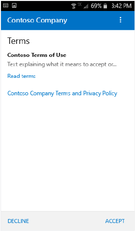
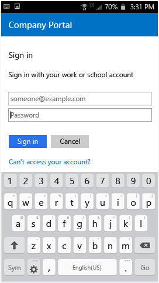
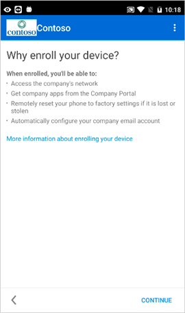
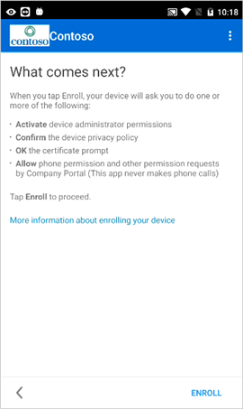
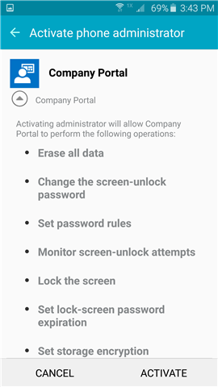
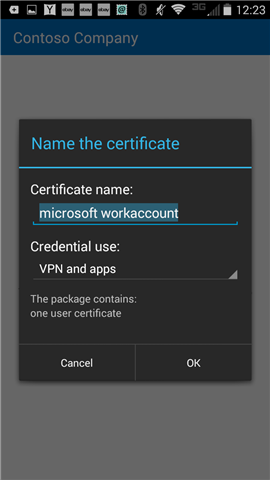
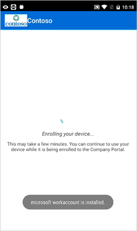

---
# required metadata

title: Enroll your Android device in Intune | Microsoft Intune
description:
keywords:
author: staciebarker
manager: jeffgilb
ms.date: 04/28/2016
ms.topic: article
ms.prod:
ms.service:
ms.technology:
ms.assetid: 0ed3a002-7533-4001-ae24-e10b64b66620

# optional metadata

#ROBOTS:
#audience:
#ms.devlang:
ms.reviewer: jeffgilb
ms.suite: ems
#ms.tgt_pltfrm:
#ms.custom:

---

# Enroll your Android device in Intune

If your company or school uses Microsoft Intune, you can enroll your Android device to get access to company email, files, and other resources. Enrolling your devices allows your IT department to manage those work or school resources and keep them secure, while giving you the freedom to use your preferred device to get your work done. To learn more about enrollment, see [What happens when I install and Company Portal app and enroll my device?](what-happens-if-you-install-the-Company-Portal-app-and-enroll-your-device-in-intune-android.md).

These enrollment instructions are for Samsung Knox Android devices and "native" (non-Samsung Knox) Android devices. To determine if you have a Samsung Knox device, go to **Settings** &gt; **About phone**. If you don't see the word  "Knox" listed there, you have a native Android device.

Before or after enrolling, you may be asked to choose a category that best describes how you use your device. Your IT administrator uses this category to help determine what apps you have access to.

If you get an error while trying to enroll your device in Intune, you can [send enrollment errors to your IT admin](send-enrollment-errors-to-your-it-administrator-android.md).

**To enroll your Android device:**

1.  Install the free Intune Company Portal app from [Google Play](http://play.google.com/store/apps/details?id=com.microsoft.windowsintune.companyportal). 
  
2.  Open the Microsoft Intune Company Portal app.

3.  On the Company Portal **Welcome** screen, tap **Sign in**, and then sign in with your work or school account.

	   

4.  If your IT administrator set up company terms and conditions, tap **ACCEPT** to accept the terms.

	

5. If you're using Android 6.0 or later, do this step. Otherwise, go to the next step.
    
  	If your IT administrator has set up certain policies, you may see the following messages: 

	
	- **Allow Company Portal to make and manage phone calls?**: If you see this message, tap **ALLOW**. It is safe to tap ALLOW, because Microsoft never makes or manages your phone calls! Google controls the message text, and Microsoft cannot change it. When you allow access, all you're doing is allowing your device to write data logs to the device's SD card, which in turn lets you move those logs by using a USB cable. You might need to use this capability to send logs to your IT administrator if you have a problem while using the Company Portal app. Learn how to [send enrollment errors to your IT administrator](send-enrollment-errors-to-your-it-administrator-android.md).

		 If you deny access, the message will appear again the next time you sign in to the Company Portal, but you can turn off future messages by tapping the **Never ask again** check box.  If you later decide to allow access, go to **Settings** &gt; **Apps** &gt; **Company Portal** &gt; **Permissions** &gt; **Phone**, and then turn on the permission.

	

	- **Allow Company Portal to access your contacts?**: If you see this message, tap **ALLOW**. It is safe to tap ALLOW, because **Microsoft never accesses your contacts!** Google controls the message text, and Microsoft cannot change it. When you allow access, it only allows the Company Portal app to access data logs to help troubleshoot issues with your device. 

		If you deny access, the message will appear again the next time you tap **Send Data**, but you can turn off future messages by tapping the **Never ask again** check box. If you later decide to allow access, go to **Settings** &gt; **Apps** &gt; **Company Portal** &gt; **Permissions** &gt; **Storage**, and then turn on the permission.

	

  
6.	Sign in to the Company Portal app using your work or school account and password, and tap **Sign in**.

	

7.	On the **Company Access Setup** screen, tap **BEGIN**.

	

8.	On the **Why enroll your device?** screen, read about what you can do when you enroll your device, and then tap **CONTINUE**.

	
   
9. Review a list of what your IT administrator can and can't see on your device, and tap **CONTINUE**.

	
 
10. On the **What comes next** screen, read about what happens during enrollment, and then tap **ENROLL**.

	
 
11. On the **Activate device administrator** screen, tap **Activate**.

	

12. Follow the prompts to enter a PIN or password. If you already set up a PIN or password on this device, you won't see this screen or be required to enter a new PIN or password.

	

13.	Follow the instructions below that match the type of device you’re using (native Android or Samsung Knox). To determine if you have a Samsung Knox device, go to **Settings** &gt; **About phone**. If you don't see the word "Knox" listed there, you have a native Android device.

	-	Native (non-Samsung Knox) device: On the **Name the certificate** screen, tap **OK** to accept the default certificate.

	

	-	Samsung Knox device: Accept the privacy policy, and tap **CONFIRM**.

	

	You’ll see the following message appear on your screen as Intune enrolls your device.

	
  
14. When the **Company Access Setup** screen appears, tap **CONTINUE**. If you see a message indicating that your device is out of compliance, follow the instructions to fix the issue, and then tap **CONTINUE**.

	  

11. On the **Company Access Setup complete** screen, tap **DONE**. Your device is now enrolled.

	

Before trying to install company apps, go to **Settings** &gt; **Security**, and turn on **Unknown sources**. If you don't turn on this option before trying to install apps, you'll see the message "Install blocked." For security reasons, your phone is set to block installations of apps obtained from unknown sources." You can tap **Settings** on the error dialog to go to the **Unknown sources** option.

### See also
[Using your Android device with Intune](using-your-android-device-with-intune.md)