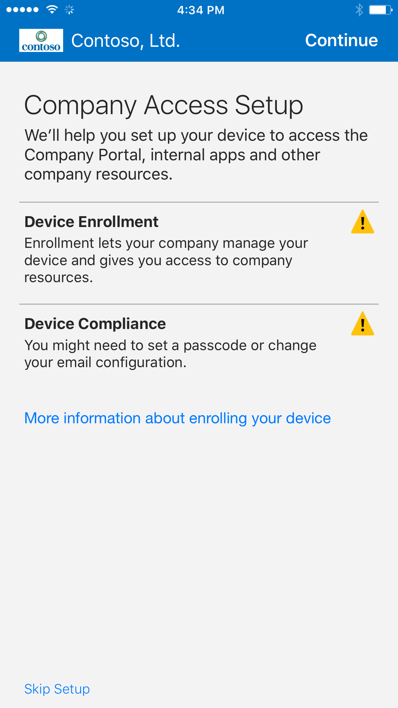
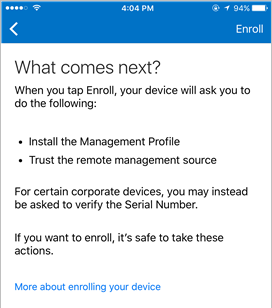

---
# required metadata

title: Enroll your iOS device in Intune | Microsoft Intune
description:
keywords:
author: Staciebarker
manager: jeffgilb
ms.date: 05/18/2016
ms.topic: article
ms.prod:
ms.service: microsoft-intune
ms.technology:
ms.assetid: 6eeec7aa-1b07-4ce3-894c-13e09b89bdd4

# optional metadata

ROBOTS:
#audience:
#ms.devlang:
ms.reviewer: esmich
ms.suite: ems
#ms.tgt_pltfrm:
#ms.custom:

---

# Enroll your iOS device in Intune

If your company or school uses Microsoft Intune, you can enroll your iOS device to get access to company email, files, and other resources. Enrolling your devices allows your IT department to manage those work or school resources and keep them secure, while giving you the freedom to use your preferred device to get your work done. To learn more about enrollment, see [What happens if you install the Company Portal app and enroll your device in Intune?](what-happens-if-you-install-the-company-portal-app-and-enroll-your-device-in-intune-ios.md).

If you're trying to enroll a Mac OS X device, see [Enroll your Mac OS X device in Intune](enroll-your-device-in-intune-mac-os-x.md).

If you need help and can't find your IT administrator's contact information, see if it's listed on the [Company Portal website](http://portal.manage.microsoft.com).

**To enroll your iOS device:**

1.  Follow the steps in [Install and sign in to the Intune Company Portal app](install-and-sign-in-to-the-intune-company-portal-app-ios.md).

2. On the **Company Access Setup** page, tap **Begin**.

	 

3. On the **Why enroll your device?** screen, read about what you can do when you enroll your device, and then tap **Continue**.

	 

4. Review a list of what your IT administrator can and can’t see on your enrolled device, and tap **Continue**.

	 

5.  On the **What comes next** screen, read about what happens during enrollment, and then tap **Enroll**.

 	 

6.  On the **Install Profile** screen, tap **Install**, and enter your passcode, if prompted.

	 
  
7.  Tap **Install**.

	    

8.  Tap **Install** to indicate that you've read the warning.

   	 

9.  Tap **Trust**.

   	 

10.  When the screen changes to show that the profile has finished installing, Tap **Done**.

 	 

	An “Enrolling device” message displays on the screen.

11.  When a message displays asking if you want to open the page in the Company Portal, tap **Open**.

	 

12. On the **Company Access Setup** screen, tap **Continue**. If your IT administrator set up additional security requirements, such as the need to set a password, follow the on-screen instructions until you meet all of the compliance requirements and are returned to the Company Access Setup screen, and then tap **Continue**.

	 

13. Tap **Done**. 

	 

Your device is now enrolled in Intune, and you are taken back to the Company Portal app.

	

  

### See also
[Using your iOS or Mac OS X device with Intune](using-your-ios-or-mac-os-x-device-with-intune.md)