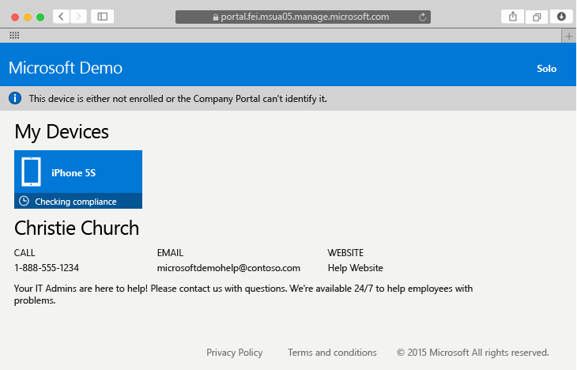
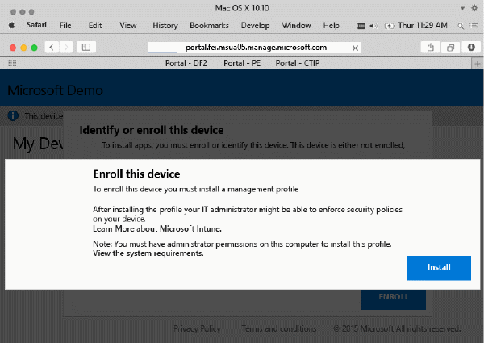
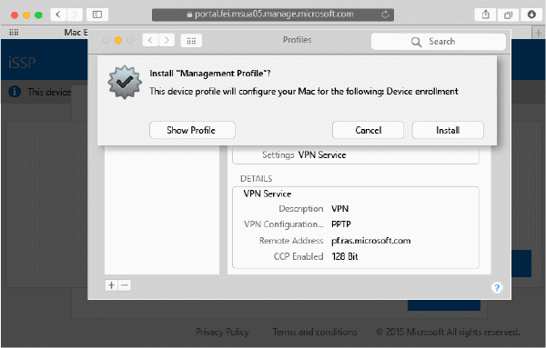
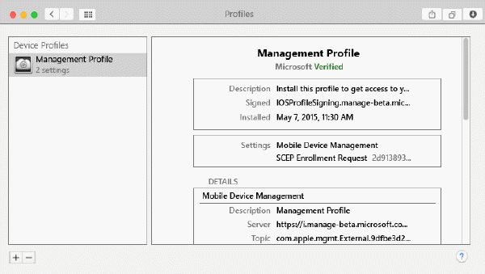

---
# required metadata

title: Enroll your Mac OS X device in Intune | Microsoft Intune
description:
keywords:
author: Staciebarker
manager: jeffgilb
ms.date: 04/28/2016
ms.topic: article
ms.prod:
ms.service:
ms.technology:
ms.assetid: 58eb0e7a-1321-4c66-a281-88fb01e72c1c

# optional metadata

ROBOTS: noindex
#audience:
#ms.devlang:
ms.reviewer: jeffgilb
ms.suite: ems
#ms.tgt_pltfrm:
#ms.custom:

---

# Enroll your Mac OS X device in Intune

Enrolling your Mac OS X device in Intune enables you to access the company’s network, your work email and work files, and lets you get company apps. For more about what happens when you enroll your device, see [What happens if you install the Company Portal app and enroll your device in Intune?](what-happens-if-you-install-the-company-portal-app-and-enroll-your-device-in-intune-ios.md).

If you're trying to enroll an iOS device, see [Enroll your iOS device in Intune](enroll-your-device-in-intune-ios.md).

To see instructions with screenshots, see [Intune End-user enrollment instructions](https://gallery.technet.microsoft.com/End-user-Intune-enrollment-55dfd64a).

To enroll your Mac OS X device:

1.  Using a Safari browser, open the [Company Portal website](https://portal.manage.microsoft.com), and tap the notification bar.

2.  Tap **This device is either not enrolled or the Company Portal can't identify it**.

	 

3.  Tap **Install** to start enrolling your device.

   	 

4.  On the **Install Management Profile** dialog, tap **Install**. If a dialog box appears asking you to enter your credentials, enter your username and password, and then tap **Continue** &gt; **Install**.

  	 

	When you finish enrolling, you'll see a Management Profile page showing that your profile has been verified.

	 

### See also
[Using your iOS or Mac OS X device with Intune](using-your-ios-or-mac-os-x-device-with-intune.md)