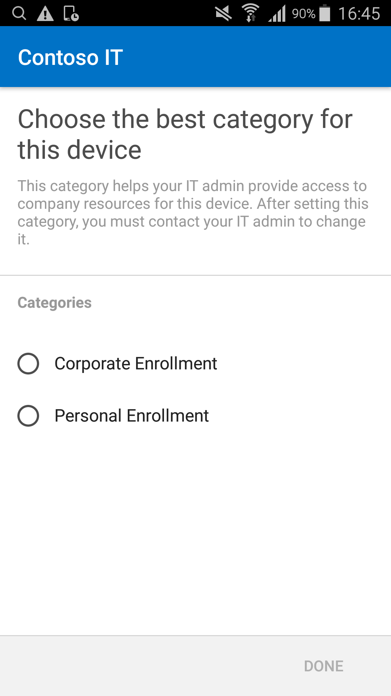

---
# required metadata

title: Enroll your Android device in telecom expense management with Intune
description:
keywords:
author: barlanmsft
ms.author: barlan
manager: angrobe
ms.date: 03/02/2017
ms.topic: article
ms.prod:
ms.service: microsoft-intune
ms.technology:
ms.assetid: 26aa3698-7e4d-453a-8852-ab75e72b6485
searchScope:
 - Company Portal

# optional metadata

ROBOTS: NOINDEX,NOFOLLOW
#audience:
#ms.devlang:
ms.reviewer: sumitp
ms.suite: ems
#ms.tgt_pltfrm:
ms.custom: intune-enduser

---

# Enroll your Android device in telecom expense management

Your organization may be using telecom expense management software to ensure that their data and voice plans are being used within acceptable limits. Once you have completed enrolling your device, you will then be prompted to select the best category for that device.

	

1. Select the appropriate option, and you will receive a notification to install the [__Datalert__](https://play.google.com/store/apps/details?id=fr.memobox.databox) app from the Google Play Store. The Datalert app is how your organization can measure data usage. Tap the __next__ arrow at the top right corner of the screen to proceed.

  

2. Provide your device's phone number.

  

3. You will then receive a verification code through an SMS message. Provide the code and tap __OK__.

  

4. Once you've provided the verification code, Datalert setup will complete. Tap __Finish__ and you will be able to monitor your data from the Datalert app.

  

Once you've enrolled, you will begin to see your data usage in the Datalert app.

Still need help? Contact your IT admin. For contact information, check the [Company Portal website](http://portal.manage.microsoft.com).
