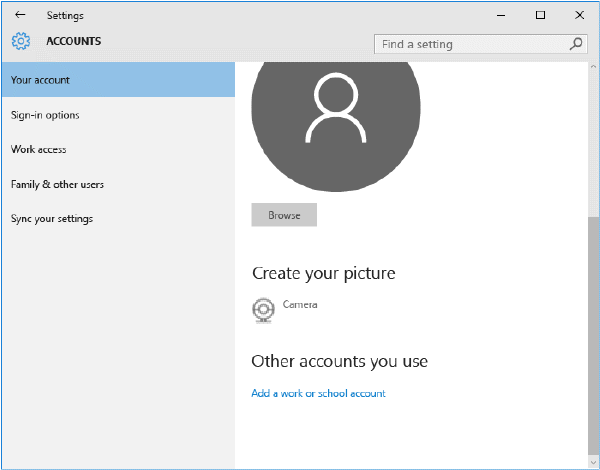

# Enroll your Windows 10 Mobile or Windows 10 desktop device in Intune

To learn about what happens when you enroll, see [What happens if you install the Company Portal app and enroll your device in Intune?](what-happens-if-you-install-the-company-portal-app-and-enroll-your-device-in-intune-windows.md).

To enroll your Windows 10 Mobile or Windows 10 desktop device:

1.  Go to Windows  **Settings** and tap **Accounts**.

    

2.  Tap **Your account**.

    

3.  Tap **Add a work or school account**.

    

4.  Sign in with your work or school credentials.

    

If you followed the steps above, but still can't access your work or school email, files, and other data, go back to **Accounts** and tap **Work access**.

-   If you see your work or school account, congratulations. You’re connected.

-   If you don’t see your work or school account, tap **Connect**, and then sign in with your work or school credentials.

We also recommend that you install the Company Portal app, which lets you easily identify and get the company apps that are relevant to you and your role. Depending on how your company  configured Intune, the Company Portal app may have been installed as part of your enrollment process. To check if you have the app, look for **Company Portal** in your apps list. If you don't see the Company Portal in your list of apps, follow these steps to install it.

1.  Tap **Start** &gt; **Store**.

2.  Tap **Search** and type **company portal**.

3.  In the list of results, tap **Company Portal** &gt; **Install**.

4.  Tap  either **Install** or **Free**. The option shown depends on how your company configured the app.

### See also
[Enroll your Windows device in Intune](enroll-your-device-in-intune-windows.md)
[Using your Windows device with Intune](using-your-windows-device-with-intune.md)

