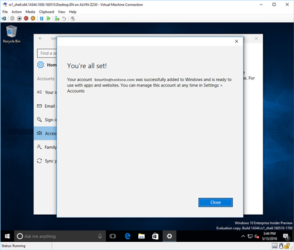

---
# required metadata

title: Enroll your Windows 10 device in Intune | Microsoft Intune
description: Describes how to enroll a Windows 10 mobile or desktop device in Intune
keywords:
author: Staciebarker
manager: angrobe
ms.date: 06/27/2016
ms.topic: article
ms.prod:
ms.service: microsoft-intune
ms.technology:
ms.assetid: 36250832-c6fd-4e8d-b681-de735023ebc3

# optional metadata

#ROBOTS:
#audience:
#ms.devlang:
ms.reviewer: priyar
ms.suite: ems
#ms.tgt_pltfrm:
#ms.custom:

---

# Enroll your Windows 10 Mobile or Windows 10 desktop device in Intune

If your company or school uses Microsoft Intune, you can enroll your devices to get access to company email, files, and other resources. Enrolling your devices enables your organization to keep corporate data secure. To learn more about enrollment, see [What happens if you install the Company Portal app and enroll your device in Intune?](what-happens-if-you-install-the-company-portal-app-and-enroll-your-device-in-intune-windows.md) and [What your IT administrator can and can't see on your device](what-can-your-it-administrator-see-when-you-enroll-your-device-in-intune-windows.md).

To enroll your Windows 10 Mobile or Windows 10 desktop device:

1.  Go to Windows  **Settings** and tap **Accounts**.

    

2.  Look at the next two screens, and find the one that looks like what you see on your device. Follow the steps that go with the screen you see on your device.

	If you see this screen, follow the steps in [Steps to follow if you see Access work or school](#steps-to-follow-if-you-see-access-work-or-school).

    

	If you see this screen, follow the steps in [Steps to follow if you see Your account](#steps-to-follow-if-you-see-access-your-account).

	

## Steps to follow if you see Access work or school

1.  Tap **Access work or school**.

    

2.  Enter your work or school email, and tap **Next**.

    

3. Sign in to Intune using your work or school account.

	

	You’ll see a message indicating that your company or school is registering your device.

4. When you see the **You’re all set!** page, tap **Close**. You’re done.

  

5. If you want to double-check that your connection looks right, go back to **Settings**, and you can now see that your work or school account is listed.

	

If you followed the steps above, but you still can’t access your work or school email and files, follow the steps in [Troubleshooting steps to follow if you see Access work or school](troubleshoot-your-windows-10-device-windows.md#troubleshooting-steps-to-follow-if-you-see-access-work-or-school).

## Steps to follow if you see Your account

1.  Go to Windows  **Settings** and tap **Accounts**.

    

2.  Tap **Your account**.

    

3.  Tap **Add a work or school account**.

	

4.  Sign in with your work or school credentials.

	

If you followed the steps above, but still can't access your work or school email, files, and other data, try the troubleshooting steps in [Troubleshooting steps to follow if you see Your account](troubleshoot-your-windows-10-device-windows.md#troubleshooting-steps-to-follow-if-you-see-your-account).

We also recommend that you install the Company Portal app, which lets you easily identify and get the company apps that are relevant to you and your role. Depending on how your company  configured Intune, the Company Portal app may have been installed as part of your enrollment process. To check if you have the app, look for **Company Portal** in your apps list. If you don't see the Company Portal in your list of apps, follow these steps to install it.

1.  Tap **Start** &gt; **Store**.

2.  Tap **Search** and type **company portal**.

3.  In the list of results, tap **Company Portal** &gt; **Install**.

4.  Tap  either **Install** or **Free**. The option shown depends on how your company configured the app.

Still need help? Contact your IT administrator. For their contact information, check the [Company Portal website](http://portal.manage.microsoft.com).

### See also
[Using your Windows device with Intune](using-your-windows-device-with-intune.md)
