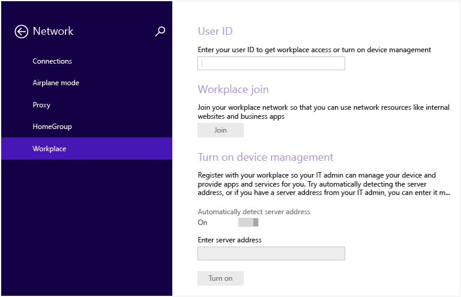

# Enroll your Windows 8.1 or Windows RT 8.1 device in Intune

To learn about what happens when you enroll, see [What happens if you install the Company Portal app and enroll your device in Intune?](what-happens-if-you-install-the-company-portal-app-and-enroll-your-device-in-intune-windows.md).

To enroll your Windows 8.1 or Windows RT 8.1 device:

1.  On the device, tap **Settings** &gt; **PC Settings** &gt; **Network** &gt; **Workplace**.

    

2.  Enter your work or school email for the User ID, if required, and then tap **Join**.

    If your user ID is not required,  the email address that you entered when you logged into this device is used.

3.  Type the password for your work or school email.

    

4.  Under **Turn on device management**, tap **Turn on**.

    

5.  In the **Allow apps and services from IT admin** dialog,  select the  **I agree** check box, and then tap **Turn on**.

    

    When you have successfully enrolled, you'll see the following screen.

    

We also recommend that you install the Company Portal app, which lets you easily identify and get the company apps that are relevant to you and your role. Depending on how your company  configured Intune, the Company Portal app may have been installed as part of your enrollment process. To check if you have the app, look for **Company Portal** in your apps list. If you don't see the Company Portal in your list of apps, follow these steps to install it.

1.  Tap **Start** &gt; **Store**.

2.  Tap **Search** and type **company portal**.

3.  In the list of results, tap **Company Portal**.

4.  Tap  either **Install** or **Free**. The option shown depends on how your company configured the app.

### See also
[Enroll your Windows device in Intune](enroll-your-device-in-intune-windows.md)
[Using your Windows device with Intune](using-your-windows-device-with-intune.md)

