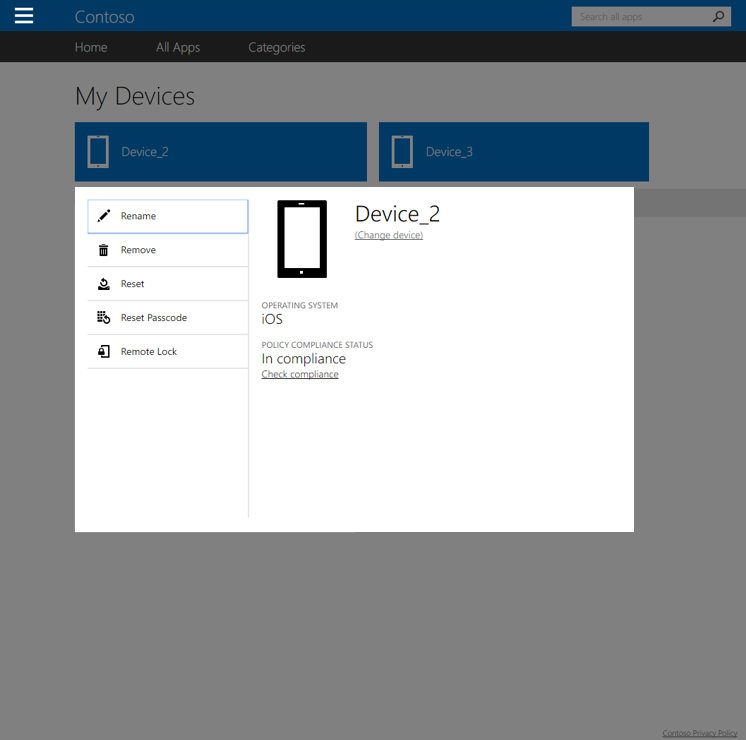

---
# required metadata

title: Remove your device from the Company Portal | Microsoft Intune
description:
keywords:
author: Staciebarker
manager: angrobe
ms.date: 07/26/2016
ms.topic: article
ms.prod:
ms.service: microsoft-intune
ms.technology:
ms.assetid: e240419a-a836-4be3-8fd9-39a4ec890226

# optional metadata

ROBOTS: noindex,nofollow
#audience:
#ms.devlang:
ms.reviewer: mamoriss
ms.suite: ems
#ms.tgt_pltfrm:
#ms.custom:

---

# Remove your device from the Company Portal

If you decide you no longer want your device to be managed by Intune and your IT administrator, you can remove it from the Company Portal by using the [Company Portal website](http://portal.manage.microsoft.com). The Company Portal website is a web page that you can use to manage computers and devices that you have enrolled in Intune and to do most of the same tasks that you can do when using your Company Portal app.

If you remove your device, it will no longer be listed in the Company Portal, and you might also lose access to company or school data, apps, and email.

To remove your device:

1.  Open the [Company Portal website](http://portal.manage.microsoft.com) and tap the device whose name you want to change.

2.  Tap **Remove**.

    

3. Read the warning message, indicating what will happen if you remove your device, and then tap **Remove** to remove your device from the Company Portal.

Your device has now been removed.

Still need help? Contact your IT administrator. For their contact information, check the [Company Portal website](http://portal.manage.microsoft.com).

### See also
[Using the Intune Company Portal website](using-the-intune-company-portal-website.md)
