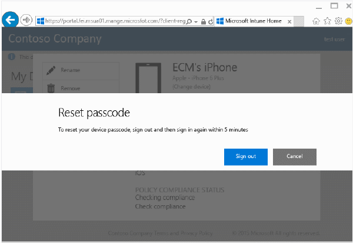
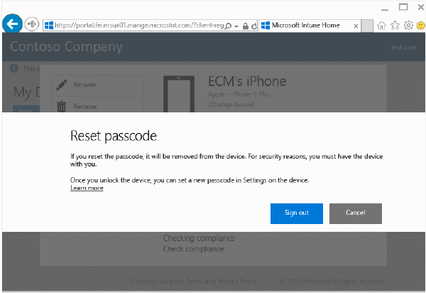

---
# required metadata

title: Reset your device passcode from the Company Portal website | Microsoft Intune
description:
keywords:
author: Staciebarker
manager: angrobe
ms.date: 09/19/2016
ms.topic: article
ms.prod:
ms.service: microsoft-intune
ms.technology:
ms.assetid: 4fa3255b-9d1e-42d5-bd8b-70963dcf2d86

# optional metadata

ROBOTS: NOINDEX,NOFOLLOW
#audience:
#ms.devlang:
ms.reviewer: mamoriss
ms.suite: ems
#ms.tgt_pltfrm:
#ms.custom:

---

# Reset your device passcode from the Company Portal website

If you lose your device PIN or password for a device that you have enrolled in Intune, you can use the [Company Portal website](http://portal.manage.microsoft.com) to reset it. You can use the Company Portal website to manage computers and devices that you have enrolled in Intune and to do most of the same tasks that you can do when you use your Company Portal app.

> [!NOTE]
> You might not see the **Reset Passcode** button on the Company Portal website, depending on how your IT admin has configured Intune. Passcode reset is not supported on Windows 8.1 devices.

To reset your passcode:

1.  Open the [Company Portal website](http://portal.manage.microsoft.com) and choose the device whose passcode you want to reset.

2.  Choose **Reset Passcode**.

    

3.  Choose **Sign out**, and then sign back in with your work or school credentials. You have to sign back in within five minutes.

    

4.  Choose **Reset Passcode**.

    

    Check the table to see how **Reset Passcode** works on your device.

    |Platform|Support|
    |------------|-----------|
    |Android|Creates a new, temporary, alphanumeric passcode.|
    |iOS|Removes the passcode from the device and does not create a new temporary passcode. If you're using Touch ID, you'll need to set it up again on your device, because it gets removed when you reset your passcode.|
    |Windows 10 (mobile devices only)|Creates a new, temporary, alphanumeric passcode. Windows Hello is supported.|
    |Windows Phone 8.1|Creates a new, temporary, numeric passcode.|
    After you unlock your device, you can set a new passcode by going to **Settings** on your device.

5.  Unlock your device and then set a new passcode, or change the temporary passcode by going to **Settings** on your device.

    To see a notification confirming that your password was reset successfully, click the notification flag at the top right of the Company Portal website.

Still need help? Contact your IT administrator. For their contact information, check the [Company Portal website](http://portal.manage.microsoft.com).
