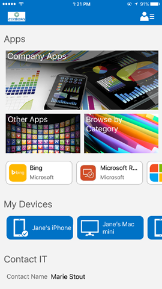

---
# required metadata

title: Sync your iOS device manually | Microsoft Intune
description:
keywords:
author: Staciebarker
manager: angrobe
ms.date: 08/29/2016
ms.topic: article
ms.prod:
ms.service: microsoft-intune
ms.technology:
ms.assetid: 2780101b-f703-4b78-9d33-f68490b9382d

# optional metadata

ROBOTS: NOINDEX,NOFOLLOW
#audience:
#ms.devlang:
ms.reviewer: esmich
ms.suite: ems
#ms.tgt_pltfrm:
#ms.custom:

---

# Sync your iOS device manually

If your app installation is taking too long, use the following instructions to manually sync your iOS device. Syncing manually might help to speed up the installation. The sync feature applies only to iOS, not to Mac OS X.

1. Open the iOS Company Portal app.

2. In the **My Devices** section, choose the device that you are currently using. This is the leftmost device tile that shows the check mark.

    

3.  Choose the **Sync** button at the bottom right of the screen.

    

A spinning circle appears on the screen until the sync is finished.

Still need help? Contact your IT admin. For their contact information, check the [Company Portal website](http://portal.manage.microsoft.com).
