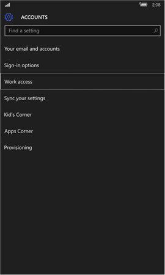
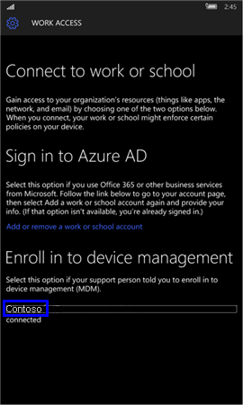
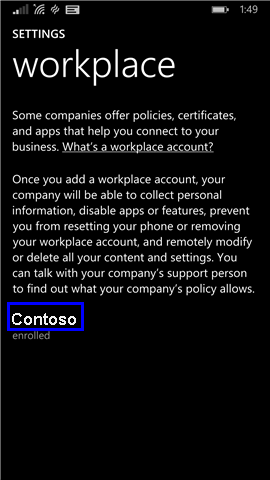

---
# required metadata

title: Sync your Windows device manually | Microsoft Intune
description:
keywords:
author: Staciebarker
manager: angrobe
ms.date: 05/18/2016
ms.topic: article
ms.prod:
ms.service: microsoft-intune
ms.technology:
ms.assetid: 443c6de7-5187-4dc4-b844-6085a0c659bd

# optional metadata

ROBOTS: noindex,nofollow
#audience:
#ms.devlang:
ms.reviewer: priyar
ms.suite: ems
#ms.tgt_pltfrm:
#ms.custom:

---

# Sync your Windows device manually
If your app installation is taking too long, use the following instructions to manually sync your Windows device, which might help to speed up the installation. The only versions that are supported are the ones listed. Use the link, shown in the "In this Article" section above, that matches the type of device you have:

* [Windows 10 Mobile](#windows-10-mobile)
* [Windows 10 Desktop](#windows-10-desktop)
* [Windows Phone 8.1](#windows-phone-8-1)

## Windows 10 Mobile
To manually sync your Windows 10 Mobile device to speed up a slow app installation:

1. Go to **All apps** > **Settings** > **Accounts**.

    

2. Tap **Work access**.

    

3. Under **Enroll in to device management**, tap your company name, as shown below.

    

4. Tap the **Sync** icon.

    

    The message “We’re synching your account” displays at the top of the screen. The Sync button is grayed out until your device finishes syncing.

## Windows 10 desktop
To manually sync your Windows 10 desktop device to speed up a slow app installation:

1. Select the **Start** button, as shown below, and then select **Settings**.

    

2. On the **Settings** page, select **Accounts**.

    

3. On the **Accounts** page, select **Work access**.

    

4. Under the section **Enroll in to device management**, click the name of your company, as shown in blue highlighting below.

    

5. Select the **Sync** button.

    

   The button becomes grayed out until the sync is complete.

## Windows Phone 8.1
To manually sync your Windows Phone 8.1 device to speed up a slow app installation:

1. Go to **All apps** > **Settings** > **workplace**.

    

2. Tap the name of your company, as indicated in blue highlighting below.

    

3. Tap the **Sync** icon.

    

   The message “We’re synching your account” displays at the top of the screen until your device finishes syncing.

Still need help? Contact your IT administrator. For their contact information, check the [Company Portal website](http://portal.manage.microsoft.com).

### See also
[Using your Windows device with Intune](using-your-windows-device-with-intune.md)
