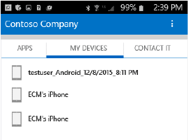
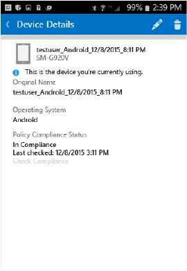
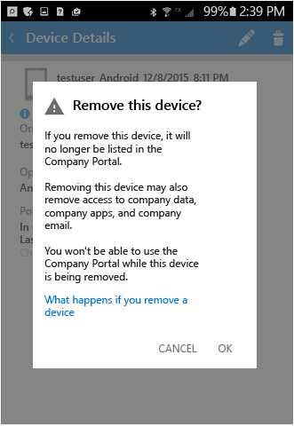

---
# required metadata

title: Unenroll your Android device from Intune | Microsoft Intune
description: unenroll Android device
keywords:
author: staciebarker
manager: jeffgilb
ms.date: 04/28/2016
ms.topic: article
ms.prod:
ms.service: microsoft-intune
ms.technology:
ms.assetid: f40aab26-7613-48cc-a74e-de83df9465a4

# optional metadata

#ROBOTS:
#audience:
#ms.devlang:
ms.reviewer: arnab
ms.suite: ems
#ms.tgt_pltfrm:
#ms.custom:

---

# Unenroll your Android device from Intune

When you unenroll your Android device from Intune, your device will no longer be able to access company resources.  For more about what happens when you unenroll, see [What happens if you unenroll your device from Intune?](what-happens-if-you-unenroll-your-device-from-intune-android.md).

To unenroll your device from Intune and uninstall the Company Portal app, follow these steps, or watch this [video](http://aka.ms/gyq2du):

1.  Sign in to the Company Portal app.

2.  Tap **MY DEVICES** and then select the device you want to unenroll.

    

3.  Tap the trash can icon.

    

    On the warning page, tap **OK** to unenroll your device.

    

Still need help? Contact your IT administrator (check the [Company Portal website](http://portal.manage.microsoft.com) for contact information), or write the Microsoft Android team at wintunedroidfbk@microsoft.com.

### See also
[Using your Android device with Intune](using-your-android-device-with-intune.md)