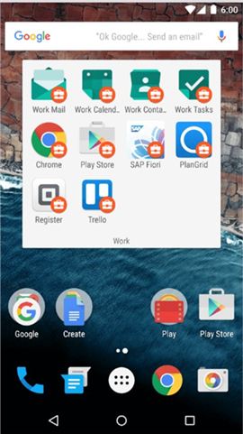

---
# required metadata

title: What happens when you create a work profile | Microsoft Intune
description: Describes how to encrypt an Android device
keywords:
author: staciebarker
manager: angrobe
ms.date: 10/12/2016
ms.topic: article
ms.prod:
ms.service: microsoft-intune
ms.technology:
ms.assetid: b217da11-2cd7-49ab-a91f-2f6d7784c6b6

# optional metadata

#ROBOTS: NOINDEX,NOFOLLOW
#audience:
#ms.devlang:
ms.reviewer: arnab
ms.suite: ems
#ms.tgt_pltfrm:
#ms.custom:

---

# What happens when you create a work profile

A work profile is something that you set up on your device to enable you to access your work or school email, apps, and files.

When you create a work profile:

- Your IT administrator can manage only the work-related apps, settings, and configurations on your device, not your personal apps or data.

- You get work apps from the Play Store for Work. To get personal apps, you continue to go to the Google Play Store that you always use to get your personal apps. The IT administrator cannot see or manage your personal apps.

- Work apps are separated from your personal apps, but they can both appear on your home screen at the same time. Below is an example of what you might see. Your screen might look slightly different.

- Work app icons have a “badge” that looks like a white briefcase inside a red circle, as shown below. Personal app icons don’t show the briefcase, and will look the same as they do now.

	

- Your company or school owns your work profile, so your IT administrator can install or remove work apps or your profile, but not your personal apps or data.
- Your IT administrator cannot reset or wipe your device.

For the steps to create a work profile, see [Create a work profile and enroll your device](create-a-work-profile-and-enroll-your-device-in-intune-android.md).

Still need help? Contact your IT administrator. For contact information, check the [Company Portal website](http://portal.manage.microsoft.com).

