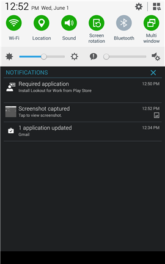
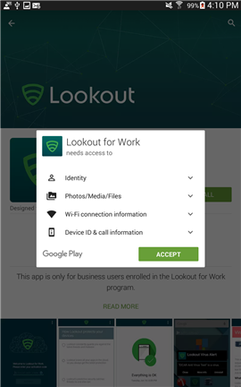
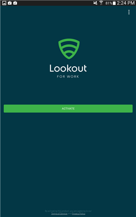
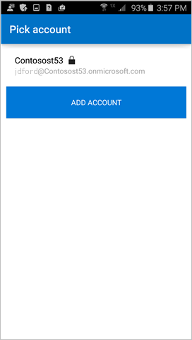
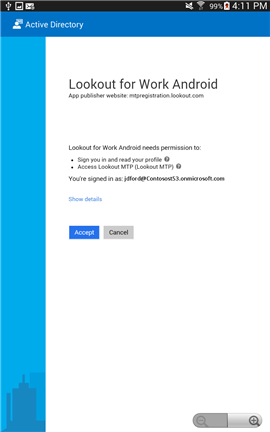
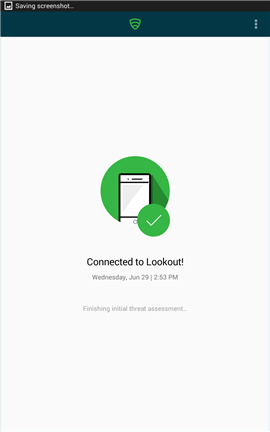
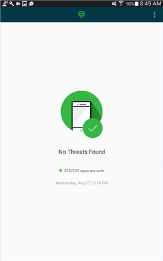
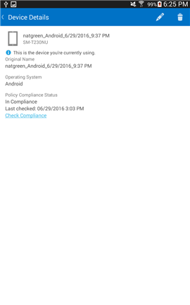

---
# required metadata

title: You are prompted to install Lookout for Work on your Android device | Microsoft Intune
description:
keywords:
author: staciebarker
manager: angrobe
ms.date: 09/08/2016
ms.topic: article
ms.prod:
ms.service: microsoft-intune
ms.technology:
ms.assetid: 0d357dc0-3e14-43d0-9874-6886ebc847fc

# optional metadata

ROBOTS: NOINDEX,NOFOLLOW
#audience:
#ms.devlang:
#ms.reviewer: jeffgilb
#ms.suite: ems
#ms.tgt_pltfrm:
#ms.custom:

---

# You are prompted to install Lookout for Work

Before you can access your work, your IT administrator needs you to install the Lookout for Work app, which helps to protect your device by finding potential security threats.

**What you need to do:**

1.	Drag down from the top of the screen to open the Notifications bar, and then tap **Required application – Install Lookout for Work from Play Store**.

	

	You are taken to the Lookout for Work installation page in the Play Store.

2.	Install Lookout for Work, and then tap **ACCEPT** to let Lookout for Work access your device.

	

3. Open Lookout for Work and tap **Activate**.

	

4. Tap **Sign in with Azure Active Directory**, and enter the account that you use to access work or school email and files.

	

5. Select the account that you use to access work or school email and files, and then tap **ADD ACCOUNT**.

	

6. Tap **Accept** to give Lookout for Work permission to sign you in and read your profile.

	

	A screen appears showing that Lookout for Work is connecting to the Lookout Security Cloud.

7. Review the items about how Lookout protects your device, and then tap **OK**.

	

	When you see the following screen, it means that Lookout is now set up and connected.

	

	Lookout for Work starts checking right away for security threats on your device. If no threats are found, you’ll see the following screen.

	

	The Device Details screen in the Company Portal shows that you are now in compliance with your company’s security requirements.

	

	If Lookout for Work finds a security threat on your device, you will see instructions on how to fix the issue.

Still need help? Contact your IT administrator. For their contact information, check the [Company Portal website](http://portal.manage.microsoft.com).

