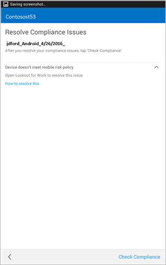
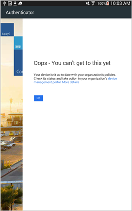
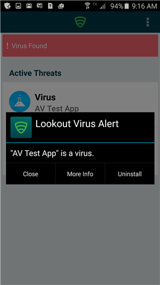

---
# required metadata

title: You need to resolve a threat found by Lookout for Work | Microsoft Intune
description:
keywords:
author: staciebarker
manager: angrobe
ms.date: 09/06/2016
ms.topic: article
ms.prod:
ms.service: microsoft-intune
ms.technology:
ms.assetid: 5656b3e6-e812-4264-a170-b17c9c03e4d4

# optional metadata

ROBOTS: NOINDEX,NOFOLLOW
#audience:
#ms.devlang:
#ms.reviewer: natgreen
#ms.suite: ems
#ms.tgt_pltfrm:
#ms.custom:

---

# You need to resolve a threat found by Lookout for Work

Lookout for Work has found a potential threat on your device, and you must fix the issue to regain access to your email and work.

## What you might see if your enrolled device is blocked from accessing email or files

If there is a virus or other security threat on your enrolled device, and you try to access your company or school email or files, you might see a message like this:

Tap the **device management portal** link to go to the [Company Portal website](http://portal.manage.microsoft.com), where you will see instructions on how to fix the issue.

## Example of an app that Lookout for Work sees as a threat

If you have installed an app that Lookout for Work thinks is a threat, you'll see a screen that is similar to this:

After you uninstall the app, you regain access to your email and other company or school data right away. If you ignore the request to uninstall the app, you will lose access to your email and data until you uninstall the app.

Still need help? Contact your IT administrator. For their contact information, check the [Company Portal website](http://portal.manage.microsoft.com).

