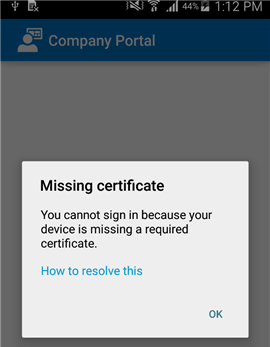
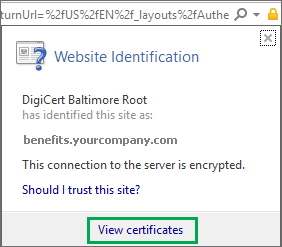

---
# required metadata

title: Your device is missing a required certificate | Microsoft Intune
description:
keywords:
author: staciebarker
manager: jeffgilb
ms.date: 05/31/2016
ms.topic: article
ms.prod:
ms.service: microsoft-intune
ms.technology:
ms.assetid: 9081b1d8-50e8-4bc2-ba37-766421364213

# optional metadata

#ROBOTS:
#audience:
#ms.devlang:
ms.reviewer: arnab
ms.suite: ems
#ms.tgt_pltfrm:
#ms.custom:

---

# Your device is missing a required certificate

## Your device is missing a certificate that usually comes installed on your phone
If your Android device isn’t enrolled in Intune, and it’s missing a certificate that usually comes installed on your phone, you won’t be able to sign in to the Android Company Portal app. When you try to sign in, you’ll see the following message:

To resolve this issue and get the required certificate:

1.  In a browser, navigate to this [Digicert certificate page](https://www.digicert.com/digicert-root-certificates.htm).

2.  Find and download the Baltimore CyberTrust Root certificate (https://www.digicert.com/CACerts/BaltimoreCyberTrustRoot.crt).

3.  Drag down from the top to open your notifications, and tap **BaltimoreCyberTrustRoot.crt** in the list of notifications.

4.  In the **Name the Certificate** dialog, accept the default certificate name.

5. Ensure that **Credential Use** is set to **Used for VPN and apps**, and then tap **OK**.

	

6. Close the web browser and the Company Portal app.

7. Reopen the Company Portal app. You should now be able to sign in to the Company Portal app. If you need help, contact your IT administrator.

## Your device is missing a certificate required by your IT administrator
If your Android device isn’t enrolled in Intune, and it’s missing a certain certificate that is required by your IT administrator, you won’t be able to sign in to the Android Company Portal app. When you try to sign in, you'll see the following message:

>[!NOTE]
> If you have already seen one "missing certificate" message, and followed the steps in [Your device is missing a certificate that usually comes installed on your phone](your-device-is-missing-a-certificate-that-usually-comes-installed-on-your-phone), that's OK. That is a different message and certificate from this one, so go ahead and follow the steps in this section to get the missing certificate.

To resolve this issue and get the required certificate, there are two main steps that you'll need to do:

- identify the missing certificate by looking on a company or school PC.
- use your device to download the missing certificate from the Internet.

1.  Find the name of the missing certificate by using a PC. If you don't have a PC to use for this purpose, contact your IT administrator. For your IT administrator's contact information, check the [Company Portal website](http://portal.manage.microsoft.com).

	a.  On a PC, open Internet Explorer. 

	b.  Go to the [Company Portal website](http://portal.manage.microsoft.com), and sign in using your work or school credentials.

	c.  At the far right of the browser's address bar, click the symbol that looks like a padlock, as shown below. If you don't see the padlock symbol, stop and contact your IT administrator. The lock means that you are securely signed in, so you should not proceed unless you see that symbol.

	

	d. Click **View certificates**.

	

	e. In the **Certificate** dialog, click the **Certification path** tab, and then identify the certificate that you need to get from the Internet. The name of the certificate that you need will be in the same position as the one that is highlighted in the screenshot above.

2. Download and install the missing certificate on your Android mobile device.

	a. Using a search engine like Bing or Google, search for the name of the missing certificate that you identified in the previous section. The certificate may end in different "extensions," like ".crt" or ".pem", etc.

	b. Download the root certificate from the website.

	c. After the certificate downloads, drag down from the top of your device to open your notifications, and then tap the name of the certificate in the list of notifications.

	d. In the **Name the Certificate** dialog, accept the default certificate name.

	b. Ensure that **Credential Use** is set to **Used for VPN and apps**, and then tap **OK**.

	

	c. Close the Company Portal app.

	d. Reopen the Company Portal app. You should now be able to sign in to the Company Portal app. If you need help, contact your IT administrator.

If you see the same "missing certificate" message as the one shown above, and you have already followed the steps above, it probably means that there is still another certificate that your IT administrator will need to help you install. Contact your IT administrator and give that person this [link](/intune/troubleshooting/troubleshoot-device-enrollment-in-intune#android-certificate-issues), which contains the steps to help resolve the issue. 

### See also
[Using your Windows device with Intune](using-your-windows-device-with-intune.md)