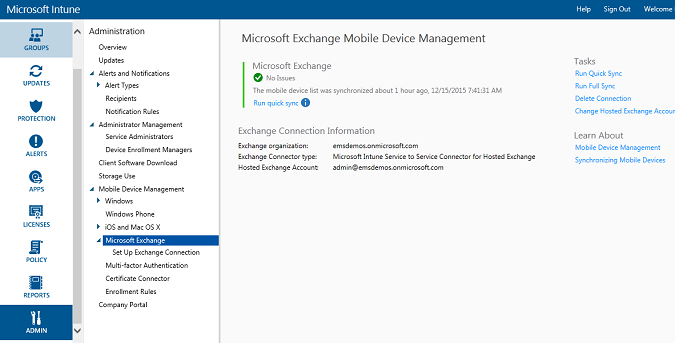

# Install the Intune connector for on-premises Exchange

To set up a connection that enables Microsoft Intune to communicate with the Exchange Server that hosts the mobile devices’ mailboxes, you must download and configure the On-Premises Connector tool from the Intune administrator console.

> [!IMPORTANT]
> Before you being installing and configuring the On-Premises Connector, ensure that you meet the [Exchange connector installation requirements](Intune-Exchange-connector-requirements.md).

## Download the On-Premises Connector software installation package

1.  On a [supported operating system for the On-Premises Connector](../Understand/network-infrastructure-requirements-for-microsoft-intune.html#BKMK_OnPremisesReqs), open the [Microsoft Intune administration console](http://manage.microsoft.com).

2.  In the workspace shortcuts pane, choose **ADMIN**.

3.  In the navigation pane, under **Mobile Device Management**, expand **Microsoft Exchange**, and then choose **Setup Exchange Connection**.

4.  On the **Setup Exchange Connection** page, choose **Download On-Premises Connector**.

5.  The On-Premises Connector software is contained in a compressed (.zip) folder that can be opened or saved. In the **File Download** dialog box, choose **Save** to store the compressed folder to a secure location.

> [!IMPORTANT]
> Do not rename or move the files within the On-Premises Connector folder. Moving or renaming the folder's contents will break the installation.

## Install and configure the Intune On-Premises Connector
Perform the following steps to install the Intune On-Premises Connector. The On-Premises Connector can only be installed once per Intune subscription, and only on one computer. If you try to configure an additional On-Premises Connector, the new connection will replace the original one.

1.  On a [supported operating system for the On-Premises Connector](../Understand/network-infrastructure-requirements-for-microsoft-intune.html#BKMK_OnPremisesReqs), extract the files in **Exchange_Connector_Setup.zip** to a secure location.

2.  After the files are extracted, open the extracted folder and double-click **Exchange_Connector_Setup.exe** to install the On-Premises Connector.

    > [!IMPORTANT]
    > If the destination folder is not a secure location, you should delete the certificate file **WindowsIntune.accountcert** after you install the On-Premises Connector.

3.  In the **Exchange server** field, select your Exchange server environment type, either **On-premises Microsoft Exchange Server** or select **Hosted Microsoft Exchange Server**.

  

  For an on-premises Exchange server, provide either the server name or the fully qualified domain name of the Exchange server that hosts the **Client Access Server** role.

  For a hosted Exchange server in Microsoft Office 365, provide the Exchange server address. To find the hosted Exchange server URL:

      1.  Open the Outlook Web App for Office 365.

      2.  Choose the “?” icon at the top left, and select **About**.

      3.  Locate the **POP External Server** value.

      4.  Choose **Proxy Server** to specify proxy server settings for your hosted Exchange server.
        1.  Select **Use a proxy server when synchronizing mobile device information**.

        2.  Enter the **proxy server name** and the **port number** to be used to access the server.

        3.  If it is necessary to provide user credentials to access the proxy server, select Use credentials to connect to the proxy server and enter the **domain\user** and the **password**.

        4.  Choose **OK**.

5.  Provide the credentials, **User (Domain\user)** and **Password** necessary to connect to your Exchange server. The user must have permissions for [required Exchange cmdlets](https://technet.microsoft.com/library/mt595858.aspx)

6.  Provide administrative credentials necessary to send notifications to a user’s Exchange mailbox. These notifications are configurable via Conditional Access policies using Intune.

    Ensure that the Autodiscover service and Exchange Web Services are configured on the Exchange Client Access Server. For more information on that see [Client Access server](https://technet.microsoft.com/library/dd298114.aspx).

7.  In the **Password** field, provide the password for this account to enable Intune to access the Exchange Server.

8. Choose **Connect**.

    It may take a few minutes while the connection is set up.

During configuration, the Exchange Connector stores your proxy settings to enable access to the Internet. If your proxy settings change, you will have to reconfigure the Exchange Connector in order to apply the updated proxy settings to the Exchange Connector.

After the Exchange Connector sets up the connection, mobile devices associated with users that are managed in Exchange Connector are automatically synchronized and added to the Exchange Connector. This synchronization may take some time to complete.

> [!NOTE]
> If you have installed the On-Premises Connector, and if at some point you delete the Exchange connection, you must uninstall the On-Premises Connector from the computer onto which it was installed.

## Validate Exchange connection

After you have successfully configured the Exchange Connector, you can view the status of the connection and the last successful synchronization attempt. In the [Microsoft Intune administration console](http://manage.microsoft.com) choose the **ADMIN** workspace, and under **Mobile Device Management**, choose **Microsoft Exchange**, and validate that the details you provided appear under **Exchange Connection Information**.

You can also check the time and date of the last successful synchronization attempt.
