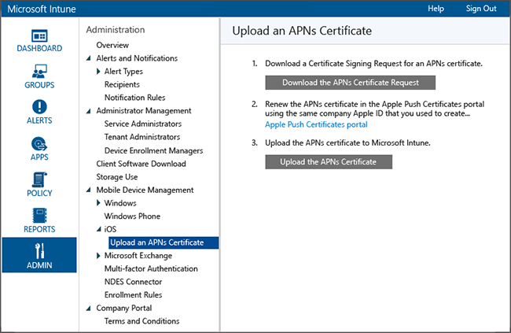

# Set up device management
After you [set the MDM authority](set-mobile-device-management-authority-and-configure-microsoft-intune.md), you can enable enrollment for iOS devices.

## Set up iOS and Mac management with Microsoft Intune
With [!INCLUDE[wit_nextref](../includes/wit_nextref_md.md)], you can enable BYOD ("bring your own device") iOS and Mac OS X device enrollment to give access to company email and apps to iPhone, iPad and Mac users. Once users install the [!INCLUDE[wit_nextref](../includes/wit_nextref_md.md)] company portal app, their devices can be targeted with policy using the [!INCLUDE[wit_nextref](../includes/wit_nextref_md.md)] administration console.  Before you can manage iOS and Mac devices, you must import an Apple Push Notification service (APNs) certificate from Apple. This certificate allows Intune to manage iOS and Mac devices and establishes an accredited and encrypted IP connection with the mobile device management authority services.

As an alternative to enrollment with the Company Portal app, you can also [enroll corporate-owned iOS devices](https://technet.microsoft.com/library/dn408185.aspx#BKMK_CODiOS) .

1.  **Set up Intune**
    If you haven’t already, prepare for mobile device management by  [setting the mobile device management authority](https://technet.microsoft.com/library/mt346013.aspx) as **Microsoft Intune** and setting up MDM.

2.  **Get a certificate signing request**
    As an administrative user, open the [Microsoft Intune administration console](http://manage.microsoft.com), go to **Administration** &gt; **Mobile Device Management** &gt; **iOS and Mac OS X** &gt; **Upload an APNs Certificate**, and click **Download the APNs certificate request**. Save the certificate signing request (.csr) file locally. The .csr file is used to request a trust relationship certificate from the Apple Push Certificates Portal.

    

3.  **Get an Apple Push Notification service certificate**
    Go to the [Apple Push Certificates Portal](http://go.microsoft.com/fwlink/?LinkId=269844) and sign in with your company Apple ID to create the APNs certificate using the .csr file. This Apple ID must be used in future to renew your APNs certificate. Download the APNs (.pem) certificate and save the file locally. This APNs certificate file is used to establish a trust relationship between the Apple Push Notification server and Intune’s mobile device management authority.

4.  **Add the APNs certificate to Intune**
    In the [Microsoft Intune administration console](http://manage.microsoft.com), go to **Administration** &gt; **Mobile Device Management** &gt; **iOS and Mac OS X** &gt; **Upload an APNs Certificate**, and click **Upload the APNs certificate**. **Browse** to the certificate (.pem) file and click **Open** and then enter your **Apple ID**. With the APNs certificate, Intune can enroll and manage iOS devices by pushing policy to enrolled mobile devices.

5.  **Tell users how to get access to company resources with the company portal**
    Your users will need to know how to enroll their devices and what to expect once they're brought into management. [What to tell your end users about using Microsoft Intune](what-to-tell-your-end-users-about-using-microsoft-intune.md)

If your company or organization purchases company-owned devices, those devices can be enrolled for management in the following ways:
- [Apple's device enrollment program (DEP) for iOS](ios-device-enrollment-program.md)
- [Apple Configurator to configure iOS Setup Assistant](ios-setup-assistant-enrollment.md)
- [Apple Configurator to directly enroll iOS devices](ios-direct-enrollment.md)

### See Also
[Get ready to enroll devices in Microsoft Intune](get-ready-to-enroll-devices-in-microsoft-intune.md)
