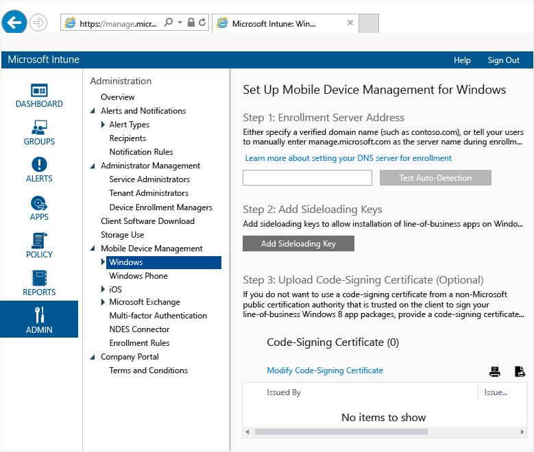

## Set up Windows Phone and Windows 10 Mobile management with Microsoft Intune
Before you can manage Windows 10 Mobile or Windows Phone devices with [!INCLUDE[wit_nextref](../includes/wit_nextref_md.md)], you have to set up management. If you manage Windows Phone 8.0 devices or need to deploy the Company Portal to devices, see [Set up Windows Phone 8.0 management](set-up-windows-8.0-management-with-microsoft-intune.md).

## Set up Windows 10 Mobile and Windows Phone management  
1.  **Set up Intune**
    If you haven’t already, prepare for mobile device management by  [setting the mobile device management authority](https://technet.microsoft.com/library/mt346013.aspx) as **Microsoft Intune** and setting up MDM.

2.  **Set a DNS alias for the enrollment server address** (optional)

    Creating a DNS alias (CNAME record type) makes it easier for users to enroll their devices. If you don't create a DNS alias, users must

    1.  Create **CNAME** DNS resource records for your company’s domain. The CNAME resource records must contain the following information:

|TYPE|Host name|Points to|TTL|
|--------|-------------|-------------|-------|
|CNAME|EnterpriseEnrollment.company_domain.com|EnterpriseEnrollment-s.manage.microsoft.com |1 Hour|
|CNAME|EnterpriseRegistration.company_domain.com|EnterpriseRegistration.windows.net|1 Hour|

    For example, if your company’s website is contoso.com, you would create a CNAME in DNS that redirects EnterpriseEnrollment.contoso.com to manage.microsoft.com. If there is more than one verified domain, create a CNAME record for each domain.

      -   `manage.microsoft.com` – Supports a redirect to the Intune service with domain recognition from the email’s domain name

      -   `enterpriseregistration.windows.net` – Supports workplace join for mobile devices. It also supports conditional access for Windows 8.1

    2.  In the [Intune administration console](http://manage.microsoft.com), click **Administration** &gt; **Mobile Device Management** &gt; **Windows Phone**.

    3.  Type the URL of the verified domain of the company website in the **Specify a verified domain name** box and then click **Test Auto-Detection**.

    No additional work is required unless you will deploy the Company Portal to devices.  Steps 2, 3 and 4 in the admin console can be safely ignored.

### See also
[Get ready to enroll devices in Microsoft Intune](get-ready-to-enroll-devices-in-microsoft-intune.md)
