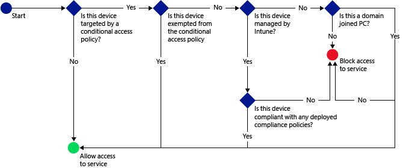

# Manage access to email and O365 services test refactor
You can restrict access to your company email and O365 services like SharePoint and Skype for Business.
Intune's conditional access capability allows you to make sure that only devices that are compliant with the rules that you set are allowed access to your company email and resources.
To implement conditional access, you configure two policy types in Intune:
## What is conditional access?
Conditional access in Intune means that you can require that devices meet a certain set of conditions in order to be able to access your company data and resources.

To set up conditional access, configure compliance policies your device must meet and a conditional access policy that is applied to your end-users and devices.
- **Compliance policies** are policies you can deploy to users and devices and evaluate settings like:

  - Passcode
  - Encryption
  - Whether the device is jailbroken or rooted
  - Whether email on the device is managed by an Intune policy

  If no compliance policy is deployed to a device, then any applicable conditional access policies will treat the device as compliant.

- **Conditional access** policies are configured for a particular service, and define rules such as which Azure Active Directory security user groups or Intune user groups will be targeted and how devices that cannot enroll with Intune will be managed.

Unlike other Intune policies, you do not deploy conditional access policies. Instead, you configure these once, and they apply to all targeted users.

When devices do not meet the conditions you configure, the user is guided though the process of enrolling the device and fixing the issue that prevents the device from being compliant.
## How does it work?
A typical flow of conditional access might as follows:

See this 4 minute video that describes how this works using email as an example:
<iframe width="560" height="315" src="https://www.youtube.com/embed/lYx3YIezccg" frameborder="0" allowfullscreen></iframe>
## Next steps
- [Manage device compliance policy](./DeployUse/manage-device-compliance-policies-for-microsoft-intune.md)

- [Manage access to email](Manage-access-to-email_test-refactor.md)

- [Manage access to SharePoint](Manage-access-to-sharepoint-online-test-refactor.md)

- Manage access to Skype for Business
