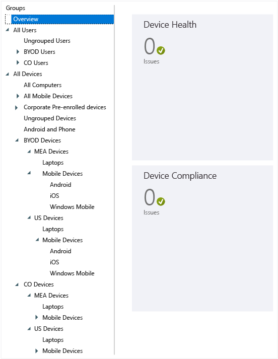

# Plan your user and device groups
<!--Write concisely: Considered planning of your groups and policies will help you keep them organized and achieve the client behavior that you want. Here are some the recommended practices for organizing and managing your Intune policies and groups.

## Group basics-->
Groups in Intune provide great flexibility in managing your devices and users. You can set up groups to suit your organizational needs according to:

- geographic location

- department

- hardware characteristics

- operating system

- whether the device is user-owned or company-owned

<!-- Move to Next steps: More information on how to create and manage groups can be found in [Use groups to manage users and devices with Microsoft Intune](use-groups-to-manage-users-and-devices-with-microsoft-intune.md)-->

## How Intune groups work
The default view of the Groups node in the Intune Management console is:

Policies are deployed onto groups, so group hierarchy is one of your key design considerations. It is also important to know that a group’s parent group cannot be changed once the group is created, so the design of your groups is critically important from the moment you start using the Intune service. Some of the recommended practices for designing a group hierarchy based on your organizational needs are  described here.

**Do we need to explain security groups and how they differ from and interact with Intune groups?**
## Group membership rules

1. A group can contain either users or devices, but not both.

    * **Device groups:** This includes both computers and mobile devices. Before you can add a computer to a group, it must be enrolled. Before you can add a mobile device to a group, your environment must be configured to support mobile devices, and the devices must be enrolled, or discovered from Exchange ActiveSync.

    * **User groups:** A group can contain users from security groups, which are groups that synchronize from your Active Directory. If you do not use Active Directory synchronization, you can manually create these groups.

2. A device or a user can belong to more than one group.

3. A group can include and exclude members based on the following membership rules:

    * **Criteria Membership:** These are dynamic rules that [!INCLUDE[wit_nextref](../includes/wit_nextref_md.md)] runs to include or exclude members. These criteria use **security groups** and other information synchronized from your local Active Directory (AD). When the security group or data changes, the group membership changes when you synchronize with AD.

    * **Direct Membership:** These are static rules that explicitly add or exclude members. The membership list is static.

4. Active Directory Domain Services (AD DS) is not required to create user groups or device groups that include users or computers, but for device groups to include mobile devices, your environment must be configured to support mobile devices.

    Additionally, the devices must be discovered and added to [!INCLUDE[wit_nextref](../includes/wit_nextref_md.md)].

## Group relationship rules

1. Every group you create must have a parent group, and you cannot change a group’s parent group after the group is created.

2. When you add users or devices to a child group:

    * Child groups are always subsets of the parent group.

    * New members you add to a child group are automatically added to that group’s parent group.

    * You cannot add a member to a child group when that member is excluded from the parent group.

3. The membership of a parent group defines the available membership for the child group.

4. When you delete a parent group, all child groups are deleted.

5. You can deploy content and policies to a parent group while excluding deployment to child groups.

6. You can add a specific user or device to a child group that is not a member of the parent group. If you do so, the new group member will be added to the parent group.

    However, you cannot add a member to a child group that is excluded from the parent group.

7. Group membership is recursive. For example:

    * **Pat** is a member of only one group, the **Laptop Users** security group.

    * The **Laptop Users** group is a member of the **Approved Users** security group.

    * You create a group in [!INCLUDE[wit_nextref](../includes/wit_nextref_md.md)] that uses a dynamic membership query that includes the members of the **Approved Users** group. The result is that your [!INCLUDE[wit_nextref](../includes/wit_nextref_md.md)] user group includes **Pat**.

> [!TIP]
> When you're creating your groups, think about how you will apply policy. For example, you may have policies specific to device operating systems, and policies specific to different roles in your organization, or to Organizational Units you've already defined in Active Directory. Some consider it useful to have device groups specific to iOS, Android, and Windows, as well as user groups for each organizational role.
>
> You'll probably want to create a default policy that applies to all groups and devices, to establish the basic compliance requirements of your company. Then create more specific policies for the broadest categories of users and devices, for example, email policies for each of the device operating systems.
>
> Be careful naming your policies so that you can easily identify them later. For example, a good, descriptive policy name is **WP Email Policy for Entire Company**.
>
> Each time you create a restrictive policy you'll want to communicate it to your users, so after you create the more general groups and policies pay attention to how you create smaller groups so that you can reduce unnecessary communication.

## Built-in groups
[!INCLUDE[wit_nextref](../includes/wit_nextref_md.md)] provides nine built-in groups that you cannot edit or delete: <!--maybe a screen shot would be best?-->

-   **All Users**
    -   Ungrouped Users
-   **All Devices**
    -   All Computers
    -   All Mobile Devices
        -   All Direct Managed Devices
        -   All Exchange ActiveSync Managed Devices
    -   All Corporate-owned Devices
    -   Ungrouped Devices

> [!NOTE]
> *Keep it simple* should be your motto. If your organization does not have specific needs such as those described here, keeping it simple and going with the default group structure and policies will make the service more manageable in the long term. Maintenance will be easier if it is possible for you to treat your users equally with little differentiation by group,  thereby having to maintain  fewer policies.

<!--Are the groups below built-in groups or user defined?-->

### All users and devices in your organization
<!--You should have a parent group defined for all users and devices in your organization, as you are likely to have policies that will apply to all. This can be the default **All Users** and **All devices** groups in Intune. These groups can then be used to apply policies that are applicable to all users and devices within your organization. If you are creating BYOD (bring your own device), Corporate Owned (CO) groups, then those groups can be the children of the **All Users** and **All devices**  parent groups.-->

Define a parent group for all users and devices in your organization, as you are likely to have policies that will apply to all. You can use the default **All Users** and **All devices** groups in Intune for this purpose. Sub-groups that organize devices by specifics, such as a group for bring your own device (BYOD) and one for corporate-owned devices (CO), can be the children of the **All Users** and **All devices** parent groups.

## Customizing groups for your organization

### BYOD and corporate owned devices
If your organization allows employees to use their own devices at work (BYOD), provides company-owned devices (CO), or a combination of both, we recommend that you apply policies based on those two categories of devices.

In the case of BYOD or a mix, be careful to plan policies that do not infringe on local privacy regulations. <!-- I don't understand this sentence: This will also help employees understand the corporate management of their personal devices and may drive more towards application-level management rather than device-level management.--> Create a parent group for all users who will be bringing their own devices. This group can then be used to apply policies that are applicable to all users in this category.

Similarly, you can create a group for the CO users in your organization:

### Groups for geographic regions
If your organization needs policies for specific regions you can create groups based on geographic region. <!--These groups could be centered on regional groups that you have already created in your on-premises Active Directory (AD), and synchronized to Azure AD (AAD) or created directly in AAD.--> You can base them on regional groups you may have already created in Active Directory (AD), and synchronize them to Azure AD. You can also create them directly in Azure AD.

These screen shots show how to create Intune groups based on groups synchronized from your on-premises AD. This examples assumes that you have an AD security group called **US Users Group**. First, provide the general information. <!-- probably should be numbered list; possibly candidate for animated .gif-->

Under Membership criteria, select **US Users Group**, synchronized from AD, as the security group to use under Membership rules.

Review and then choose **Finish** to finish creating the group.

In our example, we’ve also created a Middle East and Asia group, MEA.

> [!NOTE]
> If the group membership is not populated based on the security group membership, check that you have assigned Intune licenses to those members.

### Groups for specific hardware
If your organization requires policies that apply to specific hardware types, you can create groups based on this requirement. You can base them on specific groups that you have already created in your on-premises AD, and synchronize them to Azure AD. You can also create them directly in Azure AD. In this example, we use the **US Users Group** as the parent for the **Laptop Users** group.

At this point, the groups hierarchy should appear as shown below. As you see, there are now members within the Intune group **Laptop Users**. Any policies applied to this group will now be applied to BYOD laptop users from the US region.

### Groups for specific operating systems
If your organization requires policies that apply to specific operating systems such as Android, iOS, or Windows, you can create groups based on this requirement. As in the previous examples, you can base them on OS-specific groups that you have already created in your on-premises AD, and synchronize them to Azure AD. You can also directly create them in Azure AD.

Following the same method from the previous examples, we can create groups based on users <!--devices?--> using specific OS platforms.

> [!NOTE]
> If you have users using multiple mobile platforms/operating systems and do not have an automated way to categorize users  as Android users, iOS users or Windows users, consider applying policies at the device level, which will give you better flexibility in applying OS-specific policies.
>
> You cannot provision groups dynamically based on the OS of the device . Do this using AD or AAD Security groups.

Once all your User groups are populated based on these organizational requirements, your group hierarchy should look something like this:

This hierarchy can be used to apply the organization's policies appropriately.

### Device groups
You can also create similar groups for devices as shown below, starting with a broad group that includes all employee-owned devices, for the BYOD scenario:

Make sure you select **All devices (computers and mobile)** so that the group will include all BYO devices:

Review and choose **Finish** to create the BYOD group.

Continue to create device groups, until you have a device group hierarchy similar to the user group hierarchy. Then your group node in the Intune console should look similar to this:

## Group hierarchies and naming conventions
To make policy management easier, we recommend that you name each policy according to  purpose, platform, and scope to which it is applied. This naming standard should follow the group structure that you created in preparation for applying your policies.

For instance, for an Android policy that is applied to all corporate, android, mobile devices at the US regional level, the policy can be named
**CO_US_Mob_Android_General**.

By naming the policies this way you can quickly identify policies and their intended use and scope from the console’s policies node, as shown:

## Next steps
Create groups
