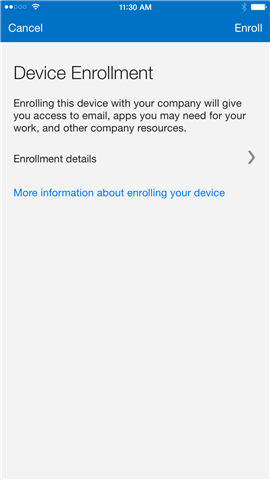
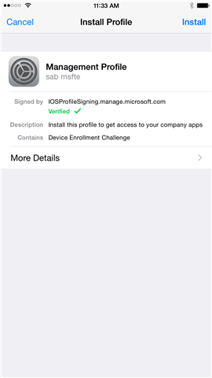
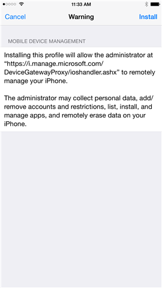

# MD Using your iOS device with Intune
Use these steps for tasks that you need to do on your iOS device when your company is using Microsoft Intune:

|Task category|Tasks you can do|
|-----------------|--------------------|
|Company Portal app installation and Intune enrollment|[Install and sign in to the Intune Company Portal app](#BKMK_ios_signin_cp)  [Enroll your iOS device in Intune](#BKMK_enroll_ios_device)  [Enroll your Mac OS X device in Intune](#BKMK_ios_enroll_macosx_dev)  [What happens when I install the Company Portal app and enroll my device in Intune?](#BKMK_ios_what_happ_enroll)|
|Things you can do when your device is enrolled in Intune|[What is the Company Portal website and what can I do with it?](#BKMK_ios_whatis_cp_website)  [Use managed apps on your device](#BKMK_ios_use_mgd_apps)  [Reset (erase) your lost or stolen device](#BKMK_ios_erase_lost_device)  [Turn off Microsoft usage data collection](#BKMK_ios_data_collect)  [Unenroll your device from Intune](#BKMK_ios_unenroll_device)  [What happens when I unenroll my device from Intune?](#BKMK_ios_what_happs_unenroll)|
|Fix issues with your device|[You get an error while using the Company Portal app](#BKMK_ios_error_use_cp)  [You see errors while trying to enroll your device in Intune](#BKMK_ios_error_enrolling_tbl)  [Device doesn't have the required minimum operating system version](#BKMK_ios_no_min_os)  [Device doesn't comply with the maximum operating system version](#BKMK_ios_no_max_os)|

## Install and sign in to the Intune Company Portal app
The Company Portal is an app that you install on your device to give you access to your company or school apps, email, and network.  Before you can get access, you must install the Company Portal app, and then  use the app to enroll your device in Microsoft Intune. For more information, see [What happens when I install the Company Portal app and enroll my device in Intune?](#BKMK_ios_what_happ_enroll).

1.  Open the **App Store** and search for **intune**.

2.  Download the **Microsoft Intune Company Portal** app.

    

3.  Open the Company Portal app, enter your work or school email and password, and then tap **Sign in**.

    If you are signing into the Company Portal app for the first time, and your company or school is using Intune, you will be prompted to enroll your device in Intune. To enroll, follow the steps in [Enroll your device in Intune](#BKMK_ios_enroll_your_device).

## Enroll your device in Intune
Enrolling your device in Intune enables you to access the company’s network, your work email and work files, and lets you get company apps. For more about what happens when you enroll your device, see [What happens when I install the Company Portal app and enroll my device in Intune?](#BKMK_ios_what_happ_enroll).

To enroll, use the instructions that match the type of device you're using:

-   [Enroll your iOS device in Intune](#BKMK_enroll_ios_device)

-   [Enroll your Mac OS X device in Intune](#BKMK_ios_enroll_macosx_dev)

### Enroll your iOS device in Intune
To enroll your device:

1.  Follow the steps in  [Install and sign in to the Intune Company Portal app](#BKMK_ios_signin_cp).

2.  On the **Device Enrollment** screen in the Company Portal app, tap **Enroll**.

    

3.  On the **Install Profile** screen, tap **Install**, and enter your passcode, if prompted.

    

4.  Tap **Install**.

    

5.  Tap **Install** to indicate that you've read the warning.

    

6.  Tap **Trust**.

    

7.  Tap **Done**.

    

8.  Tap **OK**. Your device is now enrolled in Intune.

    

### Enroll your Mac OS X device in Intune
To enroll your Mac OS X device:

1.  Using a Safari browser, open the [Company Portal website](https://portal.manage.microsoft.com), and tap the notification bar.

2.  Tap **This device is either not enrolled or the Company Portal can't identify it**.

    

3.  Tap **Install** to start enrolling your device.

    

4.  On the **Install Management Profile** dialog, tap **Install**. If a dialog box appears asking you to enter your credentials, enter your username and password, and then tap **Continue** &gt; **Install**.

    

    When you finish enrolling, you'll see a Management Profile page showing that your profile has been verified.

    

## What happens when I install the Company Portal app and enroll my device in Intune?
You start by installing the Company Portal app, and then use the app to enroll your device in Intune. Once your device is enrolled, you  can use the Company Portal app to:

-   Access the company’s network, and your email and work files

-   Get company apps from the Company Portal

-   Automatically configure your company email account

-   Reset your phone to factory settings if it is lost or stolen

When  you enroll your device in Intune, you are giving your IT administrator permission to manage your device to help protect the company information on the device.

**What IT cannot see**

-   Call history

-   Text messages

-   Personal email, contacts, and calendar

-   Web history

-   Location

-   Camera roll

-   Personal data

**What IT can see**

-   Owner

-   Device name

-   Serial number

-   Manufacturer

-   Model

-   Operating system

-   Company apps

-   Personal apps

When your device is enrolled, your IT administrator can:

-   Reset your device back to manufacturer’s default settings if the device is lost or stolen.

-   Remove all installed company-related data and business apps. Your personal data and settings aren’t removed.

-   Require you to have a password or PIN on the device.

-   Require you to accept terms and conditions.

-   Enable or disable the camera on your device.

-   Enable or disable web browsing on your device.

-   Enable or disable backup to iCloud.

-   Enable or disable document sync to iCloud.

-   Enable or disable Photo Stream to iCloud.

-   Enable or disable data roaming on your device. If data roaming is allowed, roaming charges may be incurred.

-   Enable or disable voice roaming on your device. If voice roaming is allowed, roaming charges may be incurred.

-   Enable or disable automatic file synchronization while in roaming mode on your device. If automatic file synchronization is allowed, roaming charges may be incurred.

For the steps on how to enroll your device, see [Enroll your device in Intune](#BKMK_ios_enroll_your_device).

## What is the Company Portal website and what can I do with it?
The [Company Portal website](http://portal.manage.microsoft.com) is your company’s web interface that you use to manage your work computers and devices, and your personal computers and devices that you choose to use at work. You can do most of the same tasks on this website that you can do by using the Company Portal app that you install on your device.

You can do the following tasks from the Company Portal website:

-   Browse for and download company apps

-   Rename your device

-   Remove your device from Intune

-   Reset your mobile device to its factory default settings

-   Find contact information for your IT administrator

## Use managed apps on your device
Managed apps are apps that your IT administrator can configure to help protect company data that you can access in that app. When you access company data in a managed app, you may notice that the app works a little differently from what you expect. For example, you might not be able to copy and paste protected company data, or you might not be able to save that data to certain locations.

Different managed apps can also work together on your device to allow you to do your daily tasks, while keeping corporate data protected. For example, if you open a company file in one managed app, and another managed app is required to view that file, the managed app that allows you to view the file opens automatically. If a required app is not available, certain actions, like opening a document or accessing a web link from within a managed document, might not be available.

When you access company data in a managed app, you see a message like the one below, which lets you know that the app you are opening is managed.

### How do I get managed apps?
You get managed apps in a couple of different ways:

-   When your device is enrolled in Microsoft Intune, you either install the app from your Company Portal app or Company Portal website, or your IT admin might install it on your device. To find out about enrollment, see [Enroll your device in Intune](#BKMK_ios_enroll_your_device).

-   You install an app from the App Store and then sign in with your corporate user account that is managed by Intune.

### What can my IT admin manage in an app?
Here are some examples of options that your IT admin can manage in an app and that can affect your interactions with company data on your device:

-   Access to specific websites

-   Transfers of data between apps

-   Saving files

-   Copy and paste operations

-   PIN access requirements

-   Your login, using company credentials

-   Ability to back up to the cloud

-   Ability to take screenshots

-   Data encryption requirements

Some common apps that your IT department might manage are:

-   Managed web browser

-   Managed image viewer

-   Managed PDF viewer

-   Managed AV player

-   Microsoft Word, Excel, PowerPoint

Contact your IT admin for more information about the managed apps on your device.

## Reset (erase) your lost or stolen device
If a phone that has been enrolled in Intune is lost or stolen, you can reset it to factory default settings by using the Company Portal app from a different device.

> [!WARNING]
> Resetting a device to factor defaults removes both your personal and work information from it!

1.  In the Company Portal app, under **My Devices**,  select the device you want to erase.

2.  Tap  **Reset** &gt; **Reset**.

> [!NOTE]
> If you are unable to reset your lost or stolen device, contact IT to reset it for you.

## Turn off Microsoft usage data collection
In order to improve its products and services, Microsoft automatically collects anonymous data about the reliability and performance of the Company Portal app and how it is used. You can turn off the collection of that data by using the Usage Data setting in the Company Portal app. IT administrators have no control over the collection of the data, and they cannot change your selection for the setting.

## Unenroll your device from Intune
When you unenroll your device from Intune, your device will not longer be able to access company resources and will no longer be managed by Intune. More information about unenrolling follows the steps.

To unenroll your device from Intune:

1.  In the Company Portal app, under **My Devices**,  select the device you want to unenroll.

2.  Tap  **Remove** &gt; **Remove**.

When you unenroll your device from Intune, here's what happens:

-   Your device won’t appear in the Company Portal anymore

-   You can’t install apps from the Company Portal anymore.

-   Any settings that were changed on your device when you added it (for example, disabling the camera, or requiring a certain password length) will no longer apply.

-   You might not have access to some company resources, such as file shares or internal web sites, on your device anymore.

-   You can’t use company apps and company data on your device anymore.

-   You might not be able to connect to your company network using Wi-Fi or a virtual private network (VPN) anymore.

-   Company email profiles are removed from the device.

-   Devices that are configured for email only won't appear in the Company Portal app or website anymore.

## What happens when I unenroll my device from Intune?
When you unenroll your device from Intune:

-   Your device won’t appear in the Company Portal anymore.

-   You can’t install apps from the Company Portal anymore.

-   Any settings that were changed on your device when you added it, for example, disabling the camera, or requiring a certain password length, will no longer apply.

-   You might not have access to some company resources, such as file shares or internal web sites, on your device anymore.

-   You can’t use company apps and company data on your device anymore.

-   You might not be able to connect to your company network using Wi-Fi or a virtual private network (VPN) anymore.

-   Company email profiles are removed from the device.

## What happens if I reset my iOS device using the Company Portal?
When you use the Company Portal to reset your iPhone or iPad, some apps and settings on your device may be deleted, including some of your personal data. What happens on each device depends on how you are using the device, as described in the following lists.

**Your IT admin manages your mobile device**

-   Your device won’t appear in the company portal anymore.

-   Your device is set back to the manufacturer’s factory default settings, and your personal data, apps and settings will be removed.

**Your device can access company email only**

-   Your device won’t appear in the company portal anymore.

-   Your company email account will be deleted and unsaved email will be deleted.

## Fix issues with your device
Use this information to fix issues with your device when you're trying to install the Company Portal app, enroll your device in Intune, or if you've already enrolled in Intune.

### You get an error while using the Company Portal app
If you get an error while you’re using the Company Portal app, you can send information about the error to help your IT admin troubleshoot the problem. You can send error information in different ways:

-   By tapping **Report** on error alert messages.

-   By tapping **Send Diagnostic Report** on the About screen of the Company Portal app

-   By shaking your device while you’re in the Company Portal app, and then tapping **Email** when the Diagnostics alert appears. If the alert doesn’t appear when you shake the device, open **Settings** &gt; **Company Portal**, and make sure that the **Shake Gesture** option is on.

### You see errors while trying to enroll your device in Intune
The following table lists errors that you might see while enrolling your devices in Intune.

|Error message|Issue|Resolution for your IT administrator about this error  Note to IT admins only: these resolutions also apply to System Center 2012 R2 Configuration Manager|
|-----------------|---------|----------------------------------------------------------------------------------------------------------------------------------------------------------------|
|DeviceCapReached|You have too many mobile devices enrolled already.|The user must remove one of his or her currently enrolled mobile devices from the Company Portal before enrolling another.|
|APNSCertificateNotValid|There is a problem with the certificate that allows your mobile device to communicate with your company’s network.  Contact your IT administrators and tell them that you received the message **APNSCertificateNotValid** while trying to enroll your mobile device, and tell them to see the resolution in this table.|The Apple Push Notification Service (APNS) provides a channel to reach out to enrolled iOS devices. If the steps to obtain an APNS certificate were not performed, or the APNS certificate has expired, then enrollment attempts will fail, and this message will appear.  Review the section "Prepare to manage iOS mobile devices with Microsoft Intune" in [Set up iOS and Mac management with Microsoft Intune](../Topic/Set_up_iOS_and_Mac_management_with_Microsoft_Intune.md).|
|AccountNotOnboarded|There is a problem with the certificate that allows your mobile device to communicate with your company’s network.  Contact your IT administrators and tell them that you received the message **APNSNotOnboarded** while trying to enroll your mobile device, and tell them to see the resolution in this table.|The Apple Push Notification Service (APNS) provides a channel to reach out to enrolled iOS devices. If the steps to obtain an APNS certificate were not performed, or the APNS certificate has expired, then enrollment attempts will fail, and this message will appear.  Review the section "Prepare to manage iOS mobile devices with Microsoft Intune" in [Set up iOS and Mac management with Microsoft Intune](../Topic/Set_up_iOS_and_Mac_management_with_Microsoft_Intune.md).|
|DeviceTypeNotSupported|You may have tried to enroll using a non-iOS device. The mobile device type that you are trying to enroll is not supported.  Ensure that your device is running iOS version 7.1 or later.  Contact your IT administrators and tell them that you received the message **DeviceTypeNotSupported** while trying to enroll your mobile device, and tell them to see the resolution in this table.|Ensure that your user's device is running iOS version 7.1 or later.|
|UserLicenseTypeInvalid|You cannot enroll your mobile device because your user account is not yet a member of a required user group.  Contact your IT administrators and tell them that you received the message **UserLicenseTypeInvalid** while trying to enroll your mobile device, and tell them to see the resolution in this table.|Before users can enroll their devices, they  must be a member of the right user group. This message means that they have the wrong license type for the designated mobile device management authority. For example, if [!INCLUDE[wit_firstref](../Token/wit_firstref_md.md)] has been designated as the mobile device management authority, and they are using a System Center 2012 R2 Configuration Manager license, they will see this error.  Review the following for more information:  Steps on adding users and groups in the section "Prepare to manage iOS mobile devices with Microsoft Intune" in [Set up iOS and Mac management with Microsoft Intune](../Topic/Set_up_iOS_and_Mac_management_with_Microsoft_Intune.md).  "Step 2: Add user to Intune" and "Step 3: Create groups to organize users and devices" in [Get started with a 30-day trial of Microsoft Intune](../Topic/Get_started_with_a_30-day_trial_of_Microsoft_Intune.md).  "Step 5: Create groups to organize users and devices" in [Get started with a paid subscription to Microsoft Intune](../Topic/Get_started_with_a_paid_subscription_to_Microsoft_Intune.md).|
|MdmAuthorityNotDefined|Your IT administrator needs to configure the way that mobile devices in your company are managed.  Contact your IT administrators and tell them that you received the message **MdmAuthorityNotDefined** while trying to enroll your mobile device, and tell them to see the resolution in this table.|The mobile device management authority has not been designated in [!INCLUDE[wit_firstref](../Token/wit_firstref_md.md)].  Review item #1 in the section "Step 6: Enroll mobile devices and install an app" in [Get started with a 30-day trial of Microsoft Intune](../Topic/Get_started_with_a_30-day_trial_of_Microsoft_Intune.md).|

### Device doesn't have the required minimum operating system version
Your device doesn’t meet the minimum operating system version required by your IT department.  Before updating your device, check the current operating system version by tapping **Settings** &gt; **About**. To update your device to the latest version, tap **Settings** &gt; **General** &gt; **Software Update**.

### Device doesn't comply with the maximum operating system version
Your device does not comply with your IT admin's policy for the maximum version of the operating system. Contact your IT admin for help.

