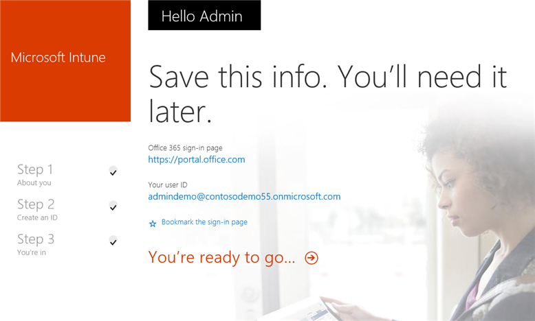
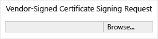

# Start a Microsoft Intune trial and deploy iOS PIN policy
These step-by-step instructions help you set up an Intune trial and configure a PIN policy for iOS devices. For a list of other common Intune evaluation tasks  that you can try, see [Common Microsoft Intune evaluation tasks](Common_Microsoft_Intune_evaluation_tasks.md).

These instructions explain:

-   [Review prerequisites for this task](#BKMK_30day_review_prereqs)

-   [Create a free Intune trial account](#BKMK_30day_create_trial_acct)

-   [Create a test user](#BKMK_30day_create_test_user)

-   [Configure an iOS pin policy for the test user](#BKMK_30day_cfg_ios_pin_pol)

-   [Validate that the policy is enforced on an iOS device](#BKMK_30day_validate_pol)

## Review prerequisites for this task

-   Windows PC with Internet Explorer - for doing administrative tasks

-   iOS 7.1 or later device for testing user policy validation

-   Phone to authenticate yourself during trial sign-up

## Create a free Intune trial account
> [!NOTE]
> If you already have an Intune subscription, skip this section and go to the next section.

1.  Using a Windows PC, right-click **Internet Explorer** (IE) and select **InPrivate Browsing**.

    

2.  Go to the [Intune sign-up portal](https://portal.office.com/Signup/Signup.aspx?OfferId=40BE278A-DFD1-470a-9EF7-9F2596EA7FF9&dl=INTUNE_A&ali=1), provide the requested information, and click **Next**.

    

3.  Enter a user ID and password for your admin account and click **Next**. You'll use this ID to log in to the Intune portal to do your admin tasks.

    

4.  Enter your cell phone number and click **Text me** to validate your number.

    

5.  Save the information shown on the screen, and then click **You're ready to go...**.

    

## Create a test user

1.  Using a Windows PC, click **Start** to go to the user management page.

    

2.  Click the **+** button to add a user.

    

3.  On the **Create new user account** page:

    1.  Provide the test user information.

    2.  Select the **Type password** option.

    3.  Clear the **Make this person change their password the next time they sign in** check box.

    4.  Click **Create**.

    

4.  On the user creation confirmation page, click **Close**.

    

5.  Click the **Refresh** button to see the test user you created.

    

## Configure an iOS pin policy for the test user

1.  Using a Windows PC, set the MDM authority to be Intune:

    1.  Go to [Intune Management console](http://manage.microsoft.com/), log in with your admin account, and click **Start Managing Mobile Devices**. The Mobile Device Management authority page opens.

        

    2.  Click the **Set Mobile Device Management Authority** link.

        

2.  Enable iOS devices for enrollment. This process sets up a trusted certificate between the Apple Push Notification Service (APNs) and your Intune subscription.

    1.  Click **Enable the iOS and Mac OS X platform**.

        

    2.  Click **Download the APNs Certificate Request**.

        

    3.  Specify a file name and location for your Certificate Signing Request (CSR), and then click **Save**. This file holds the public key that corresponds to a private key held by your Intune subscription.

        

    4.  Click **Apple Push Certificates portal** to open a new tab.

        

    5.  Enter your Apple ID and password, and click **Sign in**. This ID can be the one you use on your iOS device to get apps from the iOS App Store.

        

    6.  Click **Create a Certificate**.

        

    7.  Read Apple’s Terms of Use, select the check box, and click **Accept**.

        

    8.  Click **Browse**.

        

    9. Select the CSR file that you saved earlier, and click **Open**.

        

    10. Click the **Upload** button.

        

    11. When you are prompted to download a JSON file, click **Save as**.

        

    12. Specify a location for your JSON file and click **Save**.

        

        If your page doesn’t redirect automatically after a few seconds, click **Cancel**.

        

    13. To retrieve your newly created certificate file, click **Download**.

        

    14. When you are prompted to download a PEM file, click **Save as**.

        

    15. Specify a location for the PEM file and click **Save**.

        

    16. Return to the Intune Management Console tab, and click the **Upload the APNs Certificate**.

        

    17. Enter your Apple ID and click **Browse**.

        

    18. Select the PEM file you just saved, and click **Open**.

        

    19. Click **Upload**.

        

        Your APNs certificate is now configured.

        

3.  Create a test user group for policy targeting:

    1.  In the left pane, click **Groups**.

        

    2.  At the far right, click **Create Group**.

        

    3.  Provide a group name, select **All Users** as the parent group, and click **Next**.

        

    4.  In the **Start group membership with** field, select **All Users in the Parent group**, and click **Finish**.

        

4.  Create an iOS PIN policy and target it to the test user group:

    1.  In the left pane, click **Policy**.

        

    2.  At the far right, click **Add Policy**.

        

    3.  Expand the iOS node, select the **General Configuration** row, and click **Create Policy**.

        

    4.  Type a name for the policy,  turn on the option **Require a password to unlock mobile devices**, and set the **Minimum password length** to **4**.

        

    5.  Click **Yes** to deploy the policy.

        

    6.  Click the user group previously created, click **Add**, and click **Ok**.

        

        You now have an iOS PIN policy that targets your test user group.

        

## Validate that the policy is enforced on an iOS device

1.  On an iPad, launch the iOS App Store, install the free **Microsoft Intune Company Portal** app, and open it.

    

2.  Enter your test user account name and password, and tap **Sign in**.

    

3.  Tap **Enroll** to start enrolling the device in Intune.

    

4.  On the **Install Profile** screen, tap **Install**.

    

5.  On the **Install Profile** dialog, tap **Install**.

    

6.  On the **Warning** screen, tap **Install**.

    

7.  On the **Remote Management** dialog, tap **Trust**.

    

8.  When the management profile finishes installing, tap **Done**. Enrollment is now complete.

    

9. When enrollment is complete, tap **OK** and then close the Company Portal app.

    

10. When you are prompted to configure a passcode, tap **Continue**.

    

11. Enter your passcode, tap **Continue**, enter your passcode again, and tap **Save**.

    

12. Press the power button to lock your iPad, slide to unlock it, and see that you now need to enter your passcode to unlock the device.

## See Also
[Get started with a paid subscription to Microsoft Intune](../Topic/Get_started_with_a_paid_subscription_to_Microsoft_Intune.md)
[Common Microsoft Intune evaluation tasks](Common_Microsoft_Intune_evaluation_tasks.md)
[Set up email access for iOS devices using Microsoft Intune](Set_up_email_access_for_iOS_devices_using_Microsoft_Intune.md)

