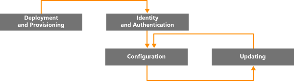
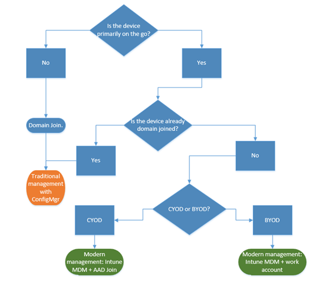
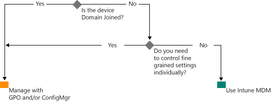

---
# required metadata

title: Path to modern Windows management | Microsoft Intune
description:
keywords:
author: NathBarn
manager: angrobe
ms.date: 09/08/2016
ms.topic: article
ms.prod:
ms.service: microsoft-intune
ms.technology:
ms.assetid: aada7909-24c9-46e2-88f0-38dd9c99b2f8

# optional metadata

#ROBOTS:
#audience:
#ms.devlang:
ms.reviewer: owenyen
ms.suite: ems
#ms.tgt_pltfrm:
#ms.custom:

---

# Path to modern Windows management with Microsoft Intune

Use of personal devices for work, as well as employees working outside the office, is changing how organizations manage devices. While certain parts of some organizations might require deep, granular control over devices, other organizations are embracing lighter, scenario-based management that empowers the modern workforce.

Windows 10 continues the tradition of Windows delivering the best-managed operating system for organizations. Windows provides support for deep manageability and security through technologies like Group Policy, Active Directory, and System Center Configuration Manager. It also delivers a “mobile-first, cloud-first” approach of simplified, modern management using cloud-based device management solutions such as Microsoft Enterprise Mobility Suite (EMS). Future Windows innovations, delivered through Windows as a Service, are complemented by fast-moving cloud services like Microsoft Intune, Azure Active Directory, Azure Rights Management Service, Office 365, and the Windows Store for Business.

IT organizations have greater flexibility with opportunities to benefit from innovation and cost savings. This document offers guidance on strategies for deploying and managing Windows 10. It also provides insight to Microsoft’s strategic thinking about device management tools. As you think about the foundations of management and how you want to apply them to different devices, consider the following four stages of the device lifecycle:

## Deployment and provisioning

Unlike traditional OS deployment, which requires complex IT operations, modern device management opens the door to “management out of the box.” IT wants to easily transform new devices into fully-configured, fully-managed devices, without reimaging.  Dynamic provisioning is easier than ever, enabled by a cloud-based device management services like Microsoft Intune. You can also create self-contained provisioning packages built with the Windows Imaging and Configuration Designer (ICD). Of course, we still support traditional imaging techniques as well, so organizations can deploy custom images using System Center Configuration Manager.

## Identity and Authentication

Windows 10 and services like Azure Active Directory open new possibilities for cloud-based identity, authentication, and management. Scenarios like BYOD and CYOD are letting enterprises rethink how users access corporate resources and apps. You can envision user and device management as falling into these two categories:

- Corporate (CYOD) or personal (BYOD) devices used by mobile users for SaaS apps such as Office 365.

  Windows 10 lets employees self-provision devices. Corporate devices can easily set up corporate access with Azure AD Join. Likewise, a new, simplified BYOD experience lets users add their work account to Windows and access work resources on personal devices. Combining Azure AD Join and automatic Intune MDM enrollment brings devices into a corporate-managed state in [one easy step](https://blogs.technet.microsoft.com/ad/2015/08/14/windows-10-azure-ad-and-microsoft-intune-automatic-mdm-enrollment-powered-by-the-cloud/), all from the cloud. Azure AD Join is also a great solution for temporary staff, partners, or other part-time employees. These accounts can be kept separate from the on-premises AD domain but still access needed corporate resources.
- Domain joined PCs and tablets using traditional applications and resources that require authentication or accessing highly sensitive or classified resources on-premises

  Windows 10 devices joined to an on-premises Active Directory domain will automatically register with Azure AD, so users can enjoy the additional benefits of Windows 10 experiences such as single sign-on to cloud and on-premises resources from everywhere, enterprise roaming of settings, Microsoft Passport for Work, and Windows Hello. Domain joined PCs and tablets should continue to be managed with the System Center Configuration Manager client or Group Policy.

Review the roles in your organization. Identify users or devices that require Domain Join, and consider switching others to Azure AD. You can read more in [this article](https://azure.microsoft.com/en-us/documentation/articles/active-directory-azureadjoin-windows10-devices/) about how Windows 10 and Azure AD optimize access to work resources across a mix of devices and scenarios.

Here is what a generalized decision tree might look like. Exceptions will apply in some cases, of course.

## Settings and Configuration

The level of management needed, the devices and data managed, and industry requirements can all define configuration requirements. Meanwhile, employees are frequently concerned about IT applying strict policies to their personal devices, but they still want access to corporate email and documents. Windows 10 provides a consistent set of configurations across PCs, tablets, and phones through a common MDM layer. The MDM approach calls for settings that achieve the admin’s intent without exposing every possible setting. In contrast, Group Policy exposes fine-grained settings the admin controls individually. One benefit of MDM is that it enables admins to apply broader privacy, security, and application management settings through lighter and more efficient tools. This makes MDM the best choice for devices that are constantly on the go.

Many organizations still need to manage domain joined computers at a granular level such as Internet Explorer’s 1,500 configurable GP settings or very specific Windows Firewall rules. In these cases, Group Policy and System Center Configuration Manager continue to be excellent management choices. Group Policy is the best way to granularly configure domain joined Windows PCs and tablets connected to the corporate network using Windows-based tools. Microsoft continues to add Group Policy settings with each new version of Windows. For granular configuration with robust software deployment, Windows updates, and OS deployment, Configuration Manager remains the recommended solution.

## Updating Windows devices

With Windows as a Service, IT organizations no longer need to perform complex imaging (wipe-and-load) processes with each new Windows release. Whether on current branch (CB) or current branch for business (CBB), devices receive the latest feature and quality updates through simple – often automatic – patching processes. MDM with Intune provide tools for applying Windows updates to client computers in the enterprise. Configuration Manager allows rich management and tracking capabilities of these updates, including maintenance windows and automatic deployment rules.

## Summary

As you think about the path to modern device management in your organization, consider the steps that you can take to start your journey.

1. **There are investments you can make today.** What components of traditional device management do you need to retain and where can you modernize? Whether you take steps to minimize custom imaging, re-evaluate settings management, or reassesses authentication and compliance, the benefits can be immediate.

2. **Assess the different use cases in your environment.** Are there groups of devices that could benefit from lighter, simplified management? BYOD devices, for example, are natural candidates for cloud-based management. Users or devices handling more highly regulated data might require on-premises AD domain for authentication. Configuration Manager and EMS provide you the flexibility to stage implementation of modern management scenarios while targeting different devices the way that best suits your business needs. The choice is yours.

## What to Do Next

- **Assess the management needs in your environment.** One size may not fit all your needs depending on people, their mobility, the devices, and the data they access.
- **Consider the requirements.** With Windows 10, Configuration Manager and the Enterprise Mobility Suite, you have the flexibility to handle imaging, authentication, settings, and management tools for any scenario.
- **Take small steps.** Moving towards modern device management doesn’t have to be an overnight transformation.
- **Optimize your existing investments.** On the road from traditional on-premises management to modern cloud-based management, take advantage of the flexible, hybrid architecture of Configuration Manager and Intune. As additional capabilities become available in the cloud-identity/MDM model, Microsoft is committed to providing a clear path from traditional to modern management.
