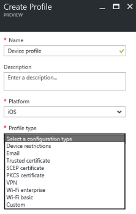

---
# required metadata

title: Create Intune device configuration profiles| Intune Azure preview
titleSuffix: "Intune Azure preview"
description: "Intune Azure preview: Learn how to create Intune device configuration profiles."
keywords:
author: robstackmsft
ms.author: robstack
manager: angrobe
ms.date: 02/15/2017
ms.topic: article
ms.prod:
ms.service: microsoft-intune
ms.technology:
ms.assetid: d98aceff-eb35-4e3e-8e40-5f300e7335cc

# optional metadata

#ROBOTS:
#audience:
#ms.devlang:
ms.reviewer: heenamac
ms.suite: ems
#ms.tgt_pltfrm:
ms.custom: intune-azure

---

# How to create device configuration profiles in Microsoft Intune

[!INCLUDE[azure_preview](../includes/azure_preview.md)]

1. Sign into the Azure portal.
2. Choose **More Services** > **Monitoring + Management** > **Intune**.
3. On the **Intune** blade, choose **Configure devices**.
2. On the **Device Configuration** blade, choose **Manage** > **Profiles**.
2. On the blade showing the list of profiles, choose **Create Profile**.
3. On the **Create Profile** blade, specify the following:
	- **Name** - Enter a descriptive name for the new profile.
	- **Description** -  Enter an optional description for the profile.
	- **Platform** -  Select the platform type for the profile you want to create.
	- **Profile type** - Select the type of profile you want to create. The list of available types will differ depending on the platform you chose.
	- **Settings** - See the following topics for information about the settings for each profile type:
		-  [Device restriction settings](/intune-azure/configure-devices/how-to-configure-device-restrictions)
		-  [Email settings](/intune-azure/configure-devices/how-to-configure-email-settings)
		-  [VPN settings](/intune-azure/configure-devices/how-to-configure-vpn-settings)
		-  [Wi-Fi settings](/intune-azure/configure-devices/how-to-configure-wi-fi-settings)
		-  [Windows 10 edition upgrade settings](/intune-azure/configure-devices/how-to-configure-windows-10-edition-upgrade)
		-  [Certificate settings](/intune-azure/configure-devices/how-to-configure-certificates)
		-  [Windows Information Protection settings](/intune-azure/configure-devices/how-to-configure-windows-information-protection)
		-  [Education settings](/intune-azure/configure-devices/education-settings-for-ios.md)
		-  [Custom settings](/intune-azure/configure-devices/how-to-configure-custom-settings)

	
4. Once you are done configuring settings, on the **Create Profile** blade, choose **Create**.

The profile will be created and appears on the profiles list blade.
If you want to go ahead and assign this profile to groups, see [How to assign device profiles](how-to-assign-device-profiles.md).

### Next steps
For information about how to assign device profiles, see [How to assign device profiles with Microsoft Intune](/intune-azure/configure-devices/how-to-assign-device-profiles).
