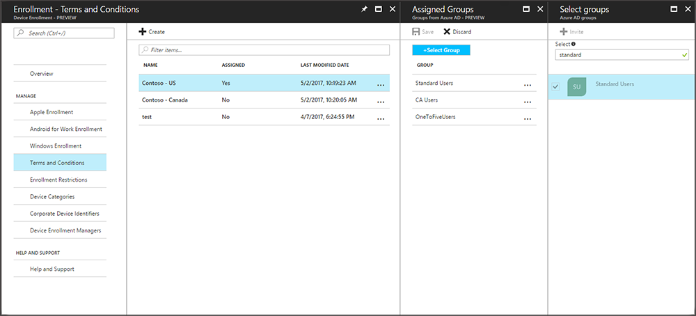

---
# required metadata

title: Set terms and conditions in Microsoft Intune
titleSuffix: "Intune Azure preview"
description: "Set terms and conditions that users see in the Company Portal for Intune. "
keywords:
author: nathbarn
ms.author: nathbarn
manager: angrobe
ms.date: 05/05/2017
ms.topic: article
ms.prod:
ms.service: microsoft-intune
ms.technology:
ms.assetid: 4a3a11a8-9c0c-4334-8c6b-6fea4d0a2efb

# optional metadata

#ROBOTS:
#audience:
#ms.devlang:
ms.reviewer: amyro
ms.suite: ems
#ms.tgt_pltfrm:
ms.custom: intune-azure
---

# Ensure users accept company terms before they enroll devices

[!INCLUDE[azure_preview](../includes/azure_preview.md)]

As an Intune admin, you can require that users accept your company's terms and conditions before they can use the Company Portal to enroll their devices and access company resources like apps and email. Use of this policy is optional.

You can create and deploy multiple policies containing different terms and conditions. You can also produce versions of the same terms and conditions in different languages and then deploy these to their appropriate groups.

## Create terms and conditions

1. In the Azure portal, choose **More Services** > **Monitoring + Management** > **Intune**.

2. On the Intune blade, choose **Device enrollment**, and then choose **Terms and Conditions**.

3. Select **Create**.

4. On the **Create Terms and Conditions** blade, specify the following information:

   - **Display name**: Name for the terms. Users see this name in the Company Portal app.

   - **Description**: Optional details that help you identify the policy in the Azure portal.

5. Select the arrow next to Define terms of use to open the Terms and Conditions blade, and then enter the following information:

   - **Title**: The title users see in the Company Portal.

   - **Summary of Terms**: Text that explains what it means if users accept the terms.

   - **Terms and Conditions**: The legal label that users see and must either accept or reject, for example, “I agree to the terms and conditions.”

6. Select **Ok**.

## Assign a terms and conditions

When users in assigned groups access the Company Portal, Intune displays the terms and conditions you deployed. Users must accept these terms before they can gain access to company resources.

1. In the Azure portal, choose **More Services** > **Monitoring + Management** > **Intune**.

2. On the Intune blade, choose **Device enrollment**, and then choose **Terms and Conditions**.

3. In the list of terms and conditions, select the terms you want to assign, and then select **Assign Groups**.

4. Click the **Select Group** button and in the **Select Groups** blade, select the groups you want to assign the terms, and then click **Select**.

5. In the **Assigned Groups** blade, click **Save**.  The terms and conditions are now assigned to users in the selected groups and users will see and must accept before they can enroll devices.

## Monitor a terms and conditions policy

1.  In the [Microsoft Intune administration console](https://manage.microsoft.com), click **Policy** &gt; **Terms and Conditions**.

2.  In the **Create New Report** window, click **View Report**. The report will open detailing which users have accepted the terms and conditions you deployed.

### Updates and version control for terms and conditions
When you edit an existing terms and conditions policy, you can choose which behavior occurs when you deploy the policy. Use the following procedure to help you update existing terms and conditions policies.

## Work with multiple versions of terms and conditions
You can edit your terms and conditions and manage their versions. We recommend that you increase the version number and require acceptance any time you make significant changes to your terms and conditions policy. Keep the current version number if you are fixing typos or changing formatting, for example.

1. In the Azure portal, choose **More Services** > **Monitoring + Management** > **Intune**.

2. On the Intune blade, choose **Device enrollment**,  choose **Terms and Conditions**, and select the terms and conditions you want to modify.

3. On the **Properties** blade, select **Terms and Conditions** and then modify the **Title**, **Summary of Terms**, and **Terms and Conditions** as needed. If the changes you made make it necessary for users to re-accept the new terms, click **Require users to re-accept, and increment the version number to**

4.  Select **OK** and then select **Save**.
