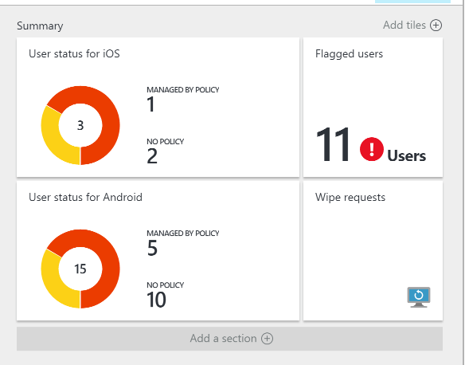
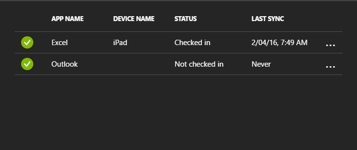

---
# required metadata

title: Monitor app protection policies with Intune | Intune Azure preview | Microsoft Docs
description: "Intune Azure preview: See how many users have the policy, and drill down to find more details."
keywords:
author: NathBarn
ms.author: nathbarn
manager: angrobe
ms.date: 12/07/2016
ms.topic: article
ms.prod:
ms.service: microsoft-intune
ms.technology:
ms.assetid: 9b0afb7d-cd4e-4fc6-83e2-3fc0da461d02

# optional metadata

#ROBOTS:
#audience:
#ms.devlang:
ms.reviewer: joglocke
ms.suite: ems
#ms.tgt_pltfrm:
#ms.custom:

---

# How to monitor app protection policy user status with Microsoft Intune
[!INCLUDE[azure_preview](../includes/azure_preview.md)]

**If you are not in the Intune service in the Azure portal preview program**, this topic explains [how to create app protection policies](https://docs.microsoft.com/en-us/intune/deploy-use/create-and-deploy-mobile-app-management-policies-with-microsoft-intune) in the classic Intune console.

After you have set up an app protection policy and applied it to users, you can monitor the compliance status in the [Azure portal](https://portal.azure.com). The Azure portal includes information about the users affected by the policy, the compliance status, and any issues that your users might be experiencing.

## Summary view

1. Sign into the Azure portal.
2. Choose **More Services** > **Other** > **Intune**.
3. On the **Intune** blade, choose **Manage apps**.
4. In the **Manage apps** workload, choose **Monitor** > **App protection user status**, to see the summary view:

-   **Users**: The total number of users in your company who are using the apps that are associated with the policy.

-   **MANAGED BY POLICY**: The number of users who have used at least one of the apps in the work context.

-   **NO POLICY**: The number of users who are using the apps that are associated with the policy, but who are not targeted by the policy. You might consider adding these users to the policy.

- **Flagged users**: The number of users who are experiencing issues. Currently, only users with jailbroken devices are reported under **Flagged users**.

## Detailed view
You can get to the detailed view of the summary by choosing the **User status** tile and the **Flagged users** tile.

### User status
You can search for a single user and check the compliance status for that user. The **App reporting** blade shows the following information for a selected user:
- Devices that are associated with the user account

- Apps with an app protection policy on the device

- Status:

  - **Checked in**: The policy was deployed to the user, and the app was used in the work context at least once.

  - **Not checked in**: The policy was deployed to the user, but the app has not been used in the work context since then.

>[!NOTE]
> If the user you searched for does not have the app protection policy deployed to them, you will see a message informing you that the user is not targeted for any app policies.

To see the reporting for a user, follow these steps:

1.  To select a user, choose the **Summary** tile or choose the **App protection user status** option

2. On the **App reporting** blade that opens, choose **Select user** to search for an Azure Active Directory user.

3. Select the user from the list. You will see the details of the compliance status for that user.

    

### Flagged users
The detailed view shows the error message, the app that was accessed when the error happened, the platform of the device, and a time stamp.  

### See also
[Manage data transfer between iOS apps](manage-data-transfer-between-ios-apps-with-microsoft-intune.md)

* [What to expect when your Android app is managed by app protection policies](app-protection-enabled-android-apps.md)
* [What to expect when your iOS app is managed by app protection policies](app-protection-enabled-ios-apps.md)
