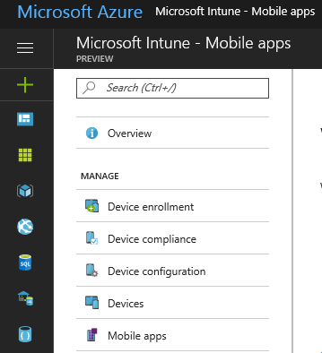

---
# required metadata

title: What is app management with Microsoft Intune | Intune Azure preview | Microsoft Docs
description: "Intune Azure preview: Use this topic to learn the basics about app management with Microsoft Intune"
keywords:
author: robstackmsft
ms.author: robstack
manager: angrobe
ms.date: 12/30/2016
ms.topic: get-started-article
ms.prod:
ms.service: microsoft-intune
ms.technology:
ms.assetid:

# optional metadata

#ROBOTS:
#audience:
#ms.devlang:
ms.reviewer:
ms.suite: ems
#ms.tgt_pltfrm:
#ms.custom:

---

# What is app management with the Intune Azure preview?

[!INCLUDE[azure_preview](../includes/azure_preview.md)]

As an IT admin, you'll most likely be tasked with making sure that your end users have access to the apps they need to do their work. This can be a challenge, as there are a wide range of device platforms and app types, you might need to manage apps on company devices as well as users own devices, and you need to do all of this, while ensuring you network, and your data remain secure.
Microsoft Intune provides a wide range of capabilities to help you stay on top of app management like:

- Adding and assigning apps
- Configuring apps
- Making corporate data in apps more secure
- Removing corporate data from apps
- Keeping apps up-to-date
- Reporting where apps are installed, and how they are being used

You'll find most things app-related in the **Mobile Apps** workload which you can access as follows:

1. Sign into the Azure portal.
2. Choose **More Services** > **Other** > **Intune**.
3. On the **Intune** blade, choose **Manage apps**.

	

### Manage
- **Apps** - This is where you'll create, assign, and monitor most of your apps. For details, see:
	- [Add apps](add-apps.md)
	- [Assign apps](deploy-apps.md)
	- [Monitor apps](monitor-apps.md)
- **Licensed Apps** - View, deploy, and monitor volume-purchased apps from the Apple store and the Windows Store for Business. For details, see:
	- [iOS volume-purchased apps](ios-vpp-apps.md)
	- [Windows Store for Business volume-purchased apps](wsfb-apps.md)
- **App Configuration Policies** - App configuration policies let you supply settings that might be required when a user runs an app. For details, see:
	- [App configuration policies](app-configuration-policies.md)
- **App Protection Policies**
	- [App protection policies](app-protection-policies.md)
- **App Selective Wipe**
	- [App selective wipe](app-selective-wipe.md)

### Monitor
- **Discovered Apps**
- **App Install Status**
- **App Protection User Status**

	For details, see [Monitor apps](monitor-apps.md)

### Setup
- **iOS VPP Tokens**
	- [iOS volume-purchased apps](ios-vpp-apps.md)
- **Windows Store for Business**
	- [Windows Store for Business volume-purchased apps](wsfb-apps.md)
- **Company Portal Branding** - Customize the Company Portal to give it your company branding. For details, see:
	- [Company portal configuration](company-portal-app.md)
