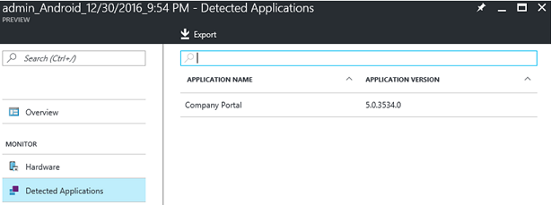
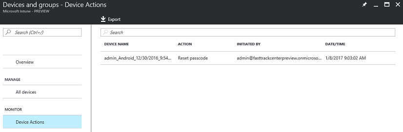

---
# required metadata

title: View Intune device inventory
titleSuffix: "Intune Azure preview"
description: "Intune Azure preview: Learn how to view the devices you manage with Intune, and understand their hardware and installed apps."
keywords:
author: robstackmsft
ms.author: robstack
manager: angrobe
ms.date: 04/27/2017
ms.topic: get-started-article
ms.prod:
ms.service: microsoft-intune
ms.technology:
ms.assetid: e71c6bdb-d75c-404f-8e38-24a663be81c2

# optional metadata

#ROBOTS:
#audience:
#ms.devlang:
#ms.reviewer: angrobe
ms.suite: ems
#ms.tgt_pltfrm:
ms.custom: intune-azure

---

# How to view Intune device inventory

[!INCLUDE[azure_preview](../includes/azure_preview.md)]

The **Devices** workload gives you insights into the devices you manage, including their hardware capabilities, and the apps installed on them. 

To view device inventory:

1. Sign into the Azure portal.
2. Choose **More Services** > **Monitoring + Management** > **Intune**.
3. On the **Intune** blade, choose **Devices**.

Now, choose one of the following:

- **Overview** Get information about devices you've enrolled, and the operating systems each device runs.
- **Manage** - Choose **All Devices** to see a list of all the devices you manage.
	Select one of those devices in the list to open the <*device name*> **Overview** blade where you can select one of:
	- **Overview**  - See general information about the device including information about it's name, the owner, whether it is a BYOD device, when it last checked-in, and more.

	- **Hardware** - See more detailed information about the device including it's free storage space, model and manufacturer, and more.
	
	- **Detected Applications** - Displays a list of all apps that Intune found installed on the device.
	
- **Monitor** Choose **Device Actions** to see a list of device actions that have been performed on devices you manage and the current state of those actions.

