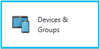

---
# required metadata

title: Manage devices with Intune | Intune Azure preview | Microsoft Docs
description: "Intune Azure preview: Learn how to view the devices you manage with Intune, and perform various operations on them."
keywords:
author: robstackmsft
ms.author: robstack
manager: angrobe
ms.date: 01/08/2017
ms.topic: get-started-article
ms.prod:
ms.service: microsoft-intune
ms.technology:
ms.assetid:

# optional metadata

#ROBOTS:
#audience:
#ms.devlang:
#ms.reviewer:
ms.suite: ems
#ms.tgt_pltfrm:
#ms.custom:

---

# Manage devices with Intune Azure preview

[!INCLUDE[azure_preview](../includes/azure_preview.md)]

The **Devices and groups** workload gives you insights into the devices you manage, and lets you perform remote tasks on those devices. To access the workload:

1. Sign into the Azure portal.
2. Choose **More Services** > **Monitoring + Management** > **Intune**.
3. On the **Intune** blade, choose **Devices & Groups**.

	

Now choose one of the following:

- **Overview** Get information about devices you've enrolled, and the operating systems each device runs.
- **Manage** - Choose **All Devices** to see a list of all the devices you manage.
	Select one of those devices in the list to open the <*device name*> **Overview** blade where you can select one of:
	- **Overview**  - See general information about the device including information about it's name, the owner, whether it is a BYOD device, when it last checked-in, and more. Additionally, you can perform the following remote actions on the device (not all actions are supported by all device platforms):
		- **Remove company data** - Removes only company data managed by Intune. Does not remove personal data from the device. The device will no longer be managed by Intune, and will no longer be able to access corporate resources (not supported for Windows devices that are joined to Azure Active Directory).
		- **Factory reset** - Returns the device to its default settings. The device will no longer be managed by Intune and both company and personal data are removed. You cannot undo this action.
		- **Remote lock** - Locks the device. The device owner must use their passcode to unlock it. You can only remotely lock a device that has a PIN or password set.
		- **Reset passcode** - Generates a new passcode for the device which will be displayed on the <*device name*> **Overview** blade.
		- **Bypass Activation Lock** - This will remove the activation lock from an iOS device without the user’s Apple ID and password. Once you bypass the activation lock, the device turns on activation lock again when the Find My iPhone app launches. Only bypass the activation lock if you have physical access to the device.
		- **Lost mode** - If a device has been stolen, you can enable lost mode. This lets you specify a message and a phone number that will be displayed on the lock screen of the device.
		- **Restart** - Causes the device to restart. The device owner is not automatically notified of the restart, therefore might lose work.
		
		
	- **Hardware** - See more detailed information about the device including it's free storage space, model and manufacturer, and more.
	
	- **Detected Applications** - Displays a list of all apps that Intune found installed on the device.
	
- **Monitor** Choose **Device Actions** to see a list of device actions that have been performed on devices you manage. In this example, you've sent a **Reset passcode** action to an Android device you manage:

