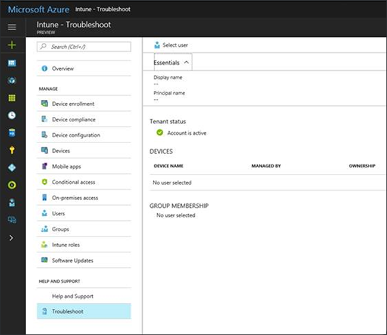

# Troubleshooting console in Microsoft Intune

[!INCLUDE[azure_preview](../includes/azure_preview.md)]

As an IT administrator, you can give users permission to view a help desk troubleshooting console that can help resolve issues for end users. The following topic explains how to enable help desk users to view the Troubleshooting blade in Intune and provides and overview of the blade.

Help desk users can view the Troubleshoot portal in the Intune console but cannot perform other administrative tasks or view other workloads.

## Add help desk users

Help desk users are Intune users with permission to view the Troubleshoot workload in the Intune console.

1. As an Intune administrator, login to the [Azure portal](https:portal.azure.com), select **More Services** > **Monitoring + Management** > **Intune**.
2. In the left navigation blade, select **Intune roles**.
3. On the **Intune roles** workload, select **Help Desk Operator** and then select **Assign**.
4. Type an **Assignment name** (required), an **Assignment description** (optional), and then assign **Members (Groups)** and **Scope (Groups)**.
5. Members of the Help Desk Operator role can now use the Troubleshooting portal.

## Use the troubleshooting portal

Help desk users can access the Troubleshoot workload in two ways:
- In the [Azure portal](https:portal.azure.com), select **More Services** > **Monitoring + Management** > **Intune**, and then in the left navigation blade, select **Troubleshoot**. Other workloads are visible in the left navigation blade, but unavailable.

- Open [http://aka.ms/intunetroubleshooting](http://aka.ms/intunetroubleshooting) in a web browser. Only the Troubleshoot console is visible.

## Use the troubleshooting console

The helpdesk user can select a user to troubleshoot by clicking **Select User**. User information can be used to help understand the current state of users and their devices.

Help desk users can use the Troubleshoot console to view the following Intune users and devices details:
- User account information
- User group membership
- Device details

Help desk users can also perform remote tasks on devices such as **Remote lock**.
