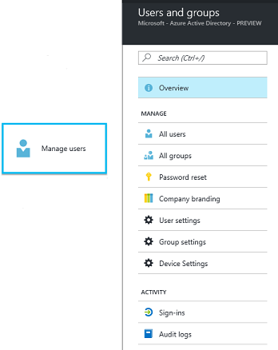

---
# required metadata

title: What is the Manage Users workload? | Intune Azure preview | Microsoft Docs
description: "Intune Azure preview: Learn how to see and manage users using Microsoft Intune and Azure."
keywords:
author: robstackmsft
ms.author: robstack
manager: angrobe
ms.date: 01/18/2017
ms.topic: get-started-article
ms.prod:
ms.service: microsoft-intune
ms.technology:
ms.assetid:

# optional metadata

#ROBOTS:
#audience:
#ms.devlang:
#ms.reviewer:
ms.suite: ems
#ms.tgt_pltfrm:
#ms.custom:

---

# What is the Manage Users workload in Intune Azure preview?

[!INCLUDE[azure_preview](../includes/azure_preview.md)]

If you are new to Intune in the Azure portal, remember that you no longer create Intune-specific groups. Intune uses Azure AD groups just like many other applications that you use.
If you want to learn more about how to work with groups in Azure AD, see [Managing access to resources with Azure Active Directory groups](https://docs.microsoft.com/en-us/azure/active-directory/active-directory-manage-groups)

When you choose **Manage users**, you are taken to the Microsoft Azure Users and groups workload where you can perform the following actions

1. See overview information about the users and groups you manage.
2. See details about all users you manage with Azure.
3. Create groups of users and devices.
4. Display audit activity for group actions.

## Next step

[Get started with groups](/intune-azure/manage-users/get-started-with-groups)