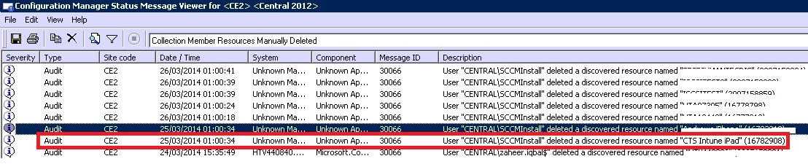

---
# required metadata

title: Troubleshoot device enrollment
description: Suggestions for troubleshooting device enrollment issues.
keywords:
author: nathbarn
ms.author: nathbarn
manager: dougeby
ms.date: 09/15/2017
ms.topic: article
ms.prod:
ms.service: microsoft-intune
ms.technology:
ms.assetid: 6982ba0e-90ff-4fc4-9594-55797e504b62
ROBOTS: NOINDEX,NOFOLLOW

# optional metadata

#audience:+
#ms.devlang:
ms.reviewer: damionw
ms.suite: ems
#ms.tgt_pltfrm:
ms.custom: intune-classic

---

# Troubleshoot device enrollment in Intune

[!INCLUDE[classic-portal](../includes/classic-portal.md)]

This topic provides suggestions for troubleshooting device enrollment issues. If this information does not solve your problem, see [How to get support for Microsoft Intune](how-to-get-support-for-microsoft-intune.md) to find more ways to get help.

## Initial troubleshooting steps

Before you begin troubleshooting, check to make sure that you've configured Intune properly to enable enrollment. You can read about those configuration requirements in:

-	[Get ready to enroll devices in Microsoft Intune](/intune-classic/deploy-use/prerequisites-for-enrollment)
-	[Set up iOS and Mac device management](/intune-classic/deploy-use/set-up-ios-and-mac-management-with-microsoft-intune)
-	[Set up Windows device management](/intune-classic/deploy-use/set-up-windows-device-management-with-microsoft-intune)
-	[Set up Android device management](/intune-classic/deploy-use/set-up-android-management-with-microsoft-intune) - No additional steps required
-	[Set up Android for Work device management](/intune-classic/deploy-use/set-up-android-for-work)

You can also make sure that the time and date on the user's device are set correctly:

1. Restart the device.
2. Make sure that the time and date are set close to GMT standards (+ or - 12 hours) relative to the end user's time zone.
3. Uninstall and reinstall the Intune company portal (if applicable).

Your managed device users can collect enrollment and diagnostic logs for you to review. User instructions for collecting logs are provided in:

- [Send Android enrollment errors to your IT admin](https://docs.microsoft.com/intune-user-help/send-enrollment-errors-to-your-it-admin-android)
- [Send iOS errors to your IT admin](https://docs.microsoft.com/intune-user-help/send-errors-to-your-it-admin-ios)

## General enrollment issues
These issues may occur on all device platforms.

### Device cap reached
**Issue:** A user receives an error on their device during enrollment, such as a **Company Portal Temporarily Unavailable** error on an iOS device, and the DMPdownloader.log on Configuration Manager contains the error **DeviceCapReached**.

**Resolution:**

#### Check number of devices enrolled and allowed

1.  Validate in the Intune admin portal that the user has no more than the allowable maximum of 15 devices assigned.

2.  Under **Admin** > **Mobile Device Management** > **Enrollment Rules** in the Intune admin console, check that the Device enrollment limit is set to 15.

<!--- Mobile device users can delete devices at the following URL: [https://byodtestservice.azurewebsites.net/](https://byodtestservice.azurewebsites.net/). --->

Administrators can delete devices in the Azure Active Directory portal.

#### To delete devices in the Azure Active Directory portal

1.  Browse to [http://aka.ms/accessaad](http://aka.ms/accessaad) or choose **Admin** &gt; **Azure AD** from [https://portal.office.com](https://portal.office.com).

2.  Log in with your Org ID using the link on the left side of the page.

3.  If you don't already have one, create an Azure subscription by choosing the **Register your free Azure Active Directory** subscription link. If you have a paid account, you shouldn't need to use a credit card or payment.

4.  Select **Active Directory** and then select your organization.

5.  Select the **Users** tab.

6.  Select the user whose devices you want to delete.

7.  Choose **Devices**.

8.  Remove devices as appropriate, such as those that are no longer in use, or those that have inaccurate definitions.

> [!NOTE]

> You can avoid the device enrollment cap by using Device Enrollment Manager account, as described in [Enroll corporate-owned devices with the Device Enrollment Manager in Microsoft Intune](/intune-classic/deploy-use/enroll-corporate-owned-devices-with-the-device-enrollment-manager-in-microsoft-intune).
>
> A user account that is added to Device Enrollment Managers account will not be able to complete enrollment when Conditional Access policy is enforced for that specific user login.

### Company Portal Temporarily Unavailable
**Issue:** Users receive a **Company Portal Temporarily Unavailable** error on their device.

**Resolution:**

1.  Remove the Intune Company Portal app from the device.

2.  On the device, open the browser, browse to [https://portal.manage.microsoft.com](https://portal.manage.microsoft.com), and attempt a user login.

3.  If the user fails to log in, have her try another network.

4.  If that fails, validate that the user’s credentials have synced correctly with Azure Active Directory.

5.  If the user successfully logs in, an iOS device will prompt you to install the Intune Company Portal app and enroll. On an Android device, you will need to manually install the Intune Company Portal app, after which you can retry enrolling.

### MDM authority not defined
**Issue:** A user receives an **MDM authority not defined** error.

**Resolution:**

1.  Verify that the MDM Authority has been set appropriately for the type of Intune service you are using (that is, Intune, Office 365, or System Center Configuration Manager with Intune. For Intune, the MDM Authority is set in **Admin** &gt; **Mobile Device Management**. For Configuration Manager with Intune, you set it when configuring the Intune connector, and in Office 365, it's a setting **Mobile Devices**.

    > [!NOTE]    
    > In Configuration Manager version 1610 or later and Microsoft Intune version 1705, you change the MDM authority without having to contact Microsoft Support, and without having to unenroll and reenroll your existing managed devices. For details, see [What to do if you choose the wrong MDM authority setting](/intune-classic/deploy-use/prerequisites-for-enrollment#what-to-do-if-you-choose-the-wrong-mdm-authority-setting).

2.  Verify that the user’s credentials have synced correctly with Azure Active Directory by checking that the user's UPN matches the Active Directory information in the Office 365 portal.
    If the UPN does not match the Active Directory information:

    1.  Turn off DirSync on the local server.

    2.  Delete the mismatched user from the **Intune Account Portal** user list.

    3.  Wait about one hour to allow the Azure service to remove the incorrect data.

    4.  Turn on DirSync again and check if the user is now synced properly.

3.  In a scenario where you are using System Center Configuration Manager with Intune, verify that the user has a valid Cloud User ID:

    1.  Open SQL Management Studio.

    2.  Connect to the appropriate DB.

    3.  Open the databases folder and find and open the **CM_DBName** folder, where DBName is the name of the customer database.

    4.  At the top, choose **New Query**  and execute the following queries:

        -   To see all users:
            `select * from [CM_ DBName].[dbo].[User_DISC]`

        -   To see Specific Users, use the following query, where %testuser1% represents username@domain.com for the user you want to look up:
            `select * from [CM_ DBName].[dbo].[User_DISC] where User_Principal_Name0 like '%testuser1%'`

        After writing the query choose **!Execute**.
        Once the results have been returned, look for the clouduser ID.  If no ID is found, the user isn't licensed to use Intune.

### Unable to create policy or enroll devices if the company name contains special characters
**Issue:** You can't create policy or enroll devices.

**Resolution:** In the [Office 365 admin center](https://portal.office.com/), remove the special characters from the company name and save the company information.

### Unable to log in or enroll devices when you have multiple verified domains
**Issue:** When you add a second verified domain to your ADFS, users with the user principal name (UPN) suffix of the second domain may not be able to log into the portals or enroll devices.

**Resolution:** Microsoft Office 365 customers who use single sign-on (SSO) through AD FS 2.0 and have multiple top level domains for users' UPN suffixes within their organization (for example, @contoso.com or @fabrikam.com) are required to deploy a separate instance of the AD FS 2.0 Federation Service for each suffix. There is now a [rollup for AD FS 2.0](http://support.microsoft.com/kb/2607496) that works in conjunction with the **SupportMultipleDomain** switch to enable the AD FS server to support this scenario without requiring additional AD FS 2.0 servers. See [this blog](https://blogs.technet.microsoft.com/abizerh/2013/02/05/supportmultipledomain-switch-when-managing-sso-to-office-365/) for more information.

## Android issues

### Android enrollment errors

The following table lists errors that end users might see while enrolling Android devices in Intune.

|Error message|Issue|Resolution|
|---|---|---|
|**IT admin needs to assign license for access** Your IT admin has not given you access to use this app. Please get help from your IT admin or try again later.|The device cannot be enrolled because the user's account does not have the necessary license.|Before users can enroll their devices, they must have been assigned the necessary license. This message means that they have the wrong license type for the designated mobile device management authority. For example, if Intune has been designated as the mobile device management authority, and they are using a System Center 2012 R2 Configuration Manager license, they will see this error.  See information about how to [assign Intune licenses to your user accounts](/intune/licenses-assign).
|**IT admin needs to set MDM authority** Looks like your IT admin has not set an MDM authority. Please get help from your IT admin or try again later.|The mobile device management authority has not been defined.|The mobile device management authority has not been designated in Intune. See information about how to [set the mobile device management authority](/intune/mdm-authority-set).|

### Devices fail to check in with the Intune service and display as "Unhealthy" in the Intune admin console
**Issue:** Some Samsung devices that are running Android versions 4.4.x and 5.x might stop checking in with the Intune service. If devices don't check in:

- They can't receive policy, apps, and remote commands from the Intune service.
- They show a Management State of **Unhealthy** in the administrator console.
- Users who are protected by conditional access policies might lose access to corporate resources.

Samsung has confirmed that the Samsung Smart Manager software, which ships on certain Samsung devices, can deactivate the Intune Company Portal and its components. When Company Portal is in a deactivated state, it can't run in the background and therefore can't contact the Intune service.

**Resolution #1:**

Tell your users to start the Company Portal app manually. Once the app restarts, the device checks in with the Intune service.

> [!IMPORTANT]
> Opening the Company Portal app manually is a temporary solution, because Samsung Smart Manager may deactivate the Company Portal app again.

**Resolution #2:**

Tell your users to try upgrading to Android 6.0. The deactivation issue doesn't occur on Android 6.0 devices. To check if an update is available, users can go to **Settings** > **About device** > **Download updates manually**, and follow the prompts on the device.

**Resolution #3:**

If Resolution #2 doesn't work, have your users follow these steps to make Smart Manager exclude the  Company Portal app:

1. Launch the Smart Manager app on the device.

  

2. Choose the **Battery** tile.

  

3. Under **App power saving** or **App optimization**, select **Detail**.

  

4. Choose **Company Portal** from the list of apps.

  

5. Choose **Turned off**.

  

6. Under **App power saving** or **App optimization**, confirm that Company Portal is turned off.

  

### Profile installation failed
**Issue:** A user receives a **Profile installation failed** error on an Android device.

**Resolution:**

1.  Confirm that the user has been assigned an appropriate license for the version of the Intune service you are using.

2.  Confirm that the device is not already enrolled with another MDM provider or that it does not already have a management profile installed.

3.  Confirm that Chrome for Android is the default browser and that cookies are enabled.

### Android certificate issues

**Issue**: Users receive the following message on their device:
*You cannot sign in because your device is missing a required certificate.*

**Resolution 1**:

The user might be able to retrieve the missing certificate by following the instructions in [Your device is missing a required certificate](/intune-user-help/your-device-is-missing-a-required-certificate-android#your-device-is-missing-a-certificate-required-by-your-it-administrator). If the error persists, try Resolution 2.

**Resolution 2**:

If users still see the missing certificate error after entering their corporate credentials and getting redirected for federated login, an intermediate certificate may be missing from your Active Directory Federation Services (AD FS) server.

The certificate error occurs because Android devices require intermediate certificates to be included in an [SSL Server hello](https://technet.microsoft.com/library/cc783349.aspx). Currently, a default AD FS server or WAP - AD FS Proxy server installation sends only the AD FS service SSL certificate in the SSL server hello response to an SSL Client hello.

To fix the issue, import the certificates into the Computers Personal Certificates on the AD FS server or proxies as follows:

1.	On the ADFS and proxy servers, right-click **Start** > **Run** > **certlm.msc**. This launches the Local Machine Certificate Management Console.
2.	Expand **Personal** and choose **Certificates**.
3.	Find the certificate for your AD FS service communication (a publicly signed certificate), and double-click to view its properties.
4.	Choose the **Certification Path** tab to see the certificate’s parent certificate/s.
5.	On each parent certificate, choose **View Certificate**.
6.	Choose the **Details** tab > **Copy to file…**.
7.	Follow the wizard prompts to export or save the public key of the parent certificate to the desired file location.
8.	Right-click **Certificates** > **All Tasks** > **Import**.
9.	Follow the wizard prompts to import the parent certificate(s) to **Local Computer\Personal\Certificates**.
10.	Restart the AD FS servers.
11.	Repeat the above steps on all of your AD FS and proxy servers.

To verify a proper certificate installation, you can use the diagnostics tool available on [https://www.digicert.com/help/](https://www.digicert.com/help/). In the **Server Address** box, enter your ADFS server’s FQDN (IE: sts.contso.com) and click **Check Server**.

**To validate that the certificate installed correctly**:

The follow steps describe just one of many methods and tools that you can use to validate that the certificate installed correctly.

1. Go to the [free Digicert tool](ttps://www.digicert.com/help/).
2. Enter your AD FS server’s fully qualified domain name (e.g., sts.contoso.com) and select **CHECK SERVER**.

If the Server certificate is installed correctly, you see all check marks in the results. If the problem above exists, you see a red X in the "Certificate Name Matches" and the “SSL Certificate is correctly Installed” sections of the report.

## iOS issues

### iOS enrollment errors
The following table lists errors that end users might see while enrolling iOS devices in Intune.

|Error message|Issue|Resolution|
|-----------------|---------|----------------------------------------------------------------------------------------------------------------------------------------------------------------|
|NoEnrollmentPolicy|No enrollment policy found|Check that all enrollment prerequisites, like the Apple Push Notification Service (APNs) certificate, have been set up and that "iOS as a platform" is enabled. For instructions, see [Set up iOS and Mac device management](/intune/deploy-use/set-up-ios-and-mac-management-with-microsoft-intune).|
|DeviceCapReached|Too many mobile devices are enrolled already.|The user must remove one of his or her currently enrolled mobile devices from the Company Portal before enrolling another. See the instructions for the type of device you're using: [Android](https://docs.microsoft.com/intune-user-help/unenroll-your-device-from-intune-android), [iOS](https://docs.microsoft.com/intune-user-help/unenroll-your-device-from-intune-ios), [Windows](https://docs.microsoft.com/intune-user-help/unenroll-your-device-from-intune-windows).|
|APNSCertificateNotValid|There is a problem with the certificate that lets the mobile device communicate with your company’s network.  |The Apple Push Notification Service (APNs) provides a channel to reach out to enrolled iOS devices. If the steps to get an APNs certificate were not performed, or if the APNs certificate has expired, then enrollment attempts will fail, and this message will appear.  Review the information about how to set up users in [Sync Active Directory and add users to Intune](/intune/users-permissions-add) and [organizing users and devices](/Intune/Get-Started/start-with-a-paid-subscription-to-microsoft-intune-step-5).|
|AccountNotOnboarded|There is a problem with the certificate that lets the mobile device communicate with your company’s network.  |The Apple Push Notification Service (APNs) provides a channel to reach out to enrolled iOS devices. If the steps to get an APNs certificate were not performed, or if the APNs certificate has expired, then enrollment attempts will fail, and this message will appear.  For more information, review [Set up iOS and Mac management with Microsoft Intune](/Intune/Deploy-use/set-up-ios-and-mac-management-with-microsoft-intune).|
|DeviceTypeNotSupported|The user might have tried to enroll using a non-iOS device. The mobile device type that you are trying to enroll is not supported.  Confirm that device is running iOS version 8.0 or later.  |Ensure that your user's device is running iOS version 8.0 or later.|
|UserLicenseTypeInvalid|The device cannot be enrolled because the user's account is not yet a member of a required user group.  |Before users can enroll their devices, they must be members of the right user group. This message means that they have the wrong license type for the designated mobile device management authority. For example, if Intune has been designated as the mobile device management authority, and they are using a System Center 2012 R2 Configuration Manager license, they will see this error.  Review the following for more information:  Review [Set up iOS and Mac management with Microsoft Intune](/Intune/Deploy-use/set-up-ios-and-mac-management-with-microsoft-intune) and information about how to set up users in [Sync Active Directory and add users to Intune](/intune/users-permissions-add) and [organizing users and devices](/Intune/Get-Started/start-with-a-paid-subscription-to-microsoft-intune-step-5).|
|MdmAuthorityNotDefined|The mobile device management authority has not been defined.  |The mobile device management authority has not been designated in Intune.  Review item #1 in the "Step 6: Enroll mobile devices and install an app" section in [Get started with a 30-day trial of Microsoft Intune](/Intune/Understand-explore/get-started-with-a-30-day-trial-of-microsoft-intune).|

### Devices are inactive or the admin console cannot communicate with them
**Issue:** iOS devices aren’t checking in with the Intune service. Devices must check in periodically with the service to maintain access to protected corporate resources. If devices don’t check in:

- They can't receive policy, apps, and remote commands from the Intune service.
- They show a Management State of **Unhealthy** in the administrator console.
- Users who are protected by conditional access policies might lose access to corporate resources.

**Resolution:** Share the following resolutions with your end users to help them regain access to corporate resources.

When users start the iOS Company Portal app, it can tell if their device has lost contact with Intune. If it detects that there is no contact, it automatically tries to sync with Intune to reconnect, and users will see the **Trying to sync…** inline notification.

  

If the sync is successful, you see a **Sync successful** inline notification in the iOS Company Portal app, indicating that your device is in a healthy state.

  

If the sync is unsuccessful, users see an **Unable to sync** inline notification in the iOS Company Portal app.

  

To fix the issue, users must select the **Set up** button, which is to the right of the **Unable to sync** notification. The Set up button takes users to the Company Access Setup flow screen, where they can follow the prompts to enroll their device.

  

Once enrolled, the devices return to a healthy state and regain access to company resources.

### Verify WS-Trust 1.3 is enabled
**Issue** Device Enrollment Program (DEP) iOS devices cannot be enrolled

Enrolling Device Enrollment Program devices with user affinity requires WS-Trust 1.3 Username/Mixed endpoint to be enabled to request user tokens. Active Directory enables this endpoint by default. You get a list of enabled endpoints by using the Get-AdfsEndpoint PowerShell cmdlet and looking for the trust/13/UsernameMixed endpoint. For example:

      Get-AdfsEndpoint -AddressPath “/adfs/services/trust/13/UsernameMixed”

For more information, see [Get-AdfsEndpoint documentation](https://technet.microsoft.com/itpro/powershell/windows/adfs/get-adfsendpoint).

For more information, see [Best practices for securing Active Directory Federation Services](https://technet.microsoft.com/windows-server-docs/identity/ad-fs/operations/best-practices-securing-ad-fs). If you need additional assistance in determining if WS-Trust 1.3 Username/Mixed is enabled in your identity federation provider, please contact Microsoft Support if you use ADFS, or your 3rd party identity vendor.

### Profile installation failed
**Issue:** A user receives a **Profile installation failed** error on an iOS device.

### Troubleshooting steps for failed profile installation

1.  Confirm that the user has been assigned an appropriate license for the version of the Intune service you are using.

2.  Confirm that the device is not already enrolled with another MDM provider or that it does not already have a management profile installed.

3.  Navigate to [https://portal.manage.microsoft.com](https://portal.manage.microsoft.com) and try to install the profile when prompted.

4.  Confirm that Safari for iOS is the default browser and that cookies are enabled.

### Enrolled iOS device doesn't appear in console when using System Center Configuration Manager with Intune
**Issue:** User enrolls iOS device but it does not appear in the Configuration Manager admin console. The device does not indicate that it's been enrolled. Possible causes:

- The Microsoft Intune Connector in your Configuration Manager site isn't communicating with the Intune service.
- Either the Data Discovery Manager (ddm) component or the State Manager (statmgr) component is not processing messages from the Intune service.
- You may have downloaded the MDM certificate from one account and used it on another account.

**Resolution:** Review the following log files for possible errors:

- dmpdownloader.log
- ddm.log
- statmgr.log

Examples will be added soon about what to look for in these log files.

## Issues when using System Center Configuration Manager with Intune
### Mobile devices disappear
**Issue:** After successfully enrolling a mobile device to Configuration Manager it disappears from the mobile device collection, but the device still has the Management Profile and is listed in CSS Gateway.

**Resolution:** This may occur because you have a custom process removing non-domain-joined devices, or because the  user has retired the device from the subscription. To validate and check which process or user account removed the device from the Configuration Manager console, perform the following steps.

#### Check how device was removed

1.  In the Configuration Manager admin console select **Monitoring** &gt; **System Status** &gt; **Status Message Queries**.

2.  Right-click **Collection Member Resources Manually Deleted** and select **Show Messages**.

3.  Pick an appropriate time/date or the last 12 hours.

4.  Find the device in question and review how the device was removed. The Example below shows that the account SCCMInstall deleted the device via an Unknown Application.

    

5.  Check that Configuration Manager does not have a scheduled task, script, or other process which could be automatically purging non-domain, mobile, or related devices.

### Other iOS enrollment errors
A list of iOS enrollment errors is provided in our documentation, in [Troubleshooting iOS device enrollment problems in Microsoft Intune](https://support.microsoft.com/help/4039809/troubleshooting-ios-device-enrollment-in-intune).

## PC Issues

|Error message|Issue|Resolution|
|---|---|---|
|**IT admin needs to assign license for access** Your IT admin has not given you access to use this app. Please get help from your IT admin or try again later.|The device cannot be enrolled because the user's account does not have the necessary license.|Before users can enroll their devices, they must have been assigned the necessary license. This message means that they have the wrong license type for the designated mobile device management authority. For example, if Intune has been designated as the mobile device management authority, and they are using a System Center 2012 R2 Configuration Manager license, they will see this error. See information about [how to assign Intune licenses to your user accounts](https://docs.microsoft.com/intune/licenses-assign).|

### The machine is already enrolled - Error hr 0x8007064c
**Issue:** Enrollment fails with the error **The machine is already enrolled**. The enrollment log shows error **hr 0x8007064c**.

This may be because the computer had been previously enrolled, or has the cloned image of a computer that had been enrolled. The account certificate of the previous account is still present on the computer.

**Resolution:**

1. From the **Start** menu, type **Run** -> **MMC**.
1. Choose **File** > **Add/ Remove Snap-ins**.
1. Double-click **Certificates**, choose **Computer account** > **Next**, and select **Local Computer**.
1. Double-click **Certificates (Local computer)** and choose **Personal/ Certificates**.
1. Look for the Intune cert issued by Sc_Online_Issuing, and delete it, if present.
1. If the following registry key exists, delete it: **HKEY_LOCAL_MACHINE\SOFTWARE\Microsoft\OnlineManagement regkey** and all sub keys.
1. Try to re-enroll.
1. If the PC still cannot enroll, look for and delete this key, if it exists: **KEY_CLASSES_ROOT\Installer\Products\6985F0077D3EEB44AB6849B5D7913E95**.
1. Try to re-enroll.

    > [!IMPORTANT]
    > This section, method, or task contains steps that tell you how to modify the registry. However, serious problems might occur if you modify the registry incorrectly. Therefore, make sure that you follow these steps carefully. For added protection, back up the registry before you modify it. Then, you can restore the registry if a problem occurs.
    > For more information about how to back up and restore the registry, read [How to back up and restore the registry in Windows](https://support.microsoft.com/kb/322756)

## General enrollment Error codes

|Error code|Possible problem|Suggested resolution|
|--------------|--------------------|----------------------------------------|
|0x80CF0437 |The clock on the client computer is not set to the correct time.|Make sure that the clock and the time zone on the client computer are set to the correct time and time zone.|
|0x80240438, 0x80CF0438, 0x80CF402C|Cannot connect to the Intune service. Check the client proxy settings.|Verify that the proxy configuration on the client computer is supported by Intune, and that the client computer has Internet access.|
|0x80240438, 0x80CF0438|Proxy settings in Internet Explorer and Local System are not configured.|Cannot connect to the Intune service. Check the client proxy settings and confirm that the proxy configuration on the client computer is supported by Intune, and that the client computer has Internet access.|
|0x80043001, 0x80CF3001, 0x80043004, 0x80CF3004|Enrollment package is out of date.|Download and install the current client software package from the Administration workspace.|
|0x80043002, 0x80CF3002|Account is in maintenance mode.|You cannot enroll new client computers when the account is in maintenance mode. To view your account settings, sign in to your account.|
|0x80043003, 0x80CF3003|Account is deleted.|Verify that your account and subscription to Intune is still active. To view your account settings, sign in to your account.|
|0x80043005, 0x80CF3005|The client computer has been retired.|Wait a few hours, remove any older versions of the client software from the computer, and then retry the client software installation.|
|0x80043006, 0x80CF3006|The maximum number of seats allowed for the account has been reached.|Your organization must purchase additional seats before you can enroll more client computers in the service.|
|0x80043007, 0x80CF3007|Could not find the certificate file in the same folder as the installer program.|Extract all files before you start the installation. Do not rename or relocate any of the extracted files: all files must exist in the same folder or the installation will fail.|
|0x8024D015, 0x00240005, 0x80070BC2, 0x80070BC9, 0x80CFD015|The software cannot be installed because a restart of the client computer is pending.|Restart the computer and then retry the client software installation.|
|0x80070032|One or more prerequisites for installing the client software were not found on the client computer.|Make sure that all required updates are installed on the client computer and then retry the client software installation.|
|0x80043008, 0x80CF3008|Failed to start the Microsoft Online Management Updates service.|Contact Microsoft Support as described in [How to get support for Microsoft Intune](how-to-get-support-for-microsoft-intune.md).|
|0x80043009, 0x80CF3009|The client computer is already enrolled into the service.|You must retire the client computer before you can re-enroll it in the service.|
|0x8004300B, 0x80CF300B|The client software installation package cannot run because the version of Windows that is running on the client is not supported.|Intune does not support the version of Windows that is running on the client computer.|
|0xAB2|The Windows Installer could not access VBScript run time for a custom action.|This error is caused by a custom action that is based on Dynamic-Link Libraries (DLLs). When troubleshooting the DLL, you might have to use the tools that are described in [Microsoft Support KB198038: Useful Tools for Package and Deployment Issues](https://support.microsoft.com/kb/198038).|
|0x80cf0440|The connection to the service endpoint terminated.|Trial or paid account is suspended. Create a new trial or paid account and re-enroll.|

### Next steps
If this troubleshooting information didn't help you, contact Microsoft Support as described in [How to get support for Microsoft Intune](how-to-get-support-for-microsoft-intune.md).
