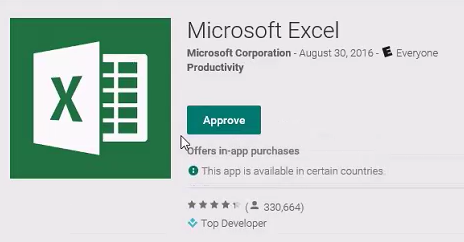
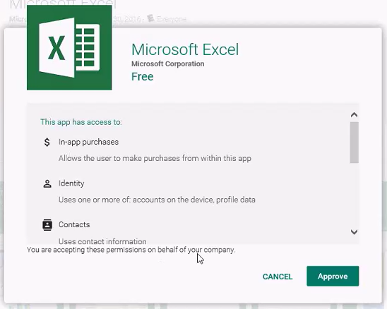

---
# required metadata

title: Deploy apps to Android for Work devices 
description: Use this topic to synchronize, then deploy app to Android for Work devices from the Google Play for Work Store.
keywords:
author: mattbriggs
ms.author: mabrigg
manager: angrobe
ms.date: 07/03/2017
ms.topic: article
ms.prod:
ms.service: microsoft-intune
ms.technology:
ms.assetid: cd0bbd90-d3fe-4efc-83fd-d1f3f86800d4

# optional metadata

#ROBOTS:
#audience:
#ms.devlang:
ms.reviewer: chrisbal
ms.suite: ems
#ms.tgt_pltfrm:
ms.custom: intune-classic

---

# How to deploy apps to Android for Work devices with Intune

[!INCLUDE[classic-portal](../includes/classic-portal.md)]

You deploy apps to Android for Work devices in a different way than you deploy them to standard Android devices. All apps you install for Android for Work come from the Google Play for Work store. You log on to the store, browse for the apps you want, and approve them.
The app then appears in the **Volume-Purchased Apps** node of the Intune console. From here, you can manage deployment of the app in the same way you would deploy any other app.

Additionally, if you have created your own line of business (LOB) apps, you can deploy them as follows:
- Sign up for a Google Developer account, which lets you publish apps to a private area in the Google Play store.
- Synchronize the apps with Intune.

## Before you start

Make sure you have configured Intune and Android for Work to work together in the **Admin** tab of the Intune console.

## Synchronize an app from the Google Play for Work store

1. Go to the [Google Play for Work store](https://play.google.com/work). Sign in with the same account you used to configure the connection between Intune and Android for Work.
2. Search the store for the app you want to deploy using Intune.
3. On the page for the app you chose, choose **Approve**. In this example, you have chosen the Microsoft Excel app. 
  
4. A window for the app opens asking you to give permissions for the app to perform various operations. Choose **Approve** to continue. 
  
5. The app is approved and displays in your IT admin console.

## Publish, then synchronize, a line-of-business app from the Google Play for Work store

1. Go to the Google Play Developer Console, [play.google.com/apps/publish](https://play.google.com/apps/publish).
2. Sign in with the same account you used to configure the connection between Intune and Android for Work. If you are signing in for the first time, you must register, and pay a fee to become a member of the Google Developer program.
3. In the console, choose **Add new application**.
4. You upload and provide information about your app in the same way as you publish any app to the Google Play store. However, you must select the setting **Only make this application available to my organization (<*organization name*>)**: 
   
This operation ensures that the app is only available to your organization, and is not available in the public Google Play store.
For more information about how to upload and publish Android apps, see the [Google Developer Console Help](https://support.google.com/googleplay/android-developer/answer/113469).
5. Once you have published your app, go to the [Google Play for Work store](https://play.google.com/work). Sign in with the same account you used to configure the connection between Intune and Android for Work.
6. In the **Apps** node of the store, verify you can see the app you have published. It is automatically approved to synchronize with Intune.

## Deploy an Android for Work app

If you approved an app from the store and don't see it in the **Volume-Purchased Apps** node of the **Apps** workspace, force an immediate sync as follows:

1. In the [Intune administrator console](https://manage.microsoft.com), choose **Admin** > **Mobile Device Management** > **Android for Work**.
2. On the **Android for Work Mobile Device Management Setup** page, choose **Sync Now**.
3. The page also displays the time and status of the last sync.

When the app is displayed in the **Volume-Purchased Apps** node of the **Apps** workspace, you can [deploy it just like you would do with any other app](deploy-apps-in-microsoft-intune.md). You can deploy the app to groups of users only. Currently, you can only select the **Required** and **Uninstall** actions.

The ability to deploy an app as **Available** applies the new grouping and targeting experience. Newly provisioned Intune service accounts can use this feature upon release. Existing Intune customers can use this feature once their tenant has been migrated to the Intune Azure portal. Existing customers can create a trial Intune account to plan for and test this feature until their tenant has been migrated.

After you deploy the app, it will be installed on the devices you targeted. The user of the device is not asked for approval.

## Manage app permissions
Android for Work requires you approve apps in Google's managed Play web console before syncing them to Intune and deploying them to your users.  Because Android for Work allows you to silently and automatically push these apps to users' devices, you must accept the app's permissions on behalf of all your users.  End users do not see any app permissions when they install, so it's important that you read and understand these permissions.

When an app developer publishes a new version of the app with updated permissions, those permissions are not automatically accepted, even if you've approved the previous permissions. Devices that run the old version of the app can still use it, but the app is not upgraded until the new permissions are approved. Devices without the app installed cannot install the app until you approve the app's new permissions.

### How to update app permissions

Periodically visit the managed Google Play console to check for new permissions. You can configure Google Play to send you or others an e-mail when new permissions are required for an approved app. If you assign an app and observe it isn't installed on devices, check for new permissions with the following steps:

1. Visit http://play.google.com/work
2. Sign in with the Google account you used to publish and approve the apps.
3. Visit the **Updates** tab to see if any apps require an update.  Any listed apps require new permissions and do not assign until they are applied.  

Alternatively, you can configure Google Play to automatically reapprove app permissions on a per app basis. 
