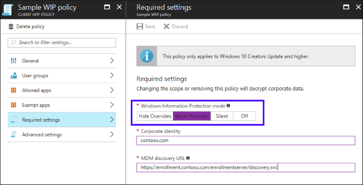

---
# required metadata

title: Create and deploy Windows Information Protection (WIP) app protection policy with Intune 
description: Create and deploy WIP app protection policy with Intune
keywords:
author: mattbriggs
ms.author: mabrigg
manager: angrobe
ms.date: 9/13/2017
ms.topic: article
ms.prod:
ms.service: microsoft-intune
ms.technology:
ms.assetid: 51e53e28-5c34-4d0f-a4b1-6390a337514c

# optional metadata

#ROBOTS:
#audience:
#ms.devlang:
ms.reviewer: joglocke
ms.suite: ems
#ms.tgt_pltfrm:
ms.custom: intune-classic

---

# Create and deploy Windows Information Protection (WIP) app protection policy with Intune

[!INCLUDE[note for both-portals](../includes/note-for-both-portals.md)]

Beginning with Intune 1704 release, you can use app protection policies with Windows 10 in the mobile application management (MAM) without enrollment scenario.

## Before you begin

Let’s talk about a few concepts when adding a WIP policy.

### List of Allowed and Exempt apps

-   **Allowed apps:** These are the apps that need to adhere to this policy.

-   **Exempt apps:** These apps are exempt from this policy and can access corporate data without restrictions.

### Types of apps

-   **Recommended apps:** a pre-populated list of (mostly Microsoft Office) apps that allow admins easily import into policy.

-   **Store apps:** Admin can add any app from the Windows store to policy.

-   **Windows desktop apps:** Admin can add any traditional Windows desktop apps to the policy (e.g. exe, dll, etc.)

## Pre-requisites

You need to configure the MAM provider before you can create a WIP app protection policy.

-   Learn more about [how to configure your MAM provider with Intune](/intune-classic/deploy-use/get-ready-to-configure-app-protection-policies-for-windows-10).

Additionally, you need to have the following:

-   [Azure AD Premium](https://docs.microsoft.com/azure/active-directory/active-directory-get-started-premium) license.
-   [Windows Creators Update](https://blogs.windows.com/windowsexperience/2017/04/11/how-to-get-the-windows-10-creators-update/#o61bC2PdrHslHG5J.97)

> [!IMPORTANT]
> WIP does not support multi-identity, only one managed identity can exist at a time.

## To add a WIP policy

After you set up Intune in your organization, you can create a WIP-specific policy through the [Azure portal](/intune-classic/deploy-use/azure-portal-for-microsoft-intune-mam-policies).

1.  Go to the **Intune mobile application management dashboard**, choose **All settings**, and then choose **App policy**.

2.  In the **App policy** blade, choose **Add a policy**, then enter the following values:

    a.  **Name:** Type a name (required) for your new policy.

    b.  **Description:** Type an optional description.

    c.  **Platform:** Choose **Windows 10** as the supported platform for your app protection policy.

    d.  **Enrollment state:** Choose **Without enrollment** as the enrollment state for your policy.

3.  Choose **Create**. The policy is created and appears in the table on the **App Policy** blade.

## To add recommended apps to your Allowed apps list

1.  From the **App policy** blade, choose the name of your policy, then choose **Allowed apps** from the **Add a policy** blade. The **Allowed apps** blade opens, showing you all apps that are already included in the list for this app protection policy.

2.  From the **Allowed apps** blade, choose **Add apps**. The **Add apps** blade opens, showing you all apps that are part of this list.

3.  Select each app you want to access your corporate data, and then choose **OK**. The **Allowed apps** blade gets updated showing you all selected apps.

## Add a Store app to your Allowed apps list

**To add a Store app**

1.  From the **App policy** blade, choose the name of your policy, then choose **Allowed apps** from the menu that appears showing all apps that are already included in the list for this app protection policy.

2.  From the **Allowed apps** blade, choose **Add apps**.

3.  On the **Add apps** blade, choose **Store apps** from the dropdown list. The blade changes to show boxes for you to add a **publisher** and app **name**.

4.  Type the name of the app and the name of its publisher, and then choose **OK**.

	> [!TIP]
	> Here’s an app example, where the **Publisher** is *CN=Microsoft Corporation, O=Microsoft Corporation, L=Redmond, S=Washington, C=US* and the Product **name** is *Microsoft.MicrosoftAppForWindows*.

5.  After you’ve entered the info into the fields, choose **OK** to add the app to your **Allowed apps** list.

> [!NOTE]
> To add multiple Store apps at the same time, you can click the menu **(…)** at the end of the app row, then continue to add more apps. Once you’re done, choose **OK**.

## Add a Desktop app to your Allowed apps list

**To add a Desktop app**

1.  From the **App policy** blade, choose the name of your policy, and then choose **Allowed apps.** The **Allowed apps** blade opens showing you all apps that are already included in the list for this app protection policy.

2.  From the **Allowed apps** blade, choose **Add apps**.

3.  On the **Add apps** blade, choose **Desktop apps** from the drop-down list.

4.  After you entered the info into the fields, choose **OK** to add the app to your **Allowed apps** list.

> [!NOTE]
> To add multiple **Desktop apps** at the same time, you can click the menu **(…)** at the end of the app row, then continue to add more apps. Once you’re done, choose **OK**.

## Windows Information Protection (WIP) Learning

After you add the apps you want to protect with WIP, you need to apply a protection mode by using **WIP Learning**.

### Before you begin

Windows Information Protection (WIP) Learning is a report that allows admins to monitor their WIP unknown apps. The unknown apps are the ones not deployed by your organization’s IT department. The admin can export these apps from the report and add them to their WIP policies to avoid productivity disruption before they enforce WIP in “Hide Override” mode.

We recommend that you start with **Silent** or **Allow Overrides** while verifying with a small group that you have the right apps on your allowed apps list. After you're done, you can change to your final enforcement policy, **Hide Overrides**.

#### What the protection modes are?

- **Hide Overrides:**
	- WIP looks for inappropriate data sharing practices and stops the user from completing the action.
	- This can include sharing info across non-corporate-protected apps, and sharing corporate data between other people and devices outside of your organization.
  

- **Allow Overrides:**
	- WIP looks for inappropriate data sharing, warning users if they do something deemed potentially unsafe.
	- However, this mode lets the user override the policy and share the data, logging the action to your audit log.
  
- **Silent:**
	- WIP runs silently, logging inappropriate data sharing, without blocking anything that would’ve been prompted for employee interaction while in Allow Override mode.
	- Unallowed actions, like apps inappropriately trying to access a network resource or WIP-protected data, are still stopped.
  
- **Off (not recommended):**
	- WIP is turned off and doesn't help to protect or audit your data.
	- After you turn off WIP, an attempt is made to decrypt any WIP-tagged files on the locally attached drives. Be aware that your previous decryption and policy info isn’t automatically reapplied if you turn WIP protection back on.

### To add a protection mode

1.  From the **App policy** blade, choose the name of your policy, then click **Required settings** from the **Add Policy** blade.

	

1.  Choose **Save**.

### To use WIP Learning

1. Go to the Azure Dashboard.

2. Choose **More services** from the left menu, then type **Intune** in the text box filter.

3. Choose **Intune**, the **Intune dashboard** opens, choose **Mobile Apps**.

4. Choose **WIP Learning** under **Monitor** section. You see the unknown apps logged by the WIP Learning.

> [!IMPORTANT]
> Once you have the apps showing up in the WIP Learning logging report, you can them into your app protection policies.

## To deploy your WIP app protection policy

> [!IMPORTANT]
> This applies for WIP with mobile application management (MAM) without enrollment scenario.

After you created your WIP app protection policy, you need to deploy it to your organization using MAM.

1.  On the **App policy** blade, choose your newly-created app protection policy, choose **User groups**, then choose **Add user group**.

	A list of user groups, made up of all the security groups in your Azure Active Directory, opens in the **Add user group** blade.

1.  Choose the group you want your policy to apply to, then click **Select** to deploy the policy.
