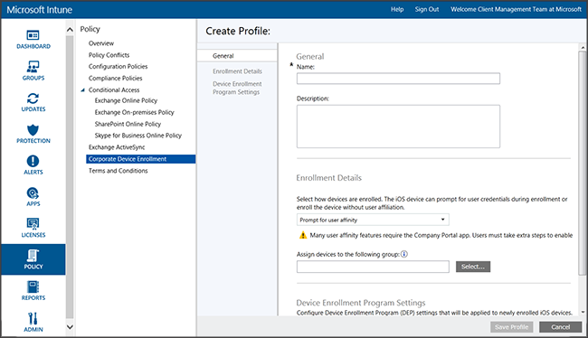

---
# required metadata

title: Apple DEP management for iOS devices 
description: Deploy an enrollment profile that enrolls iOS devices bought through the iOS Device Enrollment Program (DEP) “over the air” to manage Apple devices.
keywords:
author: nathbarn
ms.author: nathbarn
manager: angrobe
ms.date: 03/28/2017
ms.topic: article
ms.prod:
ms.service: microsoft-intune
ms.technology:
ms.assetid: 8ff9d9e7-eed8-416c-8508-efc20fca8578
ROBOTS: NOINDEX,NOFOLLOW

# optional metadata

#audience:
#ms.devlang:s
ms.reviewer: dagerrit
ms.suite: ems
#ms.tgt_pltfrm:
ms.custom: intune-classic

---

# Enroll corporate-owned Device Enrollment Program iOS devices

[!INCLUDE[classic-portal](../includes/classic-portal.md)]

Microsoft Intune can deploy an enrollment profile that enrolls iOS devices that were bought through the Device Enrollment Program (DEP) “over the air.” The enrollment package can include setup assistant options for the device.

>[!NOTE]
>DEP enrollment can't be used with the [device enrollment manager](enroll-corporate-owned-devices-with-the-device-enrollment-manager-in-microsoft-intune.md) method.
>Also, if users enroll iOS devices (i.e. using the Company Portal app) and those devices' serial numbers are then imported and assigned a DEP profile, the device will be unenrolled from Intune.

## Prerequisites for enrolling iOS devices by using Apple DEP management

- [Install an APNs certificate](set-up-ios-and-mac-management-with-microsoft-intune.md)

- Your organization must join Apple DEP and get devices through that program. Details of that process are available at:  [https://deploy.apple.com](https://deploy.apple.com). Advantages of the program include hands-free setup of devices without using a USB cable to connect each device to a computer.

- Before you can enroll corporate-owned iOS devices with DEP, you need a DEP token from Apple. This token lets Intune sync information about DEP-participating devices that your corporation owns. It also permits Intune to perform Enrollment Profile uploads to Apple and to assign devices to those profiles.

## Steps to enroll iOS devices by using Apple DEP management

The following steps explain how to enroll iOS devices on "day 0" by using Apple DEP management. As devices are added and removed from your organization, you will likely repeat some of these steps, such as adding or removing serial numbers, as described below.

### Get an Encryption Key

1. As an administrative user, open the [Microsoft Intune administration console](https://manage.microsoft.com), go to **Admin** &gt; **Mobile Device Management** &gt; **iOS** &gt; **Device Enrollment Program**, and then choose **Download Encryption Key**.

2. Save the encryption key (.pem) file locally. The .pem file is used to request a trust-relationship certificate from the Apple Device Enrollment Program portal.

### Get a Device Enrollment Program token

1. Go to the [Device Enrollment Program Portal](https://deploy.apple.com) (https://deploy.apple.com), and sign in with your company Apple ID. This Apple ID must be used later to renew your DEP token.

2.  In the Device Enrollment Program Portal, go to **Device Enrollment Program** &gt; **Manage Servers**, and then choose **Add MDM Server**.

3.  Enter the **MDM Server Name**, and then choose **Next**. The server name is for your reference to identify the mobile device management (MDM) server. It is not the name or URL of the Microsoft Intune server.

4.  The **Add &lt;ServerName&gt;** dialog box opens. Choose **Choose File…** to upload the .pem file, and then choose **Next**.

5.  The **Add &lt;ServerName&gt;** dialog box shows a **Your Server Token** link. Download the server token (.p7m) file to your computer, and then choose **Done**.

   This certificate (.p7m) file is used to establish a trust relationship between Intune and Apple’s Device Enrollment Program servers.

### Add the DEP token to Intune

1. In the [Microsoft Intune administration console](https://manage.microsoft.com), go to **Admin** &gt; **Mobile Device Management** &gt; **iOS** &gt; **Device Enrollment Program**.

2. Choose **Upload the DEP Token**. **Browse** to the certificate (.p7m) file, enter your **Apple ID**, and then choose **Upload**.

### Add the Corporate Device Enrollment Policy

1. In the [Microsoft Intune administration console](https://manage.microsoft.com), go to **Policy** &gt; **Corporate Device Enrollment**, and then choose **Add**.

2. Provide **General** details including **Name** and **Description**, and specify whether devices assigned to the profile have user affinity or belong to a group:

   - **Prompt for user affinity**: The device must be affiliated with a user during initial setup before it can be permitted to access company data and email as that user. **User affinity** should be set up for DEP-managed devices that belong to users and need to use the company portal (that is, to install apps). Multifactor authentication (MFA) doesn't work during enrollment on DEP devices with user affinity. After enrollment, MFA works as expected on these devices. New users who are required to change their password when they first sign in cannot be prompted during enrollment on DEP devices. Additionally, users whose passwords have expired won't be prompted to reset their password during DEP enrollment and must reset the password from a different device.

   	>[!NOTE]
   	>DEP with user affinity requires [WS-Trust 1.3 Username/Mixed endpoint](https://technet.microsoft.com/en-us/library/adfs2-help-endpoints) to be enabled to request user token. [Learn more about WS-Trust 1.3](https://technet.microsoft.com/itpro/powershell/windows/adfs/get-adfsendpoint).

   - **No user affinity**: The device is not affiliated with a user. Use this affiliation for devices that do tasks without accessing local user data. Apps that require user affiliation, including the Company Portal app that is used to install line-of-business apps, won’t work.

   You can also **Assign devices to the following group**. Choose **Select...** to choose a group.

   > [!Important]
   > Group assignments are moving from Intune to Azure Active Directory. Once your Intune account receives the applicable update, you won't see the **Assign devices to the following group** option. [Learn more](/intune-classic/deploy-use/ios-device-enrollment-program-in-microsoft-intune#changes-to-intune-group-assignments).

3. Enable **Configure Device Enrollment Program settings for this policy** to support DEP.

      

   The following settings are available for DEP-managed devices:

   - **Department** - Appears when users tap **About Configuration** during activation
   - **Support phone number** - Appears when the user clicks the **Need Help** button during activation
   - **Preparation mode** - Set during activation and cannot be changed without factory resetting the device:
       - **Unsupervised** - Limited management capabilities
       - **Supervised** - Enables more management options and disables Activation Lock by default
   - **Lock enrollment profile to device** - Set during activation and cannot be changed without a factory reset
       - **Disable** - Allows the management profile to be removed from the **Settings** menu
       - **Enable** - (Requires **Preparation Mode** = **Supervised**) Disables the iOS Settings menu option to remove the management profile
   - **Setup Assistant Options** - These optional settings can be set up later in the iOS **Settings** menu.
        - **Passcode** - Prompt for passcode during activation. Always require a passcode unless the device will be secured or have access controlled in some other manner (that is, kiosk mode that restricts the device to one app)
       - **Location Services** - If enabled, Setup Assistant prompts for the service during activation
       - **Restore** - If enabled, Setup Assistant prompts for iCloud backup during activation
       - **Apple ID** - If enabled, iOS will prompt users for an Apple ID when Intune attempts to install an app without an ID. An Apple ID is required to download iOS App Store apps, including those installed by Intune.
       - **Terms and Conditions** - If enabled, Setup Assistant prompts users to accept Apple's terms and conditions during activation
       - **Touch ID** - If enabled, Setup Assistant prompts for this service during activation
       - **Apple Pay** - If enabled, Setup Assistant prompts for this service during activation
       - **Zoom** - If enabled, Setup Assistant prompts for this service during activation
       - **Siri** - If enabled, Setup Assistant prompts for this service during activation
       - **Send diagnostic data to Apple** - If enabled, Setup Assistant prompts for this service during activation
   -  **Enable additional Apple Configurator management** - Set to **Disallow** to prevent syncing files with iTunes or management via Apple Configurator. It's a good idea to choose **Disallow**, export further configurations from Apple Configurator, and then deploy as a Custom iOS configuration profile via Intune instead of using this setting to allow manual deployment with or without a certificate.
       - **Disallow** - Prevents the device from communicating via USB (disables pairing)
       - **Allow** - Allows a device to communicate via USB connection for any PC or Mac
       - **Require certificate** - Allows pairing with a Mac with a certificate imported to the enrollment profile

### Assign the profile to devices

1. In the [Microsoft Intune administration console](https://manage.microsoft.com), go to **Policy** &gt; **Corporate Device Enrollment**, and then choose **Assign**.

2. Choose the devices to which you want to assign the profile that you created. You can choose **All devices** or select specific devices, and then select **Add**.

> [!Important]
> Currently, Intune lets you designate a "default" device enrollment profile," which means that new serial numbers are automatically assigned to that default profile when you synchronize new serial numbers with the Apple DEP service. When your tenant is migrated to the new Azure portal in the near future, you will no longer be able to set a default profile and have serial numbers be automatically assigned to that profile. Instead, you will have to assign serial numbers to a specific profile. [Learn more](https://docs.microsoft.com/intune/device-enrollment-program-enroll-ios)

### Assign DEP Devices for Management

1. Go to the [Device Enrollment Program Portal](https://deploy.apple.com) (https://deploy.apple.com) and sign in with your company Apple ID.

2. Go to  **Deployment Program** &gt; **Device Enrollment Program** &gt; **Manage Devices**.

3. Specify how you will **Choose Devices**, provide device information and specify details by device **Serial Number**, **Order Number**, or **Upload CSV File**.

4. Choose **Assign to Server** and choose the &lt;ServerName&gt; specified for Microsoft Intune, and then choose **OK**.

### Synchronize DEP-Managed Devices

This step synchronizes devices with the Apple DEP Service, and makes the devices appear in the Intune console.

1. As an administrative user, open the [Microsoft Intune administration console](https://manage.microsoft.com), go to **Admin** &gt; **Mobile Device Management** &gt; **iOS** &gt; **Device Enrollment Program**, and then choose **Sync now**. A sync request is sent to Apple.

2. To see DEP-managed devices after synchronization, in the [Microsoft Intune administration console](https://manage.microsoft.com) go to **Groups** &gt; **All Devices** &gt; **Corporate Pre-enrolled devices** &gt; **By iOS Serial Number**. In the **By iOS Serial Number** workspace, the **State** for managed devices reads “Not contacted” until the device is powered on and runs the Setup Assistant to enroll the device.

   To comply with Apple’s terms for acceptable DEP traffic, Intune imposes the following restrictions:

   - A full DEP sync can run no more than once every seven days. During a full sync, Intune refreshes every serial number that Apple has assigned to Intune whether the serial has previously been synced or not. If a full sync is attempted within seven days of the previous full sync, Intune only refreshes serial numbers that are not already listed in Intune.

   - Any sync request is given 10 minutes to finish. During this time or until the request succeeds, the **Sync** button is disabled.

### Distribute devices to users

Your corporate-owned devices can now be distributed to users. When an iOS device is turned on it will be enrolled for management by Intune. The user device limit applies to DEP-managed devices.

>[!NOTE]
>If a user attempts to enroll a DEP device but has exceeded her device limit, enrollment will fail silently without warning the user.

## Changes to Intune group assignments

Starting in April 2017, device group management is moving to Azure Active Directory. After the transition to Azure Active Directory groups, group assignment will not appear in the Corporate Enrollment Profile options. Because this change will roll out over a series of months, you might not see the change right away. After moving to the new portal, dynamic device group assignments can be defined based on the Corporate Enrollment Profile names.

Upon migration, for every Intune device group pre-assigned by a Corporate Device Enrollment profile, a corresponding dynamic device group will be created in Azure AD based on the Corporate Device Enrollment profile’s name. New profile names have the format *EnrollmentProfile:&lt;name of associated profile&gt;*. This process ensures that devices that are assigned to a device group already will automatically enroll in the group with policy and apps deployed.

This automatic group creation happens only once, during groups migration. After migration, Intune admins must create groups using the Azure portal. For details about how this affects company-owned iOS device enrollment, see [Changes to Automatic Grouping for Corporate Pre-enrolled iOS Devices](https://blogs.technet.microsoft.com/intunesupport/2017/04/19/changes-to-automatic-grouping-for-corporate-pre-enrolled-ios-devices/).

You can also [Learn more about Azure Active Directory groups](https://azure.microsoft.com/documentation/articles/active-directory-accessmanagement-manage-groups/).

### See also
[Prerequisites for enrolling devices](prerequisites-for-enrollment.md)
