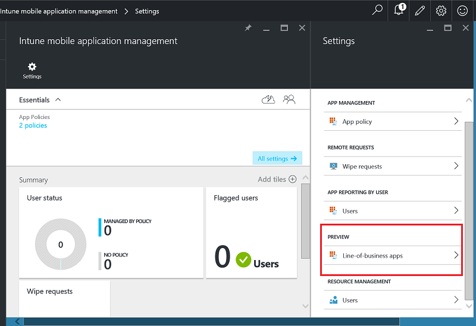
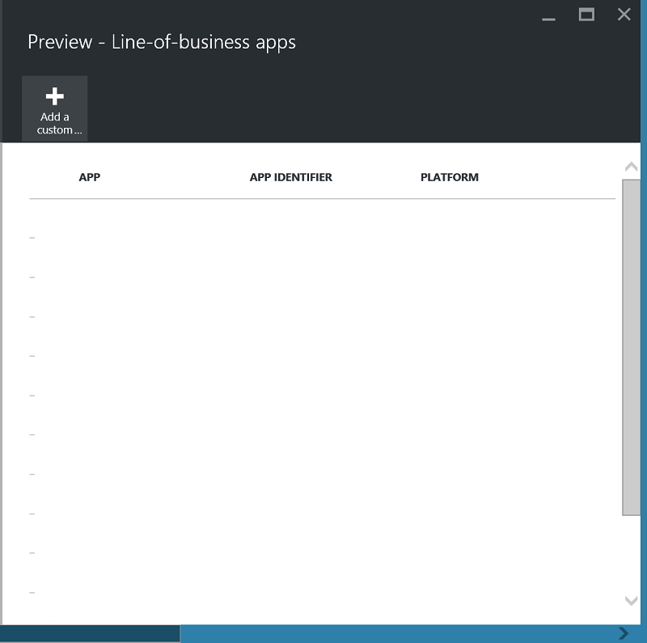
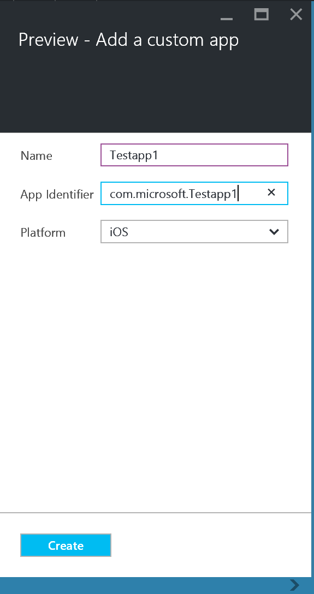
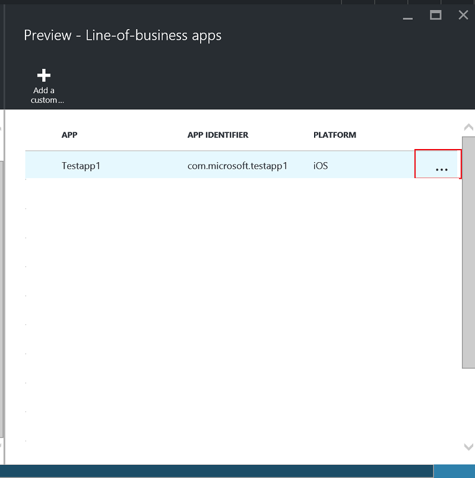
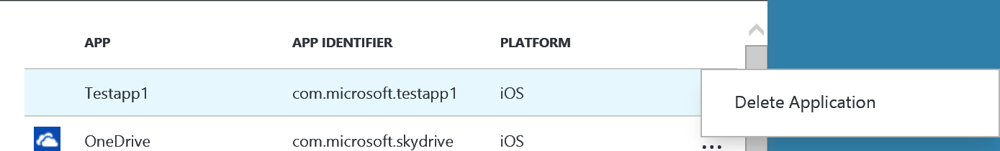

---
# required metadata

title: Protect LOB apps on devices that are not enrolled 
description: This topic describes how you can prepare your custom line-of-business apps so you can apply mobile application management policies that can help prevent data loss.
keywords:
author: mtillman
ms.author: mtillman
manager: angrobe
ms.date: 11/14/2016
ms.topic: article
ms.prod:
ms.service: microsoft-intune
ms.technology:
ms.assetid: 00219467-a62e-43b6-954b-3084f54c45ba

# optional metadata

#ROBOTS:
#audience:
#ms.devlang:
ms.reviewer: joglocke
ms.suite: ems
#ms.tgt_pltfrm:
ms.custom: intune-classic

---

# Protect line-of-business apps and data on devices that are not enrolled in Microsoft Intune

[!INCLUDE[classic-portal](../includes/classic-portal.md)]

Mobile application management (MAM) policies help protect company data by restricting actions that could leak company data and by enforcing data access requirements, such as an app PIN. To apply MAM policies to iOS and Android line-of-business apps, you must first wrap the app with the Microsoft Intune App Wrapping Tool. App wrapping is the process of applying a management layer to a mobile app without requiring any changes to it and distribute it to your users.  

This topic explains the steps that are required to apply MAM policies for apps that users access on **employee-owned devices that are not managed** and devices that are managed by a **third-party mobile device management (MDM) solution**.  To prepare your line-of-business apps that run on **devices that are enrolled in Intune MDM**, see [Decide how to prepare apps for mobile application management with Microsoft Intune](/intune/apps-prepare-mobile-application-management).

##  Step 1: Prepare the app

Before you can apply MAM policies to an app, you must first wrap the app by using the Microsoft Intune App Wrapping Tool for [iOS](/intune/app-wrapper-prepare-ios), [Android](/intune/app-wrapper-prepare-android), or use the [Intune App SDK](/intune/app-sdk) to manually integrate Intune app protection features.

For more information on using the App Wrapping Tool vs. the SDK, see [Decide how to prepare apps for mobile application management with Microsoft Intune](/intune/apps-prepare-mobile-application-management).

## Step 2: Add the app

To associate your line-of-business app with MAM policies, you must add the app details to your Intune subscription/tenant by using the following steps:

1. In the [Azure portal](https://portal.azure.com/), go to **Intune mobile application management** > **Settings**, and choose **Line-of-business apps**.

  

2. On the **Line-of-business-apps** blade, choose **Add a custom app**.

  
3.	Provide a name for the app, the bundle identifier in the App Identifier field, and the platform (iOS or Android).

  

  This step helps create a unique listing of your app. The app will also be displayed in the list of Targeted apps for a MAM policy for your tenant, as described in the next step.

## Step 3: Apply MAM policies
After the app metadata is uploaded to the service, the app shows up in the list of apps. You can now [create a new policy or use an existing policy](create-and-deploy-mobile-app-management-policies-with-microsoft-intune.md), and apply it to the line-of-business app that you added in step 2.

>[!IMPORTANT]
>You must target the MAM policy to the users who are going to use the wrapped app.  Users who don’t have this policy deployed to them won't be able to use the app.

  
## Step 4: Distribute the app
You can deploy apps to your users in the following ways:
* For devices that are enrolled in a third-party MDM solution, you can distribute the apps through your MDM solution.
* For devices that aren't managed by any MDM solution, you need a custom solution. Users must download and install the app on their device.

## Change the metadata
If you need to change the app details, like the name of the app or the bundle identifier, you must [remove the app](#remove-apps) and [add it](#step-2-add-the-app) with the new metadata.

##  Remove apps
You can remove a line-of-business app from the app list. This will remove the app from the list and will remove the association with MAM policies, but will not remove or uninstall the app from the user’s device.  

1.	In the [Azure portal](https://portal.azure.com/), go to **Intune mobile app management** > **Settings**. On the **Settings** blade, choose **Line-of-business** to open the list of existing apps.  
2.	Choose the app that you want to remove, and choose the **(…) context** menu.

  
3.	Choose **Delete Application** to delete the app.

  

  This will remove apps from the list of line-of-business apps and the Targeted list of apps in the MAM policy.
