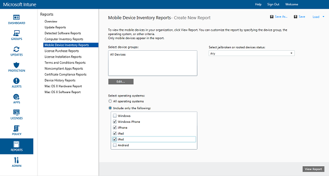
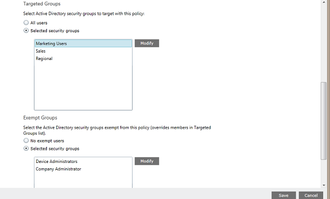

---
# required metadata

title: Protect email to Exchange Online 
description: Protect and control access to company email on Exchange Online with conditional access.
keywords:
author: andredm7
ms.author: andredm
manager: angrobe
ms.date: 01/31/2017
ms.topic: article
ms.prod:
ms.service: microsoft-intune
ms.technology:
ms.assetid: 09c82f5d-531c-474d-add6-784c83f96d93
ROBOTS: NOINDEX,NOFOLLOW

# optional metadata

#audience:
#ms.devlang:
ms.reviewer: chrisgre
ms.suite: ems
#ms.tgt_pltfrm:
ms.custom: intune-classic

---

# Protect email access to Exchange Online and new Exchange Online Dedicated with Intune

[!INCLUDE[classic-portal](../includes/classic-portal.md)]

You can configure conditional access for Exchange Online or Exchange Online Dedicated by using Microsoft Intune. To learn more about how conditional access works, read the [Protect access to email, O365, and other services](restrict-access-to-email-and-o365-services-with-microsoft-intune.md) article.

> [!NOTE]
>If you have an Exchange Online Dedicated environment and need to find out whether it's in the new or the legacy configuration, contact your account manager.

## Before you begin

To configure conditional access, you must:

-   Have an **Office 365 subscription that includes Exchange Online (such as E3)**, and users must be licensed for Exchange Online.

- Have an **Enterprise Mobility + Security (EMS) subscription** or an **Azure Active Directory (Azure AD) Premium subscription**, and users must be licensed for EMS or Azure AD. For more details, see the [Enterprise Mobility pricing page](https://www.microsoft.com/cloud-platform/enterprise-mobility-pricing) or the [Azure Active Directory pricing page](https://azure.microsoft.com/pricing/details/active-directory/).

-  Consider configuring the optional **Intune service-to-service connector**, which connects Intune to Exchange Online and helps you manage device information through the Intune console. You don't need to use the connector to use compliance policies or conditional access policies—but it's required to run reports that help evaluate the impact of conditional access.
	-  Learn more about the [Intune service-to-service connector](intune-service-to-service-exchange-connector.md).

   > [!NOTE]
   > Do not configure the Intune service-to-service connector if you intend to use conditional access for both Exchange Online and Exchange on-premises.

### Device compliance requirements

When you configure conditional access policies and target them to a user, before a user can connect to their email, the **device** they use must be:

-   A domain-joined PC or **enrolled** with Intune.

-  **Registered in Azure Active Directory**. This happens automatically when the device is enrolled with Intune. Additionally, the client Exchange ActiveSync ID must be registered with Azure Active Directory.

  The Azure Active Directory Device Registration service is activated automatically for Intune and Office 365 customers. Customers who have already deployed the ADFS Device Registration service will not see registered devices in on-premises Active Directory.

-   **Compliant** with any Intune compliance policies that are deployed to that device or domain joined to an on-premises domain.

### When the device is not compliant

If a conditional access policy isn't met, the device gets immediately quarantined, and the user receives an e-mail and sees one of the following quarantine notifications when they sign in:

- If the device isn't enrolled with Intune or isn't registered in Azure Active Directory, a message is displayed with instructions about how to install the Company Portal app, enroll the device, and activate email. This process also associates the device’s Exchange ActiveSync ID with the record in Azure Active Directory.

-   If the device is evaluated as not compliant with the compliance policy rules, the user is directed to the Intune Company Portal website or the Company Portal app, where they can find information about the problem and how to remediate it.

### How conditional access works with Exchange Online

The following diagram illustrates the flow that is used by conditional access policies for Exchange Online.

## Support for mobile devices
You can protect access to Exchange Online email from **Outlook** and other **apps that use modern authentication**. The following are supported:

- Android 4.0 and later, Samsung Knox Standard 4.0 and later, and Android for Work
- iOS 8.0 and later

**Modern authentication** brings sign-in based on Active Directory Authentication Library (ADAL) to Microsoft Office clients.

-   The ADAL-based authentication enables Office clients to engage in browser-based authentication (also known as passive authentication). To authenticate, a user is directed to a sign-in web page.
-   This new sign-in method enables better security like **multi-factor authentication** and **certificate-based authentication**. For more detailed information, see [How modern authentication works](https://support.office.com/article/How-modern-authentication-works-for-Office-2013-and-Office-2016-client-apps-e4c45989-4b1a-462e-a81b-2a13191cf517). You can set up ADFS claim rules to block non-modern authentication protocols. Detailed instructions are provided in [Scenario 3: Block all access to O365 except browser-based applications](https://technet.microsoft.com/library/dn592182.aspx).

You can protect access to **Outlook Web Access (OWA)** on Exchange Online when a user accesses it from a browser on **iOS** and **Android** devices. Access is only allowed from supported browsers on compliant devices:

* Safari (iOS)
* Chrome (Android)
* Intune Managed Browser (iOS, Android 5.0 and later)

   > [!IMPORTANT]
   > **Unsupported browsers are blocked**.

**The OWA app for iOS and Android can be modified not to use modern authentication, and it isn't supported. Access from the OWA app must be blocked through ADFS claim rules.**

You can protect access to Exchange email from the built-in **Exchange ActiveSync email client** on the following platforms:

- Android 4.0 and later, Samsung Knox Standard 4.0 and later

- iOS 8.0 and later

- Windows Phone 8.1 and later

## Support for PCs

You can set up conditional access for PCs that run Office desktop applications to access **Exchange Online** and **SharePoint Online** for PCs that meet the following requirements:

-   The PC must be running Windows 7.0, Windows 8.1, or Windows 10.

  >[!NOTE]
  > To use conditional access with Windows 10 PCs, you must update those PCs with the Windows 10 Anniversary Update.

  The PC must either be domain joined or compliant with the compliance policy rules.

  In order to be considered compliant, the PC must be enrolled in Intune and comply with the policies.

  For domain-joined PCs, you must set up conditional access to [automatically register the device](https://azure.microsoft.com/documentation/articles/active-directory-conditional-access-automatic-device-registration/) with Azure Active Directory.

  >[!NOTE]
    >Conditional access isn't supported on PCs that are running the Intune computer client.

-   [Office 365 modern authentication must be enabled](https://support.office.com/article/Using-Office-365-modern-authentication-with-Office-clients-776c0036-66fd-41cb-8928-5495c0f9168a) and have all the latest Office updates.

    Modern authentication brings sign-in based on Active Directory Authentication Library (ADAL) to Office 2013/Windows clients. It enables better security like **multi-factor authentication** and **certificate-based authentication**.

-   ADFS claim rules are set up to block non-modern authentication protocols. Detailed instructions are provided in [Scenario 3: Block all access to O365 except browser based applications](https://technet.microsoft.com/library/dn592182.aspx).

## Configure conditional access
### Step 1: Configure and deploy a compliance policy
Make sure you [create](create-a-device-compliance-policy-in-microsoft-intune.md) and [deploy](deploy-and-monitor-a-device-compliance-policy-in-microsoft-intune.md) a compliance policy to the user groups that will also get the conditional access policy.

> [!IMPORTANT]
> If you haven't deployed a compliance policy, the devices are considered compliant and are allowed access to Exchange.

### Step 2: Evaluate the effect of the conditional access policy
You can use the **Mobile Device Inventory Reports** to identify the devices that might be blocked from accessing Exchange after you configure the conditional access policy.

To do this, configure a connection between Intune and Exchange by using the [Microsoft Intune service-to-service connector](intune-service-to-service-exchange-connector.md).
1.  Navigate to **Reports** > **Mobile Device Inventory Reports**.

2.  In the report parameters, select the Intune group that you want to evaluate and, if required, the device platforms that the policy will apply to.
3.  After you’ve selected the criteria that meets your organization’s needs, choose **View Report**.
The Report Viewer opens in a new window.

After you run the report, examine these four columns to determine whether a user will be blocked:

-   **Management Channel**: Indicates whether the device is managed by Intune, Exchange ActiveSync, or both.

-   **AAD Registered**: Indicates whether the device is registered with Azure Active Directory (known as Workplace Join).

-   **Compliant**: Indicates whether the device is compliant with any compliance policies that you deployed.

-   **Exchange ActiveSync ID**: iOS and Android devices are required to have their Exchange ActiveSync ID associated with the device registration record in Azure Active Directory. This happens when a user chooses the **Activate Email** link in the quarantine email.

    > [!NOTE]
    > Windows Phone devices always display a value in this column.

Devices that are part of a targeted group are blocked from accessing Exchange unless the column values match those listed in the following table:

--------------------------
|Management Channel|AAD Registered|Compliant|Exchange ActiveSync ID|Resulting action|
|----------------------|------------------|-------------|--------------------------|--------------------|
|**Managed by Microsoft Intune and Exchange ActiveSync**|Yes|Yes|A value is displayed|Email access is allowed|
|Any other value|No|No|No value is displayed|Email access is blocked|
----------------------
You can export the contents of the report and use the **Email Address** column to tell your users that they will be blocked.

### Step 3: Configure user groups for the conditional access policy
Conditional access policies are targeted to different Azure Active Directory security groups of users. You can also exempt certain user groups from a conditional access policy. When a user is targeted by a policy, each device that they use must be compliant in order to access email.

You can configure these groups in the **Office 365 admin center** or in the **Intune account portal**.

You can specify two group types in each policy:

-   **Targeted groups**: User groups that the policy is applied to.

-   **Exempted groups**: User groups that are exempt from the policy (optional).

If a user is in both groups, they are exempt from the policy.

Only the groups that are targeted by the conditional access policy are evaluated.

### Step 4: Configure the conditional access policy

>[!NOTE]
> You can also create a conditional access policy in the Azure AD management console. The Azure AD management console lets you create an Intune device conditional access policy (referred to as the **device-based conditional access policy** in Azure AD), in addition to other conditional access policies like multi-factor authentication.

>You can also set conditional access policies for third-party enterprise apps that Azure AD supports, like Salesforce and Box. For more details, see [How to set Azure Active Directory device-based conditional access policy for access control to Azure Active Directory-connected applications](https://azure.microsoft.com/documentation/articles/active-directory-conditional-access-policy-connected-applications/).

1.  In the [Microsoft Intune administration console](https://manage.microsoft.com), choose **Policy** > **Conditional Access** > **Exchange Online Policy**.

2.  On the **Exchange Online Policy** page, choose **Enable conditional access policy for Exchange Online**.

    > [!NOTE]
    > If you haven't deployed a compliance policy, devices are treated as compliant.
    >
    > Regardless of the compliance state, all users who are targeted by the policy are required to enroll their devices with Intune.

3.  Under **Application access**, for apps that use modern authentication, you have two ways of choosing which platforms the policy should apply to. Supported platforms include Android, iOS, Windows, and Windows Phone.

    -   **All platforms**

        This requires that any device that is used to access **Exchange Online** is enrolled in Intune and compliant with the policies. Any client application that uses **modern authentication** is subject to the conditional access policy. If the platform is currently not supported by Intune, access to **Exchange Online** is blocked.

        Selecting the **All platforms** option means that Azure Active Directory applies this policy to all authentication requests, regardless of the platform that is reported by the client application. All platforms are required to enroll and become compliant, except for:
        *	Windows devices, which are required to be enrolled and compliant, domain joined with on-premises Active Directory, or both.
	    * Unsupported platforms like Mac OS. However, apps that use modern authentication coming from these platforms is still blocked.

    -   **Specific platforms**

         The conditional access policy applies to any client app that is using **modern authentication** on the device platforms that you specify.

4. Under **Outlook Web Access (OWA)**, you can choose to allow access to Exchange Online only through the supported browsers: Safari (iOS) and Chrome (Android). Access from other browsers is blocked. The same platform restrictions that you selected for Application access for Outlook also apply here.

  On **Android** devices, users must enable browser access. To do this, the user must enable the **Enable Browser Access** option on the enrolled device as follows:
  1.	Open the **Company Portal app**.
  2.	Go to the **Settings** page from the ellipsis (…) or the hardware menu button.
  3.	Press the **Enable Browser Access** button.
  4.	In the Chrome browser, sign out of Office 365 and restart Chrome.

  On **iOS** and **Android** platforms, to identify the device that is used to access the service, Azure Active Directory issues a Transport Layer Security (TLS) certificate to the device. The device displays the certificate with a prompt to the user to select the certificate, as shown in the following screenshots. The user must select this certificate before they can continue to use the browser.

  **iOS**

  

  **Android**

  

5.  Under **Exchange ActiveSync apps**, you can choose to block noncompliant devices from accessing Exchange Online. You can also select whether to allow or block access to email when the device isn't running a supported platform. Supported platforms include Android, iOS, Windows, and Windows Phone.

 Exchange Active Sync apps on **Android for Work** devices:
 -  Only **Gmail** and **Nine Work** apps in the **work profile** are supported on Android for Work devices. For conditional access to work on Android for Work devices, you must deploy an email profile for the Gmail or Nine Work app, and also deploy it as a **required** installation.

6.  Under **Targeted Groups**, select the Active Directory security groups of users that the policy applies to. You can either choose to target all users or a selected list of user groups.

    > [!NOTE]
    > For users that are in the **Targeted groups**, the Intune polices replace Exchange rules and policies.
    >
    > Exchange only enforces the Exchange allow, block, and quarantine rules, and Exchange policies if:
    >
    > -   A user isn't licensed for Intune.
    > -   A user is licensed for Intune, but the user doesn't belong to any security groups that are targeted in the conditional access policy.

6.  Under **Exempted Groups**, select the Active Directory security groups of users that are exempt from this policy. If a user is in both the targeted and exempted groups, they are exempt from the policy.

7.  When you're done, choose **Save**.

-   You don't have to deploy the conditional access policy—it takes effect immediately.

-   After a user creates an email account, the device is blocked immediately.

-   If a blocked user enrolls the device with Intune and fixes any noncompliance issues, email access is unblocked within two minutes.

-   If the user unenrolls their device, email is blocked after around six hours.

To see some **example scenarios of how you would configure a conditional access policy to protect device access**, see [Protect email access example scenarios](restrict-email-access-example-scenarios.md).

## Monitor the compliance and conditional access policies

#### To view devices that are blocked from Exchange

On the Intune dashboard, choose the **Blocked Devices from Exchange** tile to show the number of blocked devices and links to more information.

## Next steps
- [Protect access to SharePoint Online](restrict-access-to-sharepoint-online-with-microsoft-intune.md)

- [Protect access to Skype for Business Online](restrict-access-to-skype-for-business-online-with-microsoft-intune.md)
