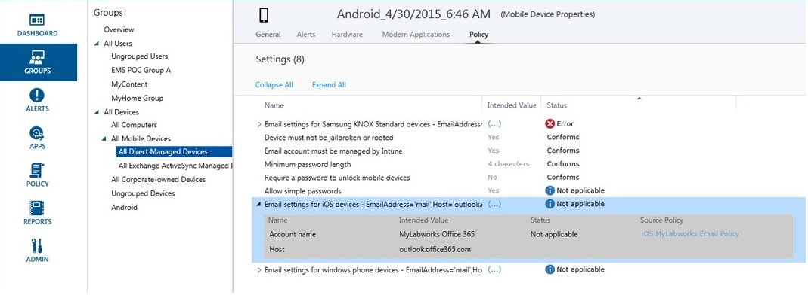

---
# required metadata

title: Use groups to manage users and devices 
description: Create and manage groups by using the Groups workspace.
keywords:
author: dougeby
ms.author: angrobe
manager: angrobe
ms.date: 12/15/2016
ms.topic: article
ms.prod:
ms.service: microsoft-intune
ms.technology:
ms.assetid: eb9b01ce-9b9b-4c2a-bf99-3879c0bdaba5
ROBOTS: NOINDEX,NOFOLLOW

# optional metadata

#audience:
#ms.devlang:
ms.reviewer: lpatha
ms.suite: ems
#ms.tgt_pltfrm:
ms.custom: intune-classic

---
# Use groups to manage users and devices in Microsoft Intune

[!INCLUDE[classic-portal](../includes/classic-portal.md)]

This topic describes how to create groups in Intune. It also provides information about how the management of groups is going to change over the coming months. 

>[!IMPORTANT]
>
>If you open the Groups workspace in the Intune portal and see a link to the Azure active directory (Azure AD) portal, then you are using the *new* Azure AD security groups approach to group management in Intune, described in [Migrating groups to Azure Active Directory](migrating-groups-to-azure-active-directory.md). Click the link to the Azure AD portal to create and manage your groups.
>
> 
>
>If you do not see the link to the Azure AD portal, you are still using the *current* approach to group management, described in [Create groups](#create-groups) in this topic.

This topic describes how to create Intune groups in the Intune administration console.

You can create and manage groups in the **Groups** workspace in the Microsoft Intune admin console. The **Groups Overview** page shows status summaries that can help you identify and prioritize issues that require your attention. Status summaries cover these areas:

-   Alerts
-   Software updates
-   Endpoint Protection
-   Policy
-   Software management

Your group hierarchy also shows status summaries to help you identify and resolve problems for members of a selected group.

## Create groups

> [!TIP]
> When you create groups, consider how you will apply policies. For example, you might have policies that are specific to a device operating system, and policies that are specific to different roles in your organization, or to organizational units that you've already defined in Active Directory. It might be useful to have separate device groups for iOS, Android, and Windows, as well as a user group for each organizational role.
>
> You'll probably also want to create a default policy that applies to all groups and devices, to establish the basic compliance requirements of your organization. Then, you can create more specific policies for the broadest categories of users and devices. For example, you might create email policies for each of the device operating systems.
>
> Be careful when you name your policies so that you can easily identify them later. For example, a good descriptive policy name is **WP Email Policy for Entire Company**.
>
> Each time you create a restrictive policy, you'll want to communicate it to your users. After you create the more general groups and policies, pay attention to how you create smaller groups, so that you can reduce unnecessary communication.

## To create a device group

1.  In the Intune admin console, choose **Groups** &gt; **Overview** &gt; **Create Group**.

2.  Enter a name and a description (optional) for the group, and then select a device group as the parent group. Choose **Next**.

3.  On the **Define Membership Criteria** page, select the type of devices to include in the group. You have additional group configuration options based on the types of devices you choose to include:

    -   **Computer**. Select whether to include all members of the parent group; the organizational units you want to include or exclude; and domains you want to include or exclude. You can get organizational unit and domain information for a computer from inventory.

    -   **Mobile**. Select whether to include mobile devices that are managed by Intune, mobile devices that are managed by Exchange ActiveSync, or both.

    -   **All devices**. This option includes all devices, with no exclusions based on any criteria.

4.  On the **Define Direct Membership** page, choose **Browse** to select individual devices to include or exclude. If you select devices that are not in the parent group that you specified, Intune automatically adds those devices to the parent group.

5.  On the **Summary** page, review your selections, and then choose **Finish**.

The newly created group is shown in the **Groups** list, in the **Groups** workspace, under the parent group. That's also where you can edit or delete the group.

## To create a user group

1.  In the Intune admin console, choose **Groups** &gt; **Overview** &gt; **Create Group**.

2.  Enter a name and a description (optional) for the group, and then select a user group as the parent group. Choose **Next**.

3.  On the **Define Membership Criteria** page, choose whether to include all members of the parent group or to start with an empty group. Then, include or exclude members based on the security groups of users that you either manually configure in the [Office 365 admin center](http://go.microsoft.com/fwlink/?LinkId=698854), or sync from Active Directory. If the membership of a security group changes, the membership of user groups based on that security group also might change.

    > [!IMPORTANT]
    > Currently, if your group includes members from specific security groups or manager groups and you exclude members from some groups, the members you initially included will be removed. To create a group that has both included members and excluded members, we recommend that first you create a parent group that has the included members. Then, create a child group for that parent group. In the new child group, list the excluded members. Then, use that child group to manage Intune policies, profiles, and app distribution.

    > [!NOTE]
    > In the Azure portal, you can create groups based on the managers who users report to. This type of group is dynamic, and it will change as employees are added to or removed from a manager's team in Azure Active Directory. How to create an Azure group based on manager name is described in [Using attributes to create advanced rules](https://azure.microsoft.com/documentation/articles/active-directory-accessmanagement-groups-with-advanced-rules/), in the section **To configure a group as a “Manager” group**.

4.  On the **Define Direct Membership** page, choose **Browse** to select individual users to include or exclude. If you select users that are not in the parent group that you specified, those devices are automatically added to the parent group. The option to manually add a user is at the bottom of the **Select Members** dialog box. This is helpful if you want to add a user who does not yet have an enrolled device.

5.  On the **Summary** page, review your selections, and then choose **Finish**.

The newly created group is shown in the **Groups** list, in the **Groups** workspace, under the parent group. That's also where you can edit or delete the group.

> [!TIP]
> Security groups are a good resource to use when you populate user groups. Because security groups define who can access which resources, security groups can translate well to Intune user groups. Security groups that are synced from Active Directory to Azure Active Directory, or which you create directly in Azure Active Directory through the Office 365 admin center or the Azure portal are available to you to use when you create user groups in Intune.

## Filter admin views by role
In filtered group views, you can tailor what an IT admin can see based on the admin's role. You also can restrict which groups each IT admin can manage. This can be useful when:

-   You want your IT admins to be able to deploy items only to specific users and devices
-   You want your IT admins to see only the groups that are relevant to that admin

You can configure filtered group views for service admins in the Intune admin console. For details, see [What to know before you start Microsoft Intune](/intune/supported-devices-browsers).

After you set up filtered group views for a service admin, when the admin deploys software or policies, or runs reports, the admin can view and select only the groups that you specified. The admin also doesn't see status information on these pages of the admin console:

-   **System Overview**
-   **Groups Overview**
-   **Endpoint Protection Overview**
-   **Alerts Overview**
-   **Software Overview**
-   **Policy Overview**

### To create a filtered group view

1.  In the Intune admin console, choose **Admin** &gt; **Administrator Management** &gt; **Service Administrators**.

2.  Select the service admin who you want to create a filtered group view for, and then choose **Manage Groups**.

3.  In the **Select the groups that will be visible to this service administrator** dialog box, add the groups that the service admin will be able to access, and then choose **OK**.

After you've set up the filtered group views, the IT admin will be able to view and select only the groups you've indicated.

## Manage your groups
After you create your groups, you can continue to manage them according to the needs of your organization.

You can edit your group to change its name or description, or who belongs to the group.

You can delete a group that no longer serves the needs of your organization. Deleting a group does not delete the users that belong to that group.

## Next steps
After you set up your groups and policies, review **Intended Value** and **Status** to check the practical implications of your design.

### To check your design

1. Select any device from a device group and browse through the categories of information at the top of the page.
2. Choose **Policy**. You'll see something like this screenshot of an Android device's policy settings.

Each policy has an **Intended Value** and a **Status**. The intended value is what you intended to achieve when you assigned the policy. The status is what you achieve when all of the policies that apply to the device, as well as the restrictions and requirements of the hardware and operating system are considered together. In this screenshot you can see two clear examples:

-   **Allow simple passwords** is set to **Yes**, as shown in the **Intended Value** column, but its **Status** is **Not applicable**. This is because simple passwords are not supported for Android devices.
-   Similarly, the expanded policy item **Email settings for iOS devices** is not applied to this device because it is an Android device.

> [!NOTE]
> Remember that when two policies that have different levels of restriction apply to the same device or user, the more restrictive policy applies in practice.
